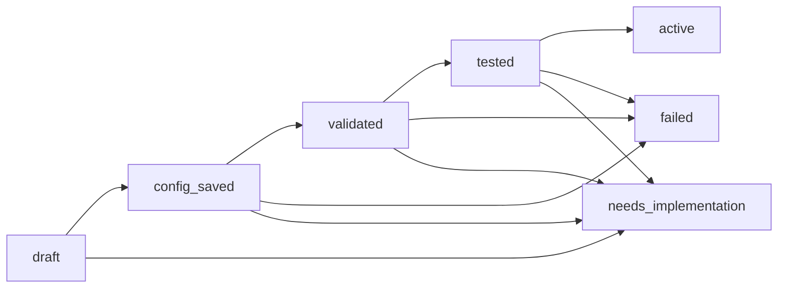
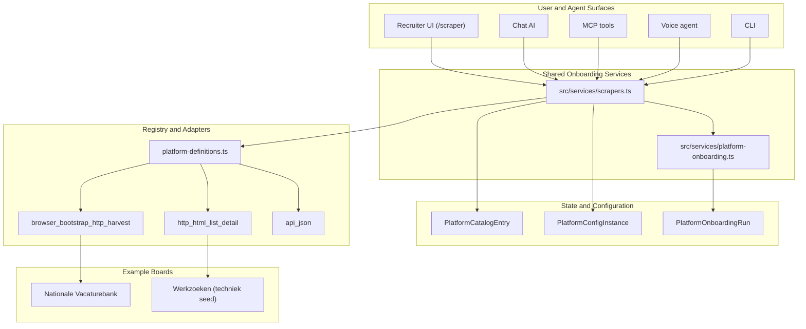

# Platform Onboarding Visual Explainer Spec

**Date:** 2026-03-12  
**Status:** Ready for `visual-explainer` input  
**Primary audience:** product, operators, recruiters, AI/agent implementers  
**Secondary audience:** engineering, onboarding support, architecture reviewers

---

## Purpose

Explain the new Motian platform onboarding system as a repeatable, agent-native workflow instead of a collection of one-off scrapers.

The explainer should make three ideas obvious within the first minute:

1. Platform onboarding is now a shared workflow, not board-specific custom code.
2. Recruiters and agents use the same backend primitives.
3. New platforms either fit a supported adapter kind and onboard cleanly, or stop explicitly with `needs_implementation` plus blocker evidence.

---

## Single-Sentence Narrative

Motian moved from hardcoded scraper support to a registry-backed onboarding system where UI users and agents can add, validate, test, activate, and monitor platforms through the same stateful workflow.

---

## Source-of-Truth References

Use these files as the canonical implementation anchors for the explainer copy:

- `packages/scrapers/src/platform-definitions.ts`
- `packages/scrapers/src/types.ts`
- `src/services/platform-onboarding.ts`
- `src/services/scrapers.ts`
- `docs/runbooks/platform-onboarding.md`
- `src/ai/tools/platforms.ts`
- `src/mcp/tools/platforms.ts`
- `src/voice-agent/agent.ts`
- `src/cli/commands.ts`

Do not invent APIs, tools, or states outside those files.

---

## Deliverable Shape

Generate either:

1. A single self-contained HTML explainer page.
2. A short slide-style narrative with 8 sections.

Preferred structure:

- bold architecture header
- three-entity system model
- onboarding state machine
- parity view across UI and agent surfaces
- board examples: Nationale Vacaturebank and Werkzoeken
- explicit blocker handling and `needs_implementation`
- operator outcomes / why this is safer and easier to extend

---

## Visual Direction

Use a product-operations look, not a generic startup deck.

- Background: dark control-room or deep graphite
- Accent colors:
  - catalog = cyan
  - runtime config = amber
  - onboarding run = pink
  - success/active = green
  - blocked/needs implementation = red
- Shape language:
  - rounded cards for entities
  - pipeline arrows for lifecycle
  - status chips for workflow states
  - compact code/data callouts for tool names and endpoints
- Tone:
  - precise
  - operational
  - trustworthy
  - not hypey

Avoid:

- fake dashboards
- decorative code that does not map to real repo concepts
- “AI magic” framing
- bypass/stealth imagery for public boards

---

## Core Concepts To Explain

### 1. `PlatformCatalogEntry`

Supported platform definition:

- slug
- display metadata
- adapter kind
- auth mode
- capability flags
- attribution metadata
- config/auth schemas

This is the “what is supported” layer.

### 2. `PlatformConfigInstance`

Runtime tenant/workspace configuration:

- enabled state
- cron expression
- credentials reference
- auth payload
- parameters
- base URL

This is the “how this tenant uses it” layer.

### 3. `PlatformOnboardingRun`

Resumable workflow record:

- status
- current step
- next actions
- blocker kind
- evidence
- last result

This is the “what happened during onboarding” layer.

---

## Workflow States

The visual explainer must show the real implemented state progression:

1. `draft`
2. `config_saved`
3. `validated`
4. `tested`
5. `active`
6. `failed`
7. `needs_implementation`

And the real step names:

1. `create_draft`
2. `choose_adapter`
3. `save_config`
4. `validate_access`
5. `run_smoke_import`
6. `activate`
7. `monitor_first_runs`

The key message:

- success path is resumable and explicit
- failure path is explicit and evidence-backed
- unsupported sources do not disappear into a generic error

---

## Scene-By-Scene Storyboard

### Scene 1 — Before vs After

Goal:
Show the architecture shift from hardcoded platform support to a shared onboarding system.

Message:
Before, adding a board meant scattered hardcoded changes. Now, it means registering a platform, configuring it, validating it, and running the same workflow across every surface.

Visual:

- left side: “old model” with scattered boxes labeled helpers, UI badges, pipeline switch logic
- right side: “new model” with registry, config, onboarding run, adapter

Copy cues:

- “From one-off scraper wiring”
- “To repeatable platform onboarding”

### Scene 2 — The Three Entities

Goal:
Make catalog vs config vs run unmistakable.

Message:
Motian separates what a platform is, how it is configured, and what happened during onboarding.

Visual:

- three stacked cards with distinct colors
- short examples on each card

Example content:

- Catalog: `werkzoeken`, adapter `http_html_list_detail`, auth `none`
- Config: base URL, parameters, active flag
- Run: current step, blocker kind, next actions

### Scene 3 — Shared Workflow State Machine

Goal:
Show the same onboarding lifecycle for humans and agents.

Message:
Every onboarding run follows the same resumable state machine.

Visual:
Use the mermaid state flow below.

Callouts:

- `failed` keeps blocker evidence and retry guidance
- `needs_implementation` captures unsupported source follow-up cleanly

### Scene 4 — One Service Layer, Many Surfaces

Goal:
Make agent-native parity obvious.

Message:
Recruiters and agents do not use separate onboarding logic. They call the same backend primitives.

Visual:
Hub-and-spoke layout.

Top row:

- `/scraper` UI
- Chat AI
- MCP
- Voice
- CLI

Center:

- `src/services/scrapers.ts`
- `src/services/platform-onboarding.ts`

Bottom:

- registry
- config storage
- onboarding run history
- platform adapters

Use this parity map directly in the visual:

| Surface | List | Create catalog | Create config | Validate | Test import | Activate | Status |
|---------|------|----------------|---------------|----------|-------------|----------|--------|
| UI (`/scraper`) | yes | yes | yes | yes | yes | yes | yes |
| AI | `platformsList` | `platformCatalogCreate` | `platformConfigCreate` | `platformConfigValidate` | `platformTestImport` | `platformActivate` | `platformOnboardingStatus` |
| MCP | `platforms_list` | `platform_catalog_create` | `platform_config_create` | `platform_config_validate` | `platform_test_import` | `platform_activate` | `platform_onboarding_status` |
| Voice | `platformsLijst` | `platformCatalogMaakAan` | `platformConfigAanmaken` | `platformConfigValideren` | `platformTestImport` | `platformActiveren` | `platformOnboardingStatus` |
| CLI | `platforms:list` | `platforms:add` | `platforms:configure` | `platforms:validate` | `platforms:test-import` | `platforms:activate` | `platforms:status` |

### Scene 5 — Adapter Kinds and Runtime Dispatch

Goal:
Show how new boards fit the system without branching the whole app.

Message:
Platforms declare an adapter kind, then runtime dispatch uses the registry instead of hardcoded switches.

Supported adapter kinds:

- `http_html_list_detail`
- `browser_bootstrap_http_harvest`
- `api_json`

Visual:

- registry card feeding into three adapter lanes
- adapter lane feeds normalize/upsert flow

Key caption:

- “Board-specific logic stays at the adapter boundary.”

### Scene 6 — Public Board Examples

Goal:
Make the architecture concrete with the two newly added public boards.

Message:
Nationale Vacaturebank and Werkzoeken are ordinary registry-backed entries, not special-case architecture branches.

Split view:

### Nationale Vacaturebank

- slug: `nationalevacaturebank`
- adapter kind: `browser_bootstrap_http_harvest`
- auth mode: `session`
- flow:
  - HTTP preflight
  - DPG consent detection
  - Playwright bootstrap when needed
  - authenticated HTTP harvest
  - detail enrichment

### Werkzoeken

- slug: `werkzoeken`
- adapter kind: `http_html_list_detail`
- auth mode: `none`
- seeded path:
  - `https://www.werkzoeken.nl/vacatures-voor/techniek/`
- flow:
  - HTML result parsing
  - detail fetch
  - normalized listing output

Important copy:

- NVB is browser-assisted only when needed
- Werkzoeken is generic and path-configurable even though techniek is the first seeded path

### Scene 7 — Explicit Blockers, Not Silent Failure

Goal:
Show the operational safety improvement.

Message:
Blocked onboarding attempts return typed blockers and evidence instead of empty results.

Visual:

- red status card with blocker chip
- evidence panel
- next action panel

Use these example blocker labels:

- `consent_required`
- `selector_drift`
- `access_denied`
- `unexpected_markup`
- `rate_limited`
- `needs_implementation`

Key copy:

- “Unsupported and blocked sources become actionable operational states.”

### Scene 8 — Outcome

Goal:
Close on why this matters to the business and to operations.

Message:
Platform expansion is now safer, faster, and more repeatable because the same workflow serves recruiters, operators, and agents.

Outcome bullets:

- less hardcoded platform drift
- self-serve onboarding for supported adapter kinds
- agent parity by default
- public boards handled as catalog entries plus adapters
- explicit blocker evidence for follow-up work

---

## Recommended Primary Diagram

Use this as the centerpiece architecture diagram:

---

## Copy Snippets That Should Appear

Use short, direct language. These lines can be reused almost verbatim in the explainer:

- “Supported platforms live in a shared registry.”
- “Runtime configuration is separate from catalog metadata.”
- “Every onboarding attempt becomes a resumable run with evidence.”
- “Recruiters and agents use the same primitives.”
- “Unsupported sources stop with `needs_implementation`, not silent failure.”
- “Nationale Vacaturebank uses browser bootstrap only when consent blocks HTTP.”
- “Werkzoeken starts with techniek, but the adapter is generic from day one.”

---

## Implementation Accuracy Notes

The explainer must reflect these implementation details:

- Catalog metadata comes from registry plus persisted catalog rows.
- Runtime configs are stored separately from catalog entries.
- Onboarding runs persist status, current step, next actions, blocker kind, and evidence.
- `runPlatformOnboardingWorkflow()` is the convenience wrapper; primitives still exist independently.
- Platform dispatch is registry-based through shared adapter contracts.
- Public-board reliability work must be framed as blocker handling and evidence capture, not stealth or anti-bot bypass.

---

## What To Omit

Do not focus the explainer on:

- raw Drizzle schema details
- full scrape normalization internals
- unrelated Motian features
- anti-bot bypass tactics
- implementation claims that are not in the current repo

---

## Acceptance Criteria

The visual explainer is successful if a new operator can answer all of these after viewing it:

1. What is the difference between a catalog entry, a config instance, and an onboarding run?
2. What steps happen when a recruiter or agent adds a new supported platform?
3. Which surfaces can trigger the same onboarding workflow?
4. How do NVB and Werkzoeken fit without changing the whole architecture?
5. What happens when a platform is blocked or unsupported?

---

## Suggested Output Filename

If the visual explainer tool generates an artifact, prefer:

- `docs/visual-explainer-platform-onboarding.html`

or, for a slide version:

- `docs/visual-explainer-platform-onboarding-slides.html`
