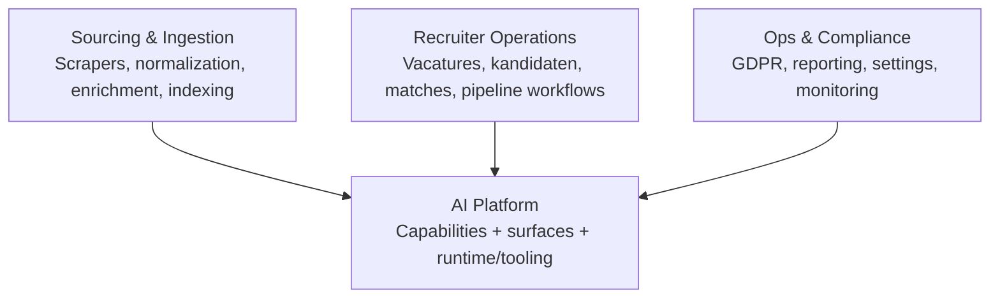

# Product boundary separation

## Problem Frame

Motian has partial technical separation, but not yet clear product boundaries. The repo already split some infrastructure into workspace packages such as `packages/db`, `packages/esco`, and `packages/scrapers`, yet the main web app, Trigger jobs, chat agent, MCP server, voice agent, and most domain services still evolve inside one broad product shape. That makes ownership fuzzy, causes cross-cutting changes, and makes it harder to decide what should be shared platform capability versus recruiter-product-specific logic.

The desired direction is to split Motian in phases across **domain boundaries, product boundaries, and runtime/apps**, with **shipping speed and ownership clarity** as the primary goal. The anchor boundary should be an **AI Platform** that is internal-first today but intentionally designed so it could become an external product later.

## Requirements

**Boundary model**
- R1. Motian must define explicit top-level product boundaries before further structural splitting.
- R2. The top-level boundaries must be: **AI Platform**, **Recruiter Operations**, **Sourcing & Ingestion**, and **Ops & Compliance**.
- R3. AI Platform must be treated as the anchor boundary around which the other product boundaries are organized.
- R4. The boundary split must happen in phases: first align domain ownership, then formalize product boundaries, then map those boundaries onto packages and runtimes/apps.
- R5. The first phase must produce a current-state domain-to-boundary ownership map for existing modules and runtimes before package moves or app extraction begin.

**AI Platform definition**
- R6. AI Platform must be a **full-stack platform boundary**, not only a tool registry or only a set of agent surfaces.
- R7. AI Platform must include shared capabilities, agent surfaces, and runtime/tooling needed to expose those capabilities consistently.
- R8. AI Platform must be treated as **internal-first, external-later**: it should serve Motian’s own products now without forcing immediate standalone commercial packaging.
- R9. Recruiter-facing flows that rely on AI must consume AI Platform through explicit contracts rather than reaching into AI internals ad hoc.
- R10. AI Platform ownership must be limited to reusable AI capabilities, agent surfaces, runtime/tooling, and intentionally platformized orchestration; domain workflows that merely use AI stay with their domain boundary unless explicitly promoted.

**Neighbor boundaries**
- R11. Recruiter Operations must own recruiter-product workflows and user-facing operating flows such as vacatures, kandidaten, matches, sollicitaties, interviews, berichten, and related cockpit behavior.
- R12. Sourcing & Ingestion must own ingestion workflows such as scrapers, normalization, enrichment, embeddings generation, and search indexing preparation.
- R13. AI Platform must consume ingestion outputs through explicit inputs and contracts rather than taking ownership of scraping or normalization internals.
- R14. Ops & Compliance must own horizontal product responsibilities such as GDPR operations, reporting, settings, observability/monitoring policy, and admin or governance flows.

**Contract and dependency rules**
- R15. Each top-level boundary must have an explicit statement of what it owns, what public contract it exposes, and what it is not allowed to depend on directly.
- R16. Shared logic must move behind boundary-owned contracts instead of remaining as incidental shared modules with unclear ownership.
- R17. Chat, MCP, voice, Trigger workflows, and related agent surfaces must be evaluated as part of the AI Platform boundary first, then assigned clear consuming or owning roles relative to the other boundaries.
- R18. Boundary design must optimize for smaller diffs, clearer ownership, and fewer cross-boundary edits for common product work.

**Migration posture**
- R19. The split must be incremental and must preserve current end-user behavior and Dutch route/API expectations while boundaries are being introduced.
- R20. Structural moves such as workspace packaging, runtime extraction, or app separation must follow the chosen product-boundary map instead of happening as isolated refactors.
- R21. The first migration deliverable must be a durable ownership map that can guide package extraction, runtime separation, and future team ownership.

## Success Criteria
- A reader can name the top-level product boundaries and explain why each exists.
- A reader can tell which current subsystems belong primarily to AI Platform versus Recruiter Operations, Sourcing & Ingestion, or Ops & Compliance.
- For any actively touched module, a primary owning boundary can be identified without debate.
- A reader can distinguish which boundary owns a capability versus which boundaries only consume that capability.
- There is an explicit current-state mapping of major repo areas and runtime surfaces to their provisional owning boundary.
- Future refactors can be judged against an explicit ownership model instead of taste or convenience.
- The resulting split direction reduces cross-cutting changes and clarifies which work should become shared platform capability.
- The first ownership map assigns a primary owning boundary to each major subsystem and makes it possible to reason about whether a common feature change should stay inside one boundary or cross a documented contract.
- The plan for packages and runtime/apps follows boundary decisions rather than inventing different seams later.
- A reader can distinguish AI runtime ownership from ingestion ownership and from ops/compliance governance ownership.

## Scope Boundaries
- This work does not require immediate extraction into separately deployed products.
- This work does not require immediate commercialization of AI Platform as a standalone offering.
- This work does not require a near-term standalone AI Platform SKU, pricing model, or external go-to-market motion.
- This work does not require standalone external API design, pricing, tenancy, or go-to-market assumptions for AI Platform in this phase.
- This work does not require rewriting existing flows before the boundary model is agreed.
- The near-term deliverable is an ownership map, contract map, and migration sequence rather than immediate code movement by itself.
- This work is about ownership and product seams first, not a full rebrand or front-end redesign.

## Key Decisions
- **AI Platform is the anchor boundary**: the split should orient around the platform that powers AI capabilities and surfaces, because the user wants that to become the most durable seam.
- **Internal-first, external-later**: the platform should be real enough to shape architecture now, but not over-productized before Motian proves the internal operating model.
- **Full-stack platform boundary**: capabilities, agent surfaces, and runtime/tooling belong together so the platform does not become an empty abstraction.
- **Four top-level product boundaries**: keeping Recruiter Operations, Sourcing & Ingestion, and Ops & Compliance next to AI Platform preserves clear neighbors instead of forcing everything under the platform.
- **Using AI does not equal AI Platform ownership**: domain flows can depend on platform capabilities without being reclassified as platform-owned product areas.
- **Ingestion is upstream, not platform-internal**: Sourcing & Ingestion owns data acquisition and preparation, while AI Platform owns the reusable AI capabilities and surfaces that consume that prepared data.
- **Ownership clarity over purity**: the primary optimization target is shipping speed and team ownership, not the most theoretically elegant domain decomposition.

## Dependencies / Assumptions
- Existing workspace packages (`packages/db`, `packages/esco`, `packages/scrapers`) are useful precedents but are not yet sufficient as a full product-boundary model.
- Current runtime surfaces in `app/`, `src/ai/`, `src/mcp/`, `src/voice-agent/`, `trigger/`, and `src/services/` will need remapping against the chosen boundaries.
- The split should preserve current external behavior while internal boundaries are introduced.

## Outstanding Questions

### Deferred to Planning
- [Affects R15][Technical] Should AI Platform contracts be package-level TypeScript APIs first, service interfaces first, or network/API contracts first?
- [Affects R17][Technical] Should Trigger tasks live with the owning domain boundary or be centralized under an AI Platform orchestration layer with domain-owned handlers?
- [Affects R20][Needs research] What is the safest migration order for moving code from `src/services/`, `src/ai/`, `src/mcp/`, `src/voice-agent/`, and `trigger/` into boundary-aligned packages or apps?
- [Affects R18][Needs research] Which current modules create the most cross-boundary churn and should therefore move first?

## Next Steps
→ `/prompts:ce-plan` for structured implementation planning
