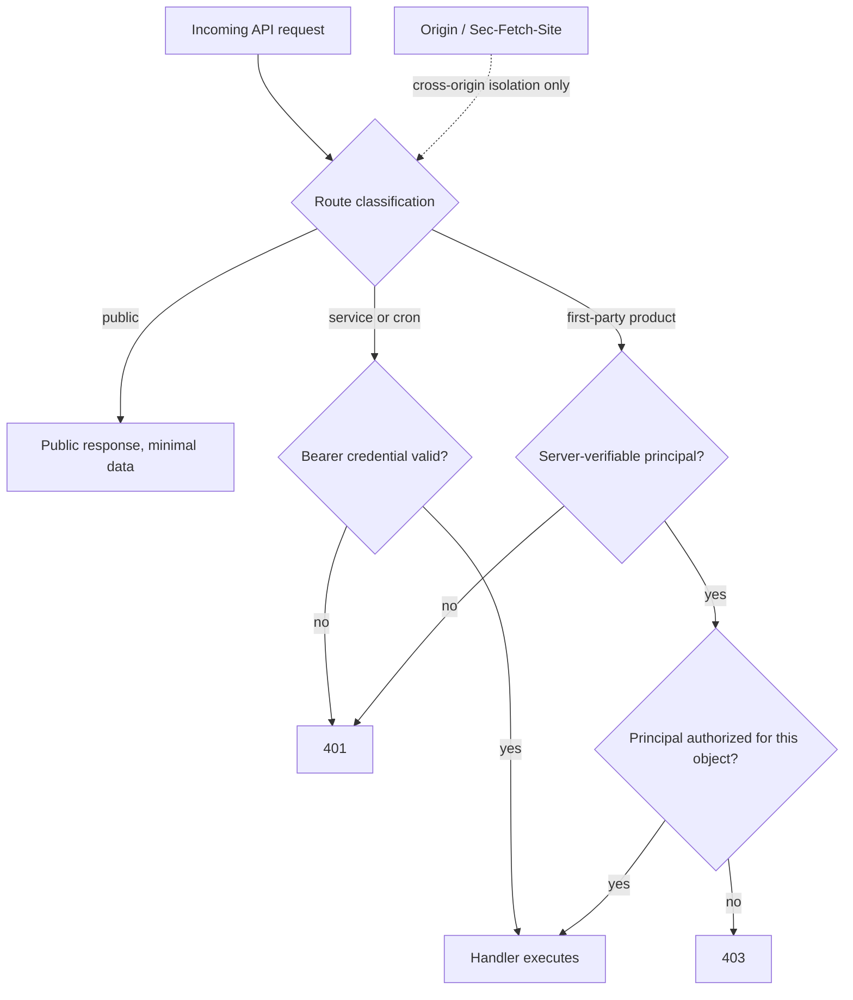

# API trust boundary hardening

## Summary

Motian's API boundary must move from browser-signal trust to a server-verifiable principal, stop leaking scraper credentials and internal failure detail, treat generated report content as untrusted, and restore verification gates that currently pass without enforcing anything. Dependency and workspace hygiene are folded in as bounded units because the same silent-drift failure mode produced several of these findings.

---

## Problem Frame

The platform holds candidate PII, private CV files, and scraper credentials for seven external platforms, and every recruiter surface reaches that data through `app/api`. Today the boundary is `proxy.ts`: routes on the first-party list are admitted when the request carries a same-origin `Sec-Fetch-Site` header, a matching `Origin`, or a `Host`-derived origin match. Those headers are set by browsers as a convenience, not as proof of identity, so any caller that can set request headers can present itself as first-party. The bearer-secret path behind that list is a single shared server secret, which cannot express "this caller may read this candidate."

The consequences fan out past authentication. `app/api/scraper-configuraties/route.ts` returns configuration rows under `Cache-Control: public, s-maxage=300`, so credential-adjacent config becomes shared-cache content. `app/api/cv-upload/route.ts` returns the raw internal error message to the client on failure, which surfaces blob-storage and AI-provider detail. `app/reports/[id]/page.tsx` hand-rolls markdown-to-HTML and injects the result with `dangerouslySetInnerHTML`, trusting that report generation is the only input path. `src/lib/markdown-fast.ts` publishes a local-fallback URL of `/api/reports/<id>`, but `app/api/reports/route.ts` has no dynamic segment and requires a `matchId` query parameter, so the fallback link cannot resolve — and the fallback store is an in-process `Map` that does not survive a serverless instance.

The verification layer that should have caught these is inert. `.github/workflows/ci.yml` runs `pnpm test:coverage` with every threshold overridden to `1`, so the committed floor in `vitest.config.ts` never applies in CI. Workspace packages under `packages/` carry no scripts of their own and `tsconfig.json` scoping leaves gaps, so package-local regressions can land without a typecheck. `packages/esco/package.json` pins `drizzle-orm` at `^0.38.4` while the root and `packages/db` are on `^0.45.2`, which means two ORM versions share one Neon connection path.

The cost shape is not a single exploit. It is that no gate in the repo currently distinguishes a hardened state from an unhardened one, so each fix decays back without a durable assertion.

---

## Key Decisions

**Identity is a server-verifiable principal; header signals are isolation only.** Browser-origin and `Sec-Fetch-Site` checks keep their role as cross-origin isolation, and they stop being an admission decision. A shared bearer secret remains acceptable for service, cron, and admin callers, and it must never reach browser code or stand in for per-candidate authorization.

**The route classification document is a ledger, not an audit artifact.** `docs/security/api-route-classification.md` already enumerates every route with a classification. It must stay accurate as routes change, because partial hardening is the failure mode this effort exists to prevent.

**Package updates are a bounded hygiene unit.** The scope is: remediate high and critical reachable runtime advisories, converge `drizzle-orm` on one version, and confirm pnpm configuration is read where it lives. A general "upgrade everything" sweep is not part of this work and would obscure which change caused which regression.

**Generated content is untrusted content.** Report markdown originates from database fields that hold candidate and vacancy free text. The renderer must escape or sanitize regardless of where the markdown was produced.

**Gates enforce the committed floor, in one place.** The threshold value lives in committed configuration. CI consumes it and does not pass its own override.

---

## Requirements

**Trust boundary and identity**

- R1. First-party API access must require a credential the caller cannot forge from request headers alone.
- R2. Browser-origin and fetch-metadata checks must serve cross-origin isolation only and must never be the sole basis for admitting a request.
- R3. Requests carrying a valid principal over a cookie-like credential must be protected against cross-site request forgery on unsafe methods.
- R4. Diagnostic endpoints must be unavailable to unauthenticated callers in production and must not return stack fragments, environment status, or schema inventory.
- R5. Every route under `app/api` must carry a current classification in `docs/security/api-route-classification.md`, and any route left unhardened must be named there with a reason and an owner.

**Candidate PII and CV handling**

- R6. Private CV access must be bound to a stored candidate or file record and to an authorized caller, not to possession of a URL.
- R7. The CV file path must reject caller-supplied storage URLs unless the server resolves them to a persisted record the caller may read.
- R8. CV uploads must be validated against file content structure before storage or parsing, not against client-supplied MIME type or extension.
- R9. CV failure responses must return a stable, client-safe message that does not expose storage-provider, AI-provider, or internal exception detail.
- R10. Work in this effort must not regress the CV upload validation and security changes currently in progress in the working tree.

**Scraper configuration and outbound fetches**

- R11. Scraper configuration responses must redact credential and credential-reference fields.
- R12. Scraper configuration responses must not be storable in shared or public caches.
- R13. Scraper target URLs must be validated when a configuration is saved and again immediately before the outbound fetch, rejecting internal, loopback, and link-local destinations.

**Report publishing and rendering**

- R14. A published report must be retrievable through the URL the publish path returns, in both the external-service and local-fallback cases, and the fallback must survive the instance that created it.
- R15. Report content must be escaped or sanitized before it reaches the rendered page, treating database-sourced free text as untrusted.

**Recruiter surface data paths**

- R16. The `/kandidaten` page must not serialize its skills-filter fetch ahead of its other server-side reads on a cache miss.
- R17. Job-detail rendering and candidate-embedding generation must each have behavioral test coverage that fails when the observable outcome changes, not only when structure changes.

**Verification gates and workspace hygiene**

- R18. CI must enforce the coverage floor from committed configuration and must not pass per-run threshold overrides.
- R19. Workspace packages under `packages/` must be covered by the same lint and typecheck gates as root source.
- R20. The existing project gates — lint, typecheck, Vitest, and the pre-PR harness — must continue to pass.

**Dependency hygiene**

- R21. High and critical reachable runtime advisories must be remediated, or recorded as a bounded residual carrying advisory ID, dependency chain, reachability, compensating control, owner, and revisit date.
- R22. pnpm package extensions, peer-dependency rules, and overrides must live where the installed pnpm version reads them, with no ignored-configuration warning on install.
- R23. `drizzle-orm` must resolve to a single version across the root package and all workspace packages.
- R24. Dependency changes beyond advisory remediation and version convergence are out of this effort's scope unless a listed requirement cannot be satisfied without them.

**Documentation accuracy**

- R25. `README.md` integration and API claims must match the shipped surface, with unshipped or removed integrations corrected rather than left aspirational.

---

## Acceptance Examples

- AE1. Forged first-party access
  - **Covers R1, R2.**
  - **Given:** A caller with no principal and no service credential.
  - **When:** It requests a candidate route with `Sec-Fetch-Site: same-origin` and no `Origin` header.
  - **Then:** The request is rejected, and the same request from the app's own browser session succeeds.

- AE2. Cross-tenant CV read
  - **Covers R6, R7.**
  - **Given:** An authenticated principal and a CV record belonging to a candidate that principal may not read.
  - **When:** It requests that CV by identifier, or by the raw storage URL.
  - **Then:** The response is 403 and no upstream storage fetch is issued.

- AE3. Spoofed upload
  - **Covers R8, R9.**
  - **Given:** A file named with a `.pdf` extension and a PDF MIME type whose bytes are plain text.
  - **When:** It is uploaded.
  - **Then:** It is rejected before storage and before parsing, with a Dutch client-safe message that names no provider or exception.

- AE4. Credential exposure through cache
  - **Covers R11, R12.**
  - **Given:** A scraper configuration holding a credential reference.
  - **When:** It is read through the configuration API.
  - **Then:** The credential fields are absent from the body, and the response is not marked publicly cacheable.

- AE5. Internal scrape target
  - **Covers R13.**
  - **Given:** A configuration whose base URL resolves to a loopback or link-local address.
  - **When:** It is saved, and separately when a scrape run reaches the fetch step.
  - **Then:** Both points reject it, so a target that became internal after being saved is still refused.

- AE6. Report link after fallback
  - **Covers R14.**
  - **Given:** Report publishing where the external service is unavailable.
  - **When:** A recruiter opens the URL the publish call returned, from a different server instance than the one that published it.
  - **Then:** The report renders.

- AE7. Injected report content
  - **Covers R15.**
  - **Given:** A candidate or vacancy field containing markup.
  - **When:** A report including that field is rendered.
  - **Then:** The markup appears as text and does not execute.

- AE8. Coverage regression
  - **Covers R18.**
  - **Given:** A branch whose coverage falls below the committed floor.
  - **When:** CI runs.
  - **Then:** The coverage job fails.

---

## Success Criteria

- Removing a header from a request, or omitting one, cannot grant access to any route classified as non-public.
- No response body in the hardened surface contains a provider name, exception message, stack fragment, or credential value.
- Each finding absorbed here has at least one test that fails if the fix is reverted; a hardened state is distinguishable from an unhardened one by running the suite.
- `pnpm audit --prod --audit-level high` is clean, or every remaining item has a durable residual record.
- A planning agent can sequence this work from these requirements without deciding what "authorized" means for a candidate record — that decision is either pinned below or listed as blocking.

---

## Scope Boundaries

### Deferred for later

- Multi-tenant role and permission modeling, if the product later needs recruiter-team or client-level authorization beyond the current single-operator deployment.
- Outcome-calibrated matching: scoring that learns from placement outcomes rather than rule weights.
- Provider-gated channel submission: submitting candidates to external channels behind per-provider policy gates.
- Source-quality intelligence: rating scrape sources by the quality of what they yield.
- Governed Autopilot remediation: letting Autopilot act on its findings under an approval policy.
- Low and moderate dependency advisories outside the high and critical reachable set.
- Drizzle migration journal reconciliation.

### Outside this effort's identity

- Reworking matching, search, or scoring behavior. The report-rendering requirement touches report output, not the scores it presents.
- Scraper architecture refactors or new platform adapters. R13 constrains target validation only.
- A general dependency upgrade sweep, per R24.
- UI redesign of CV download or report surfaces beyond what R6 and R14 require to keep the existing flows working.

---

## Dependencies and Assumptions

- The working tree already carries in-progress CV upload and security changes across `app/api/cv-upload/route.ts`, `src/lib/cv-upload.ts`, `proxy.ts`, and `tests/cv-upload-validation.test.ts`. R10 makes preserving that path a requirement rather than a merge accident.
- `docs/security/api-route-classification.md` is assumed accurate as of its generation. R5 treats keeping it accurate as ongoing work, not a one-time regeneration.
- The deployment model is assumed single-operator today. If that is wrong, R6 and R7 need tenant scoping and the answer changes the shape of the principal.
- Advisory remediation depends on upstream releases. R21 accepts a documented residual where no fixed version exists.

---

## Outstanding Questions

### Resolve before planning

- Which server-verifiable principal mechanism does R1 use? The candidates differ in migration surface: an HttpOnly session cookie changes every browser call site's assumptions, a server-side rendering path moves the calls off the browser entirely, and an external identity provider adds an operational dependency. Planning cannot sequence R1, R3, R6, or R7 without this.
- What does "authorized for this candidate" mean in the current deployment — any authenticated operator, or a narrower relationship? This determines whether R6 needs an ownership model or only an authentication check.
- What coverage floor value does R18 enforce? The committed default is 24 and CI currently overrides it to 1. Raising to the committed value may fail today, so the floor needs a number the branch can actually meet.

### Deferred to planning

- Whether R23 converges by raising `packages/esco` to the root version or by another route, and whether the ESCO code depends on behavior that changed between the two versions.
- Whether R14's fallback durability is met by a database-backed store, the existing report generation path, or removing the external-service integration entirely — which depends on whether markdown.fast is still an intended dependency.
- Whether R19 is satisfied by extending root lint and typecheck scope or by per-package scripts.
- Whether R4 removes the diagnostic route outside local development or retains it behind the principal from R1.

---

## Sources and Research

- `docs/plans/2026-06-14-001-fix-api-security-hardening-plan.md` — the prior hardening plan; its R1 through R8 are absorbed above and merged with the newer findings.
- `docs/security/api-route-classification.md` — full route inventory with current classifications; the ledger R5 refers to.
- `proxy.ts` — the first-party admission logic, the public path list, and the shared-secret bearer check.
- `app/api/cv-upload/route.ts` — the failure path that returns the internal error message to the client.
- `app/api/scraper-configuraties/route.ts` — the publicly cacheable configuration read.
- `src/services/scrapers.ts` — where a configuration base URL is persisted and passed toward scrape runs.
- `src/lib/markdown-fast.ts` and `app/api/reports/route.ts` — the local-fallback URL and the route that cannot serve it.
- `app/reports/[id]/page.tsx` — the hand-rolled markdown renderer and the unescaped injection point.
- `vitest.config.ts` and `.github/workflows/ci.yml` — the committed coverage floor and the CI override that bypasses it.
- `packages/esco/package.json`, `packages/db/package.json`, `package.json` — the split `drizzle-orm` versions.
- `app/kandidaten/page.tsx` and `app/kandidaten/data.ts` — the skills-filter read that runs before the page's other server-side fetches.
