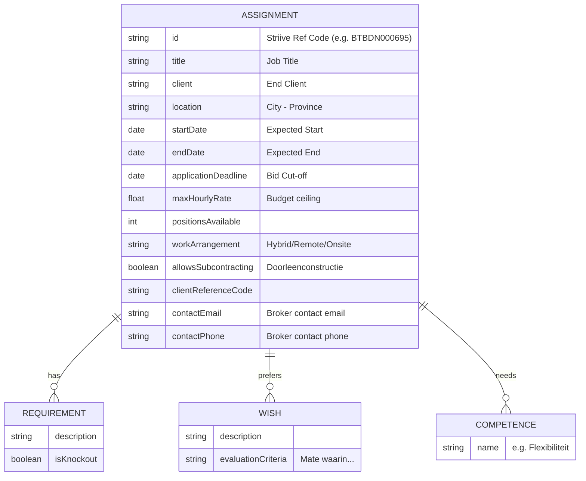

# Striive.com Data Extraction Schema

Based on reversing the Striive.com supplier dashboard and assignment (opdracht) details, here is the data we can extract for our recruitment use case.

## 🎯 Primary Entity: Assignment (Opdracht)

Striive acts as a Vendor Management System / Broker where clients post assignments. Suppliers (like Shaiinvest) can bid with their professionals.
The core entity to scrape is the **Assignment**.

### Data Fields Available for Extraction

| Field Name           | Description                           | Example / Type                                 |
| :------------------- | :------------------------------------ | :--------------------------------------------- |
| **Job Title**        | The role or function required         | `Junior Projectleider`, `Data Scientist`       |
| **Client**           | _Opdrachtgever_ - The end client      | `Belastingdienst Non -ICT`, `Rabobank`         |
| **Location**         | Where the job is based                | `Utrecht - Utrecht`, `Den Haag - Zuid-Holland` |
| **Start Date**       | _Startdatum_                          | `19 februari 2026`                             |
| **End Date**         | _Einddatum_                           | `31 december 2026`                             |
| **Deadline**         | _Reageren kan t/m_ - Cut-off for bids | `24 februari 2026`                             |
| **Max Hourly Rate**  | _Wat is het uurtarief?_               | `84.50`                                        |
| **Positions**        | _Aantal posities_ - Headcount         | `1`                                            |
| **Work Arrangement** | _Thuiswerken_ - Remote policy         | `Hybride`                                      |
| **Subcontracting**   | _Doorleenconstructie toegestaan_      | `Ja` / `Nee`                                   |
| **Contract Label**   | _Contractlabel_ - Broker name         | `Between`                                      |
| **Reference Code**   | _Referentiecode_ - Striive/Broker ID  | `BTBDN000695`                                  |
| **Client Ref Code**  | _Referentiecode opdrachtgever_        | `SRQ187726`                                    |
| **Contact Email**    | Broker/Recruiter Email                | `Shirley.Trouwen@between.com`                  |
| **Contact Phone**    | Broker/Recruiter Phone Number         | `+31645014935`                                 |

### Unstructured Text Data

1. **Requirements (Eisen)**
   - Hard requirements, often knock-out criteria.
   - Example: _"Kandidaat heeft minimaal 1 jaar werkervaring in de rol van junior Projectleider..."_
2. **Wishes (Wensen)**
   - Preferred qualifications for scoring.
   - Example: _"De mate waarin de aangeboden kandidaat ervaring heeft met..."_
3. **Competences (Competenties)**
   - Soft skills.
   - Examples: _Resultaatgerichtheid, Flexibiliteit, Plannen en organiseren_.
4. **Conditions (Voorwaarden)**
   - Legal/Compliance requirements (WKA, G-rekening, SNA-certificering).

---

## 🏗 Schema Visualization (Mermaid)

## 💡 Notes for Scraper Implementation

- **Authentication**: Striive requires an authenticated session (`supplier.striive.com`). The scraper should simulate login or reuse session cookies.
- **Pagination/Filters**: The assignment list `/dashboard/opdrachten` natively supports pagination and filtering by category/title.
- **Other Entities**: `Professionals` and `Biedingen` are tied to _our_ supplier account, containing our own candidates and ongoing bids. Scrape these only if we want to sync our Striive application state back to Dash TSG.
