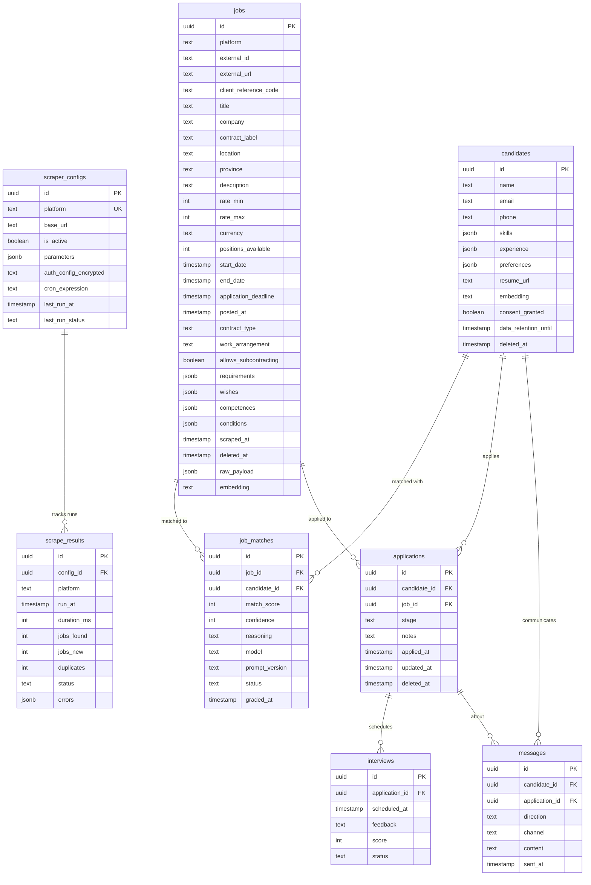

# feat: AI-Assisted Recruitment Operations Platform

## Overview

Build a full-stack recruitment operations platform that scrapes job listings from multiple Dutch freelance platforms (Striive, Indeed, LinkedIn), normalizes them into a unified model, and provides AI-powered candidate-job matching with a ChatGPT-style dark-theme UI.

**Stack:** Motia.dev (Steps framework) + Next.js 16 (App Router) + Drizzle ORM + Neon (PostgreSQL) + Stagehand/Browserbase + Firecrawl + Zod + Vitest + shadcn/ui + OpenAI Apps SDK UI

**Architecture:** Agent-Native (every UI action = API endpoint) + Event-Driven (Motia emit/subscribes) + Vertical Slices + TDD

**Language:** Dutch UI/logs/API paths, English code variables

## Problem Statement / Motivation

Recruitment operations for freelance/assignment-based hiring in the Netherlands currently require manually checking multiple platforms (Striive, Indeed, LinkedIn), copy-pasting job details, and maintaining spreadsheets. This platform automates the entire pipeline: ingestion, normalization, deduplication, AI-powered matching, and application tracking — all observable through a unified dashboard.

## Proposed Solution

Seven vertical slices, each delivering end-to-end functionality:

1. **Striive Scraper** — Authenticated browser scraping + normalize + dedup + DB
2. **Scraper Dashboard** — Config management + history + health monitoring
3. **Extra Platforms** — Indeed (public) + LinkedIn (authenticated)
4. **Next.js 16 UI** — ChatGPT-style interface for job discovery
5. **AI Matching** — Two-phase pgvector + LLM matching with human-in-the-loop
6. **Application Pipeline** — Full application lifecycle tracking
7. **Quality Harness** — Linting, testing, visual feedback tooling

## Technical Approach

### Architecture

```
Motia Steps (Event-Driven Backend)
  ├── CronConfig steps (scheduled scraping)
  ├── EventConfig steps (normalize, grade, record)
  └── ApiRouteConfig steps (REST endpoints)
        ↓
Next.js 16 App Router (Frontend)
  ├── Server Components (data fetching via Motia API)
  ├── shadcn/ui + OpenAI Apps SDK UI (ChatGPT design)
  └── ISR with cache tags (event-driven revalidation)
        ↓
Neon PostgreSQL (Persistence)
  ├── Drizzle ORM (schema + queries)
  ├── pgvector (embedding search)
  ├── tsvector (Dutch full-text search)
  └── pg_trgm (fuzzy search)
```

### Event Topology

```
MasterScrape (cron: 0 */4 * * *)
  └─ emits: platform.scrape
       ├─ ScrapeStriive (filter: striive) ─┐
       ├─ ScrapeIndeed (filter: indeed)  ──┤
       └─ ScrapeLinkedIn (filter: linkedin)┤
                                            └─ all emit: jobs.normalize
                                                 └─ NormalizeJobs
                                                      └─ emits: scrape.completed
                                                           ├─ RecordScrapeResult
                                                           ├─ RevalidateCache
                                                           └─ EmbedJobs (Slice 5)
```

### Key Design Decisions

| Decision | Rationale |
|----------|-----------|
| Motia Steps as microservices | Each step is auto-discovered, independently testable, event-coupled |
| Upsert (onConflictDoUpdate) | Keeps job data current + revives soft-deleted jobs |
| Two-phase AI matching | pgvector retrieve (fast, cheap) → LLM rerank (deep, expensive) |
| Event-driven ISR | Cache tags invalidated by scrape.completed — instant fresh data |
| Dutch full-text search | `to_tsvector('dutch', ...)` with stemming for NL job titles |
| Exponential backoff + jitter | Prevents thundering herd on Browserbase rate limits |
| Agent-Native parity | Every UI action backed by API endpoint (PATCH config, PATCH match) |

### ERD



## Implementation Phases

### Phase 1: Foundation — Striive Scraper + DB (Slice 1)

The foundation: authenticated scraping, unified schema, dedup, and the full Motia event pipeline.

**Prerequisites:** Neon account, Browserbase account, Striive supplier credentials

#### Tasks

- [x] **1.1 Project scaffold** — `npx motia@latest create`, install deps with pnpm
  - `package.json` (pnpm)
  - `.env` with DATABASE_URL, BROWSERBASE_API_KEY, BROWSERBASE_PROJECT_ID, STRIIVE_USERNAME, STRIIVE_PASSWORD, ENCRYPTION_KEY
  - `.gitignore` (node_modules, .env, drizzle/)
  - `drizzle.config.ts`

- [x] **1.2 Database schema** — Drizzle + Neon
  - `src/db/schema.ts` — `jobs` table with 28 columns (Striive data model), composite indexes
  - `src/db/index.ts` — Connection pool (max:10, idle:30s, timeout:5s)
  - Run `drizzle-kit generate` + `drizzle-kit push`

- [x] **1.3 Unified Zod schema** — Cross-platform validation
  - `src/schemas/job.ts` — `unifiedJobSchema` with structured requirements (union types), `extractProvince()` helper
  - Supports both `string[]` (Indeed) and `{description, isKnockout}[]` (Striive) requirements

- [x] **1.4 TDD: Schema tests** (RED → GREEN → REFACTOR)
  - `tests/job-schema.test.ts` — Full Striive test case, simple Indeed case, date coercion, province extraction, default arrays

- [x] **1.5 Master Scrape cron step**
  - `steps/scraper/master-scrape.step.ts` — CronConfig, emits `platform.scrape`

- [x] **1.6 Striive scraper step** — Authenticated via Stagehand
  - `steps/scraper/platforms/striive.step.ts` — EventConfig, subscribes `platform.scrape`, emits `jobs.normalize`
  - Login flow via Stagehand act()
  - Paginated extraction (MAX_PAGES=5, "Volgende" button detection)
  - Exponential backoff with jitter (MAX_RETRIES=2)
  - Province enrichment before emit
  - Always-emit pattern (empty listings on total failure)

- [x] **1.7 Normalize + dedup step**
  - `steps/jobs/normalize.step.ts` — EventConfig, subscribes `jobs.normalize`, emits `scrape.completed`
  - Zod validation → batch upsert (50 rows) → `onConflictDoUpdate` with all 28 fields
  - Soft-delete revival (`deletedAt: null`)
  - Metrics: jobsNew, duplicates, errors, durationMs, status (success/partial/failed)

- [x] **1.8 Integration test** — Manual trigger via Motia Workbench
  - Verify flow: MasterScrape → ScrapeStriive → NormalizeJobs
  - Check Neon DB for job rows
  - Verify dedup on re-run

**Acceptance Criteria:**
- [x] `pnpm test` passes all schema tests
- [ ] Manual trigger in Workbench produces jobs in Neon DB
- [ ] Re-run deduplicates (no duplicate rows for same externalId)
- [ ] Failed scrapes still emit `scrape.completed` with status="failed"
- [ ] Striive login + multi-page extraction works end-to-end

**Files created:**
- `drizzle.config.ts`
- `src/db/schema.ts`
- `src/db/index.ts`
- `src/schemas/job.ts`
- `src/lib/helpers.ts`
- `steps/scraper/master-scrape.step.ts`
- `steps/scraper/platforms/striive.step.ts`
- `steps/jobs/normalize.step.ts`
- `tests/job-schema.test.ts`

---

### Phase 2: Scraper Operations (Slice 2)

Admin dashboard backend: config management, scrape history, health monitoring, cache revalidation.

**Prerequisites:** Phase 1 complete

#### Tasks

- [ ] **2.1 scraper_configs + scrape_results tables**
  - Add to `src/db/schema.ts` — scraperConfigs (platform UK, authConfig encrypted, cronExpression), scrapeResults (configId FK SET NULL, durationMs, status, errors JSON)
  - Run migration

- [ ] **2.2 RecordScrapeResult step**
  - `steps/jobs/record-scrape-result.step.ts` — subscribes `scrape.completed`, writes to scrape_results, updates scraperConfigs.lastRunAt/lastRunStatus

- [ ] **2.3 RevalidateCache step**
  - `steps/jobs/revalidate-cache.step.ts` — subscribes `scrape.completed`, calls Next.js revalidateTag for `jobs`, `scrape-results`, `scraper-configs`
  - Fire-and-forget (never blocks pipeline)

- [ ] **2.4 API: GET /api/scraper-configuraties**
  - `steps/api/scraper-configs.step.ts`

- [ ] **2.5 API: PATCH /api/scraper-configuraties/:id**
  - `steps/api/scraper-config-update.step.ts` — Toggle isActive, update cronExpression, parameters

- [ ] **2.6 API: POST /api/scrape/starten**
  - `steps/api/trigger-scrape.step.ts` — Manual trigger, emits `platform.scrape`

- [ ] **2.7 API: GET /api/scrape-resultaten**
  - `steps/api/scrape-history.step.ts` — Last 50 results ordered by runAt

- [ ] **2.8 API: GET /api/gezondheid**
  - `steps/api/gezondheid.step.ts` — Per-platform status + 24h failure rate

- [ ] **2.9 Update MasterScrape** to load configs from DB
  - Modify `steps/scraper/master-scrape.step.ts` — query scraperConfigs where isActive=true

- [ ] **2.10 Seed scraper config** for Striive
  - Insert initial scraperConfigs row for Striive platform

**Acceptance Criteria:**
- [ ] All 5 API endpoints return correct data
- [ ] PATCH toggle actually prevents scraping on next cron run
- [ ] Manual trigger via POST works end-to-end
- [ ] ScrapeResults recorded for every run (success and failure)
- [ ] Health endpoint shows "waarschuwing" when >3 failures in 24h

**Files created:**
- `steps/jobs/record-scrape-result.step.ts`
- `steps/jobs/revalidate-cache.step.ts`
- `steps/api/scraper-configs.step.ts`
- `steps/api/scraper-config-update.step.ts`
- `steps/api/trigger-scrape.step.ts`
- `steps/api/scrape-history.step.ts`
- `steps/api/gezondheid.step.ts`

**Files modified:**
- `src/db/schema.ts` (add scraperConfigs, scrapeResults)
- `steps/scraper/master-scrape.step.ts` (load from DB)

---

### Phase 3: Multi-Platform Scrapers (Slice 3)

Prove the adapter pattern works with public (Firecrawl) and additional authenticated (Stagehand) scrapers.

**Prerequisites:** Phase 2 complete, Firecrawl API key

#### Tasks

- [ ] **3.1 Indeed scraper step** (public, Firecrawl)
  - `steps/scraper/platforms/indeed.step.ts` — subscribes `platform.scrape`, filters platform==="indeed"
  - Firecrawl client inside handler (not module scope)
  - Exponential backoff + jitter (MAX_RETRIES=2)
  - Always-emit on total failure

- [ ] **3.2 LinkedIn scraper step** (authenticated, Stagehand)
  - `steps/scraper/platforms/linkedin.step.ts` — subscribes `platform.scrape`, filters platform==="linkedin"
  - Stagehand extraction with Zod schema

- [ ] **3.3 Seed scraper configs** for Indeed + LinkedIn
  - Insert scraperConfigs rows with platform-specific baseUrl and parameters

- [ ] **3.4 Contract tests** for each adapter
  - `tests/indeed-adapter.test.ts` — Schema validation against sample Indeed data
  - `tests/linkedin-adapter.test.ts` — Schema validation against sample LinkedIn data

- [ ] **3.5 HTML fixture tests** (offline scraper testing)
  - `tests/fixtures/striive/page1.html` — Saved HTML snapshot
  - `tests/striive-extract-fixture.test.ts` — Test extraction against saved HTML (no network)

**Acceptance Criteria:**
- [ ] Adding a new platform = new step file + config row (zero core changes)
- [ ] Indeed scrape produces normalized jobs in same jobs table
- [ ] Platform isolation: Striive failure doesn't affect Indeed scrape
- [ ] Contract tests pass for all adapters
- [ ] Fixture tests work offline

**Files created:**
- `steps/scraper/platforms/indeed.step.ts`
- `steps/scraper/platforms/linkedin.step.ts`
- `tests/indeed-adapter.test.ts`
- `tests/linkedin-adapter.test.ts`
- `tests/fixtures/striive/page1.html`
- `tests/fixtures/indeed/search-results.html`
- `tests/striive-extract-fixture.test.ts`

---

### Phase 4: Next.js 16 UI (Slice 4)

ChatGPT-style dark-theme interface for job discovery and scraper management.

**Prerequisites:** Phase 2 complete (API endpoints exist)

#### Tasks

- [ ] **4.1 Next.js 16 setup**
  - Install next@latest, react@latest, tailwindcss, postcss
  - `npx shadcn-ui@latest init` (New York style, Zinc palette)
  - Install shadcn components: button, card, input, badge, table, dialog, command, sheet, separator, skeleton, switch, tabs, scroll-area

- [ ] **4.2 Design system: globals.css**
  - `app/globals.css` — ChatGPT color tokens (dark: #212121/#2f2f2f/#424242, light: #ffffff/#f7f7f8/#ededed), OpenAI typography scale, status colors (success/partial/failed)

- [ ] **4.3 Root layout + sidebar**
  - `app/layout.tsx` — ThemeProvider (dark default), flex layout with sidebar
  - `app/components/sidebar.tsx` — ChatGPT-style navigation (Dashboard, Opdrachten, Scraper, Kandidaten, Matches, Sollicitaties)
  - `app/components/theme-provider.tsx` — Dark/light toggle

- [ ] **4.4 Opdrachten page** (Server Component)
  - `app/opdrachten/page.tsx` — Search input, platform filter, job cards with title/company/location/rate/requirements badges
  - Fetch from Motia API with cache tags: `{ next: { tags: ["jobs"], revalidate: 14400 } }`

- [ ] **4.5 Opdracht detail page**
  - `app/opdrachten/[id]/page.tsx` — Full job details with structured requirements, wishes, competences, conditions sections

- [ ] **4.6 Scraper dashboard page**
  - `app/scraper/page.tsx` — Platform config cards (with Switch toggle), "Alles Scrapen" button, scrape history table
  - `app/scraper/components/scraper-config-card.tsx`
  - `app/scraper/components/scrape-history-table.tsx`

- [ ] **4.7 Revalidation API route**
  - `app/api/revalidate/route.ts` — Receives tag parameter, calls `revalidateTag()`

- [ ] **4.8 Shared components**
  - `app/components/platform-badge.tsx` — Striive/Indeed/LinkedIn badges
  - `app/components/status-indicator.tsx` — Success/partial/failed dots
  - `app/components/job-card.tsx` — Reusable job card
  - `app/components/search-command.tsx` — Cmd+K search dialog

- [ ] **4.9 Storybook + Agentation setup**
  - `npx storybook@latest init`
  - `npx agentation init`
  - Stories for key components (job-card, platform-badge, status-indicator)

**Acceptance Criteria:**
- [ ] Dark theme matches ChatGPT aesthetic (visual review)
- [ ] Opdrachten page loads with < 200ms TTFB (ISR cached)
- [ ] Search uses Dutch full-text search (not ILIKE)
- [ ] Scraper Switch toggle calls PATCH API
- [ ] "Nu Scrapen" button calls POST /api/scrape/starten
- [ ] Cache invalidates when new jobs arrive (event-driven)
- [ ] All components have Storybook stories

**Files created:**
- `app/layout.tsx`
- `app/globals.css`
- `app/page.tsx`
- `app/opdrachten/page.tsx`
- `app/opdrachten/[id]/page.tsx`
- `app/scraper/page.tsx`
- `app/scraper/components/scraper-config-card.tsx`
- `app/scraper/components/scrape-history-table.tsx`
- `app/api/revalidate/route.ts`
- `app/components/sidebar.tsx`
- `app/components/theme-provider.tsx`
- `app/components/platform-badge.tsx`
- `app/components/status-indicator.tsx`
- `app/components/job-card.tsx`
- `app/components/search-command.tsx`
- `components.json` (shadcn config)
- `.storybook/main.ts`
- `stories/*.stories.tsx`

---

### Phase 5: AI Matching (Slice 5)

Two-phase matching pipeline: pgvector similarity search → LLM reranking with human review.

**Prerequisites:** Phase 1 complete, LLM API access (Claude/GPT)

#### Tasks

- [ ] **5.1 PostgreSQL extensions**
  - Enable `pgvector` and `pg_trgm` in Neon dashboard
  - Run migration SQL for tsvector + trigram + vector indexes

- [ ] **5.2 Candidates + job_matches tables**
  - Add to `src/db/schema.ts` — candidates (GDPR fields: consentGranted, dataRetentionUntil), jobMatches (confidence, model, promptVersion, status)
  - Run migration

- [ ] **5.3 Candidate API endpoints**
  - `steps/api/candidates.step.ts` — GET (list) + POST (create)

- [ ] **5.4 EmbedJobs step**
  - `steps/jobs/embed-jobs.step.ts` — subscribes `scrape.completed`, generates embeddings for new/updated jobs using LLM embedding API

- [ ] **5.5 EmbedCandidate step**
  - `steps/candidates/embed-candidate.step.ts` — subscribes `candidate.updated`, generates candidate profile embedding

- [ ] **5.6 RetrieveMatches step**
  - `steps/matching/retrieve-matches.step.ts` — subscribes `matches.retrieve`, pgvector cosine similarity → top 50

- [ ] **5.7 GradeJob step** (LLM reranking)
  - `steps/jobs/grade.step.ts` — subscribes `jobs.grade`, LLM grading with score/confidence/reasoning, stores in jobMatches with model+promptVersion

- [ ] **5.8 Match review API**
  - `steps/api/matches.step.ts` — GET /api/matches (list)
  - `steps/api/match-review.step.ts` — PATCH /api/matches/:id (approve/reject)

- [ ] **5.9 Matches UI page**
  - `app/matches/page.tsx` — Match cards with score, reasoning, approve/reject buttons
  - `app/kandidaten/page.tsx` — Candidate management

- [ ] **5.10 Matching tests**
  - `tests/matching.test.ts` — Unit tests for embedding generation, similarity scoring

**Acceptance Criteria:**
- [ ] Vector search returns top 50 in < 50ms
- [ ] LLM grades include reasoning, confidence, model, and prompt version
- [ ] Recruiters can approve/reject matches via PATCH endpoint
- [ ] Candidates have GDPR fields (consent, retention)
- [ ] Match status transitions: pending → approved/rejected

**Files created:**
- `steps/api/candidates.step.ts`
- `steps/jobs/embed-jobs.step.ts`
- `steps/candidates/embed-candidate.step.ts`
- `steps/matching/retrieve-matches.step.ts`
- `steps/jobs/grade.step.ts`
- `steps/api/matches.step.ts`
- `steps/api/match-review.step.ts`
- `app/matches/page.tsx`
- `app/kandidaten/page.tsx`
- `tests/matching.test.ts`

**Files modified:**
- `src/db/schema.ts` (add candidates, jobMatches)

---

### Phase 6: Application Pipeline (Slice 6)

Full application lifecycle from candidate submission to placement.

**Prerequisites:** Phase 5 complete

#### Tasks

- [ ] **6.1 Applications + interviews + messages tables**
  - Add to `src/db/schema.ts` — applications (stage enum, soft-delete), interviews (scheduled/completed/cancelled), messages (inbound/outbound, email/phone/platform)
  - Run migration

- [ ] **6.2 Application API endpoints**
  - `steps/api/applications.step.ts` — GET (list) + POST (create)
  - `steps/api/application-detail.step.ts` — GET /:id + PATCH (update stage)

- [ ] **6.3 Interview API endpoints**
  - `steps/api/interviews.step.ts` — GET + POST + PATCH

- [ ] **6.4 Stage change event step**
  - `steps/pipeline/stage-change.step.ts` — subscribes `application.stage.changed`, audit logging, notifications

- [ ] **6.5 Sollicitaties UI page**
  - `app/sollicitaties/page.tsx` — Pipeline kanban or table view with stage columns

- [ ] **6.6 Pipeline tests**
  - `tests/pipeline.test.ts` — Stage transition validation, FK constraint tests

**Acceptance Criteria:**
- [ ] Applications track full lifecycle: applied → screening → interview → offer → placed/rejected
- [ ] Stage changes emit events for audit trail
- [ ] FK constraints prevent orphaned records (ON DELETE RESTRICT)
- [ ] Messages linked to both candidate and application

**Files created:**
- `steps/api/applications.step.ts`
- `steps/api/application-detail.step.ts`
- `steps/api/interviews.step.ts`
- `steps/pipeline/stage-change.step.ts`
- `app/sollicitaties/page.tsx`
- `tests/pipeline.test.ts`

**Files modified:**
- `src/db/schema.ts` (add applications, interviews, messages)

---

### Phase 7: Quality Harness (Slice 7)

The "harness" that makes both human and AI development reliable.

**Prerequisites:** Can run at any point (parallel with other phases)

#### Tasks

- [ ] **7.1 Ultracite setup**
  - `npx ultracite@latest init --agents claude`
  - Generates `biome.json` + CLAUDE.md linting rules

- [ ] **7.2 Qlty CLI setup**
  - `curl https://qlty.sh | sh && qlty init && qlty githooks install`
  - Pre-commit: `qlty fmt`, Pre-push: `qlty check`
  - `.qlty/qlty.toml`

- [ ] **7.3 CLAUDE.md quality rules**
  - Add quality rules to project CLAUDE.md: qlty fmt, qlty check, pnpm test, language rules, agent-native rules

- [ ] **7.4 Agentation self-driving critique**
  - Configure `npx agentation critique` for automated UI feedback

**Acceptance Criteria:**
- [ ] Pre-commit hook auto-formats code
- [ ] Pre-push hook blocks unclean code
- [ ] `pnpm test` runs all Vitest tests
- [ ] CLAUDE.md contains agent-native and NL language rules

**Files created/modified:**
- `biome.json` (auto-generated)
- `.qlty/qlty.toml` (auto-generated)
- `CLAUDE.md` (quality rules section)

---

## Alternative Approaches Considered

| Approach | Why Rejected |
|----------|-------------|
| ScrapeRun orchestration entity | Over-engineering for MVP; Motia's event tracing provides sufficient observability |
| Dead-letter queue | Unnecessary with always-emit pattern — failed runs are recorded as ScrapeResults with status="failed" |
| Scrape artifacts (HTML snapshots in DB) | Expensive storage; rawPayload + fixture tests provide sufficient debugging |
| Single-pass LLM matching (O(N*M)) | Astronomically expensive; two-phase (vector + rerank) is 10-100x cheaper |
| Global unique on externalUrl | Too restrictive — URLs are platform-specific; platform-scoped uniqueness is correct |

## Dependencies & Prerequisites

| Dependency | Required For | Free Tier? |
|------------|-------------|------------|
| Neon (PostgreSQL) | All phases | Yes (10 connections, 512MB) |
| Browserbase | Phase 1, 3 (authenticated scraping) | Yes (limited sessions) |
| Striive supplier account | Phase 1 | N/A (requires company) |
| Firecrawl | Phase 3 (public scraping) | Yes (500 pages/month) |
| LLM API (Claude/GPT) | Phase 5 (AI matching) | No (pay per token) |
| ElevenLabs or similar | Phase 5 (embeddings) | Varies |

## Risk Analysis & Mitigation

| Risk | Impact | Mitigation |
|------|--------|------------|
| Striive changes login flow | Phase 1 blocked | Stagehand AI-act adapts to UI changes; fixture tests detect drift |
| Browserbase rate limits | Slow scraping | Exponential backoff + jitter; concurrency limits in MasterScrape |
| Neon connection limits (10) | DB errors under load | Connection pooling (max:10, idle:30s); consider serverless driver for prod |
| pgvector not available on Neon free | Phase 5 blocked | Neon supports pgvector on all plans; verify in dashboard before Phase 5 |
| LLM cost explosion | Phase 5 expensive | Two-phase matching limits LLM calls to top-50; batch embedding generation |
| Striive anti-bot detection | Scraping blocked | Session caching in Stagehand; proxy rotation if needed |

## Success Metrics

| Metric | Target |
|--------|--------|
| Scrape success rate | > 95% (measured via ScrapeResults) |
| Dedup accuracy | 0 duplicate jobs after repeated runs |
| Search latency (p95) | < 300ms (Dutch full-text search) |
| Page load (TTFB) | < 200ms (ISR cached) |
| AI match relevance | > 80% recruiter approval rate |
| New platform onboarding | < 2h (step file + config row) |

## Quality Gates

- [ ] All Vitest tests pass (`pnpm test`)
- [ ] Qlty check clean (`qlty check --fix --level=low`)
- [ ] Biome formatting clean (`qlty fmt`)
- [ ] Contract test exists for every scraper adapter
- [ ] Agent-native: every UI action has API endpoint
- [ ] No hardcoded credentials anywhere
- [ ] Dutch text in all UI, logs, API responses

## API Contract Summary

| Endpoint | Method | Phase | Description |
|----------|--------|-------|-------------|
| `/api/opdrachten` | GET | 4 | Search jobs (zoek, platform, pagina, limiet) |
| `/api/opdrachten/:id` | GET | 4 | Job detail |
| `/api/scraper-configuraties` | GET | 2 | List scraper configs |
| `/api/scraper-configuraties/:id` | PATCH | 2 | Update config (toggle, params) |
| `/api/scrape/starten` | POST | 2 | Manual scrape trigger |
| `/api/scrape-resultaten` | GET | 2 | Scrape history (last 50) |
| `/api/gezondheid` | GET | 2 | Health + failure rate |
| `/api/kandidaten` | GET/POST | 5 | Candidate CRUD |
| `/api/matches` | GET | 5 | Match results |
| `/api/matches/:id` | PATCH | 5 | Approve/reject match |
| `/api/sollicitaties` | GET/POST | 6 | Application CRUD |
| `/api/revalidate` | POST | 4 | Cache tag invalidation (internal) |

## References & Research

### Internal References
- Brainstorm: `docs/brainstorms/2026-02-21-recruitment-platform-brainstorm.md` (2500+ lines, 5+ review rounds)
- PRD: `docs/brainstorms/PRD.md` (v2.0, tech-agnostic)
- Striive schema: `docs/brainstorms/striive-scraping-schema.md` (reverse-engineered)
- GPT revisions: `docs/brainstorms/gpt-revisions.md`
- Gemini revisions: `docs/brainstorms/2026-02-21-recruitment-platform-revisions-gemini.md`

### External References
- Motia.dev documentation: https://motia.dev/docs
- Drizzle ORM: https://orm.drizzle.team
- Stagehand (Browserbase): https://docs.browserbase.com/integrations/stagehand
- Neon PostgreSQL: https://neon.tech/docs
- shadcn/ui: https://ui.shadcn.com
- OpenAI Apps SDK UI: https://openai.github.io/apps-sdk-ui/
- pgvector: https://github.com/pgvector/pgvector
- Ultracite: https://ultracite.dev
- Qlty CLI: https://qlty.sh

### Architectural Inspiration
- OpenAI Harness Engineering: https://openai.com/index/harness-engineering/
- Agent-Native Architecture: https://every.to/chain-of-thought/agent-native-architectures-how-to-build-apps-after-the-end-of-code
