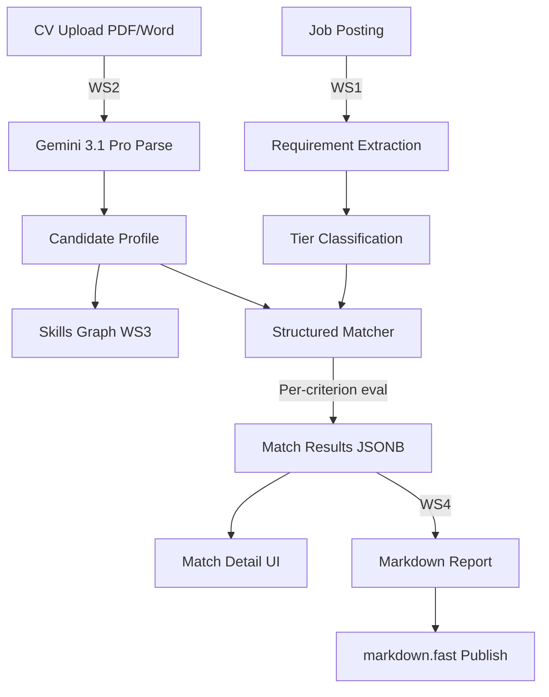
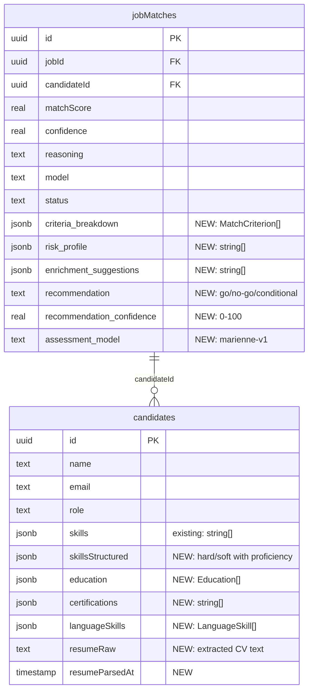

# Candidate Intelligence & Structured Matching

## Overview

Upgrade Motian's matching engine from a single numeric score to a **Mariënne-style 6-phase structured evaluation** powered by Gemini 3.1 Pro. Add CV drag-and-drop upload via a persistent sidebar, skills visualization (radar chart + tag cloud), and match report publishing via markdown.fast.

Four parallel workstreams executed via agent swarm:
- **WS1:** Structured matching pipeline (LLM-powered per-criterion evaluation)
- **WS2:** CV upload sidebar with AI parsing
- **WS3:** Skills graph visualization (radar + tags)
- **WS4:** Markdown.fast report integration

## Problem Statement / Motivation

**Current state:** Matching produces a single `matchScore: 78` with flat `reasoning` text. Recruiters can't see WHY a candidate matches, which criteria are met vs missed, or what risks exist. The scoring is 60% rule-based substring matching + 40% vector similarity — no semantic understanding of requirements.

**Target state:** Per-criterion evaluation with evidence from the CV, tiered requirement classification (knock-out / gunningscriteria / process), risk profiling, enrichment suggestions, and a go/no-go recommendation. Recruiters see structured, auditable match assessments suitable for government tenders.

**Why Gemini 3.1 Pro:** Released Feb 19 2026. 1M token context window can ingest a full CV PDF (up to 900 pages) + job posting in a single call. Native PDF processing eliminates the need for separate document parsing. 77.1% ARC-AGI-2 score enables nuanced evidence-based reasoning. Structured output via `generateObject()` ensures type-safe results.

## Technical Approach

### Architecture



### Model Choice

| Aspect | Current (Gemini 2.5 Flash Lite) | New (Gemini 3.1 Pro) |
|--------|--------------------------------|----------------------|
| Context window | 32K tokens | 1M tokens |
| Output limit | 8K tokens | 65K tokens |
| PDF processing | No (text only) | Native (up to 900 pages) |
| Reasoning | Basic extraction | Advanced reasoning (ARC-AGI-2: 77.1%) |
| Use case | Job description enrichment | Full CV analysis + structured matching |
| Model ID | `gemini-2.5-flash-lite` | `gemini-3.1-pro` |

**Cost management:** Use Gemini 3.1 Pro for detailed structured matching (per-candidate evaluation). Keep Gemini 2.5 Flash Lite for bulk job enrichment (unchanged). Keep rule-based + embedding scoring as fast pre-filter.

### Implementation Phases

All four workstreams execute in **parallel via agent swarm**. Dependencies between workstreams are managed via shared interfaces (Zod schemas).

---

## WS1: Structured Matching Pipeline

### Phase 1.1: Schema Extension

**File:** `src/db/schema.ts`

Add JSONB columns to `jobMatches`:

```typescript
// New columns on jobMatches table
criteriaBreakdown: jsonb("criteria_breakdown"),    // MatchCriterion[]
riskProfile: jsonb("risk_profile"),                // string[]
enrichmentSuggestions: jsonb("enrichment_suggestions"), // string[]
recommendation: text("recommendation"),             // "go" | "no-go" | "conditional"
recommendationConfidence: real("recommendation_confidence"), // 0-100
assessmentModel: text("assessment_model"),          // "marienne-v1"
```

**File:** `src/db/schema.ts` — candidates table extension:

```typescript
// New columns on candidates table
resumeRaw: text("resume_raw"),                     // Raw extracted CV text
resumeParsedAt: timestamp("resume_parsed_at"),
skillsStructured: jsonb("skills_structured"),      // StructuredSkills
education: jsonb("education"),                     // Education[]
certifications: jsonb("certifications"),           // string[]
languageSkills: jsonb("language_skills"),           // LanguageSkill[]
```

**Migration:** `pnpm db:generate` then `pnpm db:push`

### Phase 1.2: Zod Schemas for Structured Output

**New file:** `src/schemas/matching.ts`

```typescript
// Criterion tiers
const tierSchema = z.enum(["knockout", "gunning", "process"]);

// Single criterion evaluation result
const criterionResultSchema = z.object({
  criterion: z.string().describe("The requirement text from the job posting"),
  tier: tierSchema,
  passed: z.boolean().nullable().describe("For knockout: true/false. For gunning/process: null"),
  stars: z.number().min(1).max(5).nullable().describe("For gunning: 1-5 stars. For knockout/process: null"),
  evidence: z.string().describe("Specific evidence from the CV supporting the assessment"),
  confidence: z.enum(["high", "medium", "low"]),
});

// Full structured match output
const structuredMatchOutputSchema = z.object({
  criteriaBreakdown: z.array(criterionResultSchema),
  overallScore: z.number().min(0).max(100),
  knockoutsPassed: z.boolean().describe("True if ALL knockout criteria are met"),
  riskProfile: z.array(z.string()).describe("List of risk flags"),
  enrichmentSuggestions: z.array(z.string()).describe("Suggestions to strengthen the match"),
  recommendation: z.enum(["go", "no-go", "conditional"]),
  recommendationReasoning: z.string().describe("2-3 sentence summary of the recommendation"),
  recommendationConfidence: z.number().min(0).max(100),
});
```

### Phase 1.3: Requirement Extraction Service

**New file:** `src/services/requirement-extraction.ts`

Uses Gemini 3.1 Pro to extract and classify job requirements:

```typescript
// Input: job record (title, description, requirements[], wishes[], competences[])
// Output: ClassifiedRequirement[] with tier assignments
// Uses: generateObject() with requirementExtractionSchema
// Model: google("gemini-3.1-pro")
// System prompt: Dutch, extract from job posting, classify into knockout/gunning/process
```

**Tier classification rules (in system prompt):**
- **Knockout:** Hard requirements from `requirements[]` with `isKnockout: true`, certifications, mandatory qualifications, years of experience thresholds
- **Gunning:** Wishes from `wishes[]`, soft skills, "nice to have" qualifications, domain experience
- **Process:** Administrative requirements (availability date, security clearance application, reference letters)

### Phase 1.4: Structured Matching Service

**New file:** `src/services/structured-matching.ts`

Single-call evaluation using Gemini 3.1 Pro:

```typescript
// Input: classified requirements + candidate profile (or raw CV PDF)
// Output: structuredMatchOutputSchema
// Uses: generateObject() with the full CV text or PDF as context
// Model: google("gemini-3.1-pro")
// System prompt: Mariënne-style evaluation methodology
```

**System prompt design (Dutch):**
```
Je bent een recruitment matching specialist. Evalueer de kandidaat tegen ELKE eis afzonderlijk.

Voor KNOCK-OUT criteria: Geef Ja/Nee met bewijs uit het CV.
Voor GUNNINGSCRITERIA: Geef 1-5 sterren met onderbouwing.
Voor PROCESEISEN: Noteer maar beoordeel niet.

Wees eerlijk en specifiek. Citeer concrete passages uit het CV als bewijs.
Als er geen bewijs is, zeg dan "Geen bewijs gevonden in CV".
```

### Phase 1.5: API Route & Server Action

**File:** `app/api/matches/structured/route.ts` — POST endpoint for triggering structured evaluation

**File:** `app/matching/actions.ts` — Add `runStructuredMatch(jobId, candidateId)` server action

### Phase 1.6: Match Detail UI

**File:** `app/matching/match-detail.tsx` — New component showing:
- Knock-out criteria section (pass/fail badges with evidence)
- Gunningscriteria section (star ratings with evidence per criterion)
- Risk profile section (amber/red flags)
- Enrichment suggestions section
- Go/no-go recommendation badge with confidence

**File:** `app/matching/page.tsx` — Update match cards to show structured data when available

### Phase 1.7: Tests

**File:** `tests/structured-matching.test.ts`
- Schema structure assertions (new JSONB columns exist)
- Zod schema validation tests (valid/invalid criterion results)
- Service export assertions
- Source-text assertions for system prompt content

---

## WS2: CV Upload Sidebar

### Phase 2.1: File Storage Setup

**Option:** Vercel Blob Storage (simplest with Next.js) or R2 (Cloudflare, if already used)

**New file:** `src/lib/file-storage.ts` — Upload/download abstraction

### Phase 2.2: CV Parsing Service

**New file:** `src/services/cv-parser.ts`

Uses Gemini 3.1 Pro with **native PDF processing**:

```typescript
// Input: CV file (PDF buffer or Word text)
// Output: ParsedCV Zod schema
// Uses: generateObject() with file attachment
// Model: google("gemini-3.1-pro")
```

**ParsedCV output schema:**
```typescript
const parsedCVSchema = z.object({
  name: z.string(),
  email: z.string().email().nullable(),
  phone: z.string().nullable(),
  role: z.string().describe("Most recent or primary job title"),
  location: z.string().nullable(),
  skills: z.object({
    hard: z.array(z.object({
      name: z.string(),
      proficiency: z.number().min(1).max(5).describe("1=beginner, 5=expert"),
      evidence: z.string().describe("How this was determined from the CV"),
    })),
    soft: z.array(z.object({
      name: z.string(),
      proficiency: z.number().min(1).max(5),
      evidence: z.string(),
    })),
  }),
  experience: z.array(z.object({
    title: z.string(),
    company: z.string(),
    startYear: z.number().nullable(),
    endYear: z.number().nullable(),
    description: z.string(),
  })),
  education: z.array(z.object({
    degree: z.string(),
    institution: z.string(),
    year: z.number().nullable(),
  })),
  certifications: z.array(z.string()),
  languages: z.array(z.object({
    language: z.string(),
    level: z.string().describe("CEFR level: A1-C2 or native"),
  })),
  summary: z.string().describe("2-3 sentence professional summary"),
});
```

### Phase 2.3: Candidate Deduplication

**Logic in CV parser route:**
1. Parse CV → extract email and name
2. If email exists: check `candidates` table by email (unique index)
3. If match found: prompt user to confirm merge or create new
4. If no email: fuzzy name search, prompt if similar found
5. Create or update candidate record

### Phase 2.4: Sidebar Component

**New file:** `components/cv-upload-sidebar.tsx`

- Lives in `app/layout.tsx` (persists across all routes)
- Uses `Sheet` component (right side) from `components/ui/sheet.tsx`
- Drag-and-drop zone using native HTML5 DnD API
- Accepts `.pdf` and `.docx` files
- Shows parsing progress with streaming status
- Displays parsed profile preview for confirmation
- "Opslaan" button to create/update candidate

### Phase 2.5: Upload API Route

**New file:** `app/api/cv-upload/route.ts`

- POST with `multipart/form-data`
- Validates file type and size (max 20MB)
- Stores file in blob storage
- Triggers CV parsing service
- Returns parsed profile data

### Phase 2.6: Tests

**File:** `tests/cv-upload.test.ts`
- File type validation
- Parsed CV schema validation
- Deduplication logic assertions
- Component export assertions

---

## WS3: Skills Graph Visualization

### Phase 3.1: Install Visualization Library

```bash
pnpm add recharts
```

Recharts is React-native, works with Tailwind, supports radar charts and bar charts.

### Phase 3.2: Radar Chart Component

**New file:** `components/skills-radar.tsx`

- Uses `recharts` `RadarChart` with `PolarGrid`, `PolarAngleAxis`
- Groups skills into categories: Technical, Soft Skills, Domain, Tools, Languages
- Minimum 3 axes required; falls back to horizontal bar chart below 3
- Supports comparison mode (overlay two candidates)
- Responsive sizing

### Phase 3.3: Skills Tag Cloud Component

**New file:** `components/skills-tags.tsx`

- Hard skills: blue tags with proficiency bar (1-5)
- Soft skills: purple tags with proficiency bar (1-5)
- Source indicator: "CV" badge vs "Manual" badge
- Sortable by proficiency or alphabetical

### Phase 3.4: Skills Section on Candidate Profile

**File:** `app/professionals/[id]/page.tsx` (or wherever candidate detail lives)

- Add Skills section with radar chart + tag cloud
- Read from `candidate.skillsStructured` JSONB column
- Fallback to legacy `candidate.skills` string array (no proficiency)

### Phase 3.5: Tests

**File:** `tests/skills-graph.test.ts`
- Component export assertions
- Schema validation for structured skills
- Radar chart axis calculation logic

---

## WS4: Markdown.fast Report Integration

### Phase 4.1: Report Generation Service

**New file:** `src/services/report-generator.ts`

- Takes structured match result + candidate profile + job details
- Generates markdown document following a professional template
- Sections: Executive Summary, Knock-out Assessment, Criteria Scoring, Risk Profile, Recommendation
- Dutch language output

### Phase 4.2: Markdown.fast CLI Integration

**Setup:**
```bash
# Install markdown.fast CLI
npm install -g @markdownfast/cli
```

**New file:** `src/lib/markdown-fast.ts`

- Wrapper around markdown.fast sync API
- Publish markdown to cloud
- Generate shareable URL
- Handle authentication

### Phase 4.3: Report API Route

**New file:** `app/api/reports/route.ts`

- POST: Generate report for a match ID
- GET: Retrieve generated report
- Returns markdown content + shareable URL

### Phase 4.4: Report UI

**File:** `app/matching/page.tsx` — Add "Rapport genereren" button on match cards

**New file:** `app/reports/[id]/page.tsx` — Public report view page

### Phase 4.5: GDPR Compliance

- Only include: name, role, skills, match scores
- Exclude: email, phone, address, personal notes
- Log all report generations in `gdpr_audit_log`
- Shareable links expire after 30 days (configurable)

### Phase 4.6: Tests

**File:** `tests/report-generation.test.ts`
- Report template validation
- GDPR field exclusion assertions
- Markdown output format assertions

---

## Shared Interfaces

### Critical Zod Schemas (shared between workstreams)

**File:** `src/schemas/candidate-intelligence.ts`

```typescript
// Shared between WS2 (cv-parser output) and WS3 (skills graph input)
export const structuredSkillsSchema = z.object({
  hard: z.array(z.object({
    name: z.string(),
    proficiency: z.number().min(1).max(5),
    evidence: z.string(),
  })),
  soft: z.array(z.object({
    name: z.string(),
    proficiency: z.number().min(1).max(5),
    evidence: z.string(),
  })),
});

// Shared between WS1 (matcher output) and WS4 (report input)
export const matchAssessmentSchema = z.object({
  criteriaBreakdown: z.array(criterionResultSchema),
  riskProfile: z.array(z.string()),
  enrichmentSuggestions: z.array(z.string()),
  recommendation: z.enum(["go", "no-go", "conditional"]),
  recommendationConfidence: z.number(),
});
```

---

## Acceptance Criteria

### Functional Requirements
- [ ] Recruiter can upload a CV (PDF/Word) via persistent sidebar from any page
- [ ] CV is parsed by Gemini 3.1 Pro and candidate profile is created/enriched
- [ ] Candidate deduplication works by email (exact) and name (fuzzy prompt)
- [ ] Recruiter can trigger structured matching for a job+candidate pair
- [ ] Structured match shows per-criterion breakdown with evidence
- [ ] Knock-out criteria show pass/fail with CV evidence
- [ ] Gunningscriteria show 1-5 star rating with justification
- [ ] Risk profile highlights weak areas
- [ ] Go/no-go recommendation is displayed with confidence
- [ ] Skills radar chart renders for candidates with 3+ categorized skills
- [ ] Skills tag cloud shows hard/soft split with proficiency bars
- [ ] Match reports can be generated as markdown
- [ ] Reports are publishable via markdown.fast with shareable URLs

### Non-Functional Requirements
- [ ] Structured matching completes within 30 seconds per candidate
- [ ] CV parsing completes within 15 seconds
- [ ] Existing hybrid scoring continues to work as fast-path
- [ ] All new JSONB data is queryable with PostgreSQL operators
- [ ] GDPR: Reports exclude PII, share actions logged in audit table
- [ ] Mobile: Sidebar becomes bottom sheet on mobile viewports

### Quality Gates
- [ ] All new Zod schemas have validation tests
- [ ] Structural tests verify service exports and component existence
- [ ] Biome lint passes with zero errors
- [ ] All existing 159 tests continue to pass

---

## Dependencies & Prerequisites

| Dependency | Status | Notes |
|-----------|--------|-------|
| `@ai-sdk/google` | ✅ Installed | Need to use `gemini-3.1-pro` model ID |
| `recharts` | ❌ Not installed | `pnpm add recharts` |
| `markdown.fast CLI` | ❌ Not installed | Evaluate integration approach |
| Vercel Blob Storage | ❌ Not configured | For CV file storage |
| Drizzle migration | ❌ Needed | New columns on jobMatches + candidates |

---

## Risk Analysis & Mitigation

| Risk | Impact | Mitigation |
|------|--------|------------|
| Gemini 3.1 Pro rate limits | Structured matching blocked | Implement queue with retry; fallback to existing scoring |
| CV parsing produces poor results | Bad candidate profiles | Allow recruiter manual editing of parsed profiles |
| Schema migration on production | Data loss | JSONB columns are nullable; additive-only migration |
| markdown.fast service downtime | Reports unavailable | Generate markdown locally; sync is optional |
| Cost of per-candidate LLM calls | Budget overrun | Pre-filter with existing scoring; only run structured match on top candidates |

---

## File Summary

### New Files
| File | WS | Purpose |
|------|-----|---------|
| `src/schemas/matching.ts` | WS1 | Structured match Zod schemas |
| `src/schemas/candidate-intelligence.ts` | Shared | Shared skills + assessment schemas |
| `src/services/requirement-extraction.ts` | WS1 | Job requirement extraction + tier classification |
| `src/services/structured-matching.ts` | WS1 | Per-criterion LLM evaluation |
| `app/api/matches/structured/route.ts` | WS1 | Structured match API endpoint |
| `app/matching/match-detail.tsx` | WS1 | Structured match result UI component |
| `src/services/cv-parser.ts` | WS2 | CV parsing with Gemini 3.1 Pro |
| `src/lib/file-storage.ts` | WS2 | File upload/download abstraction |
| `app/api/cv-upload/route.ts` | WS2 | CV upload API endpoint |
| `components/cv-upload-sidebar.tsx` | WS2 | Persistent CV upload sidebar |
| `components/skills-radar.tsx` | WS3 | Radar chart for skills overview |
| `components/skills-tags.tsx` | WS3 | Tag cloud with proficiency bars |
| `src/services/report-generator.ts` | WS4 | Match report markdown generation |
| `src/lib/markdown-fast.ts` | WS4 | Markdown.fast sync wrapper |
| `app/api/reports/route.ts` | WS4 | Report API endpoint |
| `app/reports/[id]/page.tsx` | WS4 | Public report view page |
| `tests/structured-matching.test.ts` | WS1 | Matching pipeline tests |
| `tests/cv-upload.test.ts` | WS2 | CV upload tests |
| `tests/skills-graph.test.ts` | WS3 | Skills visualization tests |
| `tests/report-generation.test.ts` | WS4 | Report generation tests |

### Modified Files
| File | WS | Changes |
|------|-----|---------|
| `src/db/schema.ts` | Shared | Add JSONB columns to jobMatches + candidates |
| `app/matching/page.tsx` | WS1 | Show structured match data, add report button |
| `app/matching/actions.ts` | WS1 | Add `runStructuredMatch` server action |
| `app/layout.tsx` | WS2 | Add persistent CV upload sidebar |
| `package.json` | WS3 | Add `recharts` dependency |
| `app/professionals/[id]/page.tsx` | WS3 | Add skills visualization section |

---

## ERD: Schema Changes


