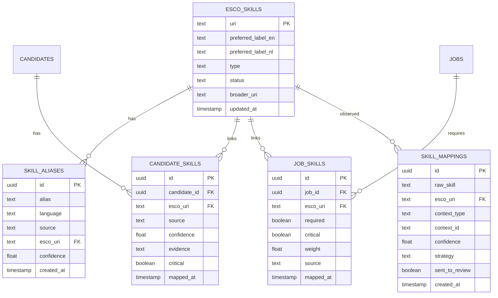

# ✨ feat: ESCO Skills Canonical Matching

## Enhancement Summary

**Deepened on:** 2026-03-05  
**Sections enhanced:** Architecture, Phases 1–3, learnings  
**Research agents used:** learnings-researcher, architecture-strategist, best-practices-researcher

### Key Improvements
1. **Service boundaries** — `esco.ts` = mapping + persistence; `esco-scoring.ts` = pure skill subscore (no DB); `scoring.ts` = orchestration; single contract for guardrail fallback.
2. **Parity** — Every ESCO API surface gets matching tools in chat, MCP, voice in same PR; direct service imports; single source of truth for ESCO payload (Zod/types) across API and tools.
3. **Dual-write & backfill** — One transaction per entity (legacy + canonical links + mapping events); idempotent backfill keys; read path prefers canonical when present.
4. **Observability** — One analytics service + API + UI block for mapping stats and review queue from day one; metric/log when `guardrailFallback === true`.

### New Considerations Discovered
- Review queue = query over `skill_mappings` where `sent_to_review = true` and `review_status in ('pending', null)`; only `esco.ts` writes review entries.
- Rollback = configuration only (disable ESCO-first or thresholds); no code deploy.
- Composite unique `(candidate_id, esco_uri, source)` (and job equivalent) for idempotent link-table upserts.

---

## Overview
We implement an ESCO-first skill architecture that normalizes all inbound skill text (candidate, job, and agent/chat inputs) to canonical ESCO URIs and makes ESCO scoring the primary ranking signal in phase 1, with confidence guardrails and controlled fallback.

This plan is directly grounded in the brainstorm decisions from `docs/brainstorms/2026-03-05-esco-skills-koppeling-brainstorm.md` (see brainstorm: `docs/brainstorms/2026-03-05-esco-skills-koppeling-brainstorm.md`).

## Problem Statement
Current matching relies on keyword overlap + hybrid embedding blending (`src/services/scoring.ts`) with free-text skills from JSON fields (`src/db/schema.ts`). This produces avoidable precision loss in top matches:
- Synonyms and bilingual variants fragment equivalent skills.
- Required/critical skills are not modeled as canonical graph concepts.
- UX filters/search depend on loose text rather than a shared taxonomy.

From the brainstorm, the explicit target is top-match precision improvement in 4-6 weeks, with direct ranking switch (not shadow-only), while limiting human review to uncertain mappings of critical skills (see brainstorm: `docs/brainstorms/2026-03-05-esco-skills-koppeling-brainstorm.md`).

## Proposed Solution
Adopt Approach A from the brainstorm: ESCO-first scoring + immediate ranking usage + guardrails.

1. Introduce canonical skill data model:
- ESCO concept table (URI, preferred labels, metadata)
- alias/synonym table
- candidate-skill and job-skill link tables with confidence/evidence/criticality
- mapping event/audit table

2. Build shared normalization pipeline for all inbound skill text:
- deterministic normalization
- alias exact match
- semantic fallback match
- critical-skill review queue for low confidence only
- dual-write bridge during rollout so legacy free-text skills remain readable until backfill and UI parity are complete

3. Replace skill subscore in `computeMatchScore` with ESCO-based subscore and make that score primary in ranking while retaining fallback behavior at runtime when confidence is insufficient.

4. Update recruiter UX and API surfaces to query/filter/suggest canonical ESCO skills consistently.

## Technical Approach

### Architecture
Baseline references:
- Current scoring entrypoint: `src/services/scoring.ts:61`
- Current auto-matching pipeline: `src/services/auto-matching.ts:97`
- Current candidate skill storage: `src/db/schema.ts:186` and `src/db/schema.ts:200`
- Current hybrid search path: `src/services/jobs.ts:263`
- Existing requirement extraction for critical tiers: `src/services/requirement-extraction.ts:32`

Target architecture:
- New `src/services/esco.ts` for canonical mapping and lookup.
- New `src/services/esco-scoring.ts` for ESCO skill similarity/criticality scoring.
- Existing `computeMatchScore` delegates skill dimension to ESCO module.
- Existing ingestion paths (`candidates`, CV parse enrich, jobs normalize/enrich, chat/voice/mcp tools) call a shared mapper.
- Review queue persisted in DB and surfaced in admin/recruiter flow.
- Cutover controlled by explicit config thresholds (for example `ESCO_ALIAS_MIN_CONFIDENCE`, `ESCO_SEMANTIC_MIN_CONFIDENCE`, `ESCO_CRITICAL_REVIEW_THRESHOLD`) plus a runtime flag for ESCO-first scoring so rollout and rollback are deterministic.

### Service boundaries (deepen)
- **`esco.ts`**: mapping + persistence of canonical links and mapping events; only place that writes review-queue entries (`skill_mappings.sent_to_review`).
- **`esco-scoring.ts`**: pure function from canonical skill sets → skill subscore + guardrail flag + reasoning; no DB access; no import of `scoring.ts` or `esco.ts`.
- **`scoring.ts`**: orchestration of dimensions and final score; calls `computeEscoSkillScore` when ESCO enabled; replaces rule-based skill block with that result; on `guardrailFallback: true` uses existing rule-based skill subscore and appends ESCO reasoning.
- **`auto-matching.ts`**: calls only `computeMatchScore`; persists `reasoning` and `model` so guardrail events are visible; does not call `esco` or `esco-scoring` directly.
- **Data flow**: Ingestion → `esco.mapSkillInput` → writes `candidate_skills`/`job_skills` + `skill_mappings`. Scoring → callers load entity with canonical links (or legacy) → `computeMatchScore` → `computeEscoSkillScore(candidateSkills, jobSkills)` (no DB inside esco-scoring).
- **Rollback**: configuration only (e.g. disable ESCO-first or set thresholds so guardrail always triggers); no code deploy.

### ERD (new model)


### SpecFlow Analysis (gaps and edge cases)

#### User flow overview
1. Candidate ingestion flow
- Input skill text from CV/manual/LinkedIn -> map -> persist candidate ESCO skills -> trigger score recompute.
2. Job ingestion flow
- Input requirements/competences/wishes -> classify criticality -> map to ESCO -> persist job ESCO skills.
3. Matching flow
- Candidate-job pair scoring uses ESCO overlap/critical matches as primary skill signal; fallback if confidence guardrail fails.
4. Recruiter filtering flow
- Recruiter selects canonical skill facet -> unified search across jobs/candidates.
5. Review flow
- Low-confidence critical mapping appears in review queue -> reviewer confirms/overrides -> rescoring triggered.

#### Missing elements addressed in this plan
- Low confidence behavior for critical vs non-critical skills.
- Version pinning and reproducibility for ESCO dataset selection.
- Re-score triggers and idempotency when mappings are updated.
- Cross-surface parity (chat/mcp/voice/UI) for canonical skills.

#### Critical questions and default assumptions
1. Critical: Which ESCO source mode in phase 1, hosted API or downloaded dataset?
- Assumption: start with downloaded dataset + local DB import for deterministic performance; keep API adapter optional.
2. Critical: Ranking cutover strategy at runtime?
- Assumption: immediate ESCO-first, with per-score fallback only on guardrail failure (aligns with brainstorm).
3. Important: How broad is critical skill definition?
- Assumption: requirements marked knockout/required become `critical=true`; others not.

### Implementation Phases

#### Phase 1: Foundation (Data + Import + Mapping Core)
- Add DB schema objects for `esco_skills`, `skill_aliases`, `candidate_skills`, `job_skills`, `skill_mappings`.
- Add import job for ESCO dataset and delta-safe upsert strategy.
- Add shared mapper with confidence scoring and strategy output.
- Add critical-skill review queue support.
- Add backfill + dual-write plan so existing `candidates.skills`, `candidates.skills_structured`, `jobs.requirements`, `jobs.wishes`, and `jobs.competences` can be re-mapped without downtime.

Deliverables:
- Drizzle migration + schema types.
- `src/services/esco.ts` mapping interface.
- Initial ESCO seed import script.
- Backfill command and rerunnable reconciliation job for existing records.

Success criteria:
- Canonical ESCO URIs persisted for both candidates and jobs.
- Mapping confidence and evidence persisted per mapping.
- Re-running the import/backfill does not duplicate link rows or review items.

Estimated effort: 3-4 days.

#### Phase 2: Scoring and Ranking Cutover
- Refactor `src/services/scoring.ts` to route skill scoring through ESCO module.
- Integrate criticality-aware penalties/bonuses.
- Apply fallback guardrail when critical mapping confidence below threshold.
- Update auto-match pipeline and hybrid ranking behavior to prioritize ESCO score.
- Record side-by-side scoring telemetry during the cutover window so rollback decisions can compare `rule-based-v1`/`hybrid-v1` against `esco-hybrid-v1` on the same entities.

Deliverables:
- `src/services/esco-scoring.ts`
- Updated `computeMatchScore` behavior and model versioning (`model: esco-hybrid-v1`).

Success criteria:
- Ranking uses ESCO-first skill score in production path.
- Guardrail fallback visible in reasoning fields.
- Rollback to legacy scoring remains a configuration change rather than an emergency code change.

Estimated effort: 2-3 days.

#### Phase 3: API/UI/Agent Surface Parity + Observability
- Update APIs and tools to expose canonical skills and filters.
- Add recruiter-facing canonical skill filters/suggesters.
- Add metrics dashboard: mapping confidence distribution, fallback rate, precision-at-k.
- Add review queue management UI for critical unresolved mappings.

Deliverables:
- API schema updates for canonical skill payloads.
- UI facet/filter components using ESCO labels.
- Ops metrics and logs for mapping/scoring decisions.

Success criteria:
- All entry surfaces ingest and return canonical skill references.
- Precision KPI tracking enabled for 4-6 week measurement window.

Estimated effort: 3-4 days.

## Alternative Approaches Considered
1. Pure direct cutover without fallback (rejected)
- Rejected due to high regression risk during initial alias coverage ramp.

2. Shadow-only rollout (rejected)
- Rejected because brainstorm explicitly chose direct ranking switch in phase 1 (see brainstorm: `docs/brainstorms/2026-03-05-esco-skills-koppeling-brainstorm.md`).

3. Partial scope (candidate-only) (rejected)
- Rejected because brainstorm scope includes candidates, jobs, and chat/tooling inputs (see brainstorm: `docs/brainstorms/2026-03-05-esco-skills-koppeling-brainstorm.md`).

## System-Wide Impact

### Interaction Graph
- Candidate CV upload (`src/services/candidates.ts`) -> ESCO mapping -> `candidate_skills` write -> `computeMatchScore` in auto-match (`src/services/auto-matching.ts:200`) -> `job_matches` write.
- Job ingest/normalize (`src/services/normalize.ts`) -> ESCO mapping for requirements/competences -> `job_skills` write -> scoring path on search and auto-match.
- Agent tool queries (`src/ai/tools/query-opdrachten.ts`, `src/mcp/tools/vacatures.ts`, `src/voice-agent/agent.ts`) -> canonical skill filters -> shared service methods.

### Error & Failure Propagation
- Mapping service errors should not hard-fail candidate/job creation unless path marked critical.
- Critical mapping low-confidence should return deterministic fallback + review event, not silent skip.
- ESCO import failures should fail fast in scheduled job and alert via existing operations channel.

### State Lifecycle Risks
- Partial writes risk: candidate/job persisted but skill links missing.
- Mitigation: transactional write per entity (entity + link rows + mapping events), idempotent upsert keys.

### API Surface Parity
Must update all equivalent interfaces:
- UI routes (`app/api/candidates/*`, `app/api/opdrachten/*`, `app/api/matches/*`)
- AI chat tools (`src/ai/tools/*`)
- MCP tools (`src/mcp/tools/*`)
- Voice agent tools (`src/voice-agent/agent.ts`)

### Integration Test Scenarios
1. Candidate import with bilingual synonyms maps to same ESCO URI and improves top match precision.
2. Critical skill low-confidence triggers review queue and fallback scoring, with no crash.
3. Job with outdated ESCO version reference re-maps deterministically after version update.
4. Chat/MCP/Voice query by skill returns same candidate set as UI filter.
5. Manual reviewer override triggers re-score and changes ranking deterministically.

## Acceptance Criteria

### Functional Requirements
- [ ] New canonical ESCO tables exist and are migrated with indexes/constraints.
- [ ] Candidate/job/chat skill inputs map to ESCO URI with confidence and evidence.
- [x] ESCO score is primary skill signal in ranking and auto-match.
- [x] Guardrail fallback activates only for low-confidence critical mappings.
- [x] Critical low-confidence mappings are persisted to review queue.
- [ ] Recruiter can filter/search on canonical skills in UI.
- [x] API/tool responses include canonical skill payloads where applicable.

### Non-Functional Requirements
- [ ] No >15% regression in query latency on key search endpoints at p95.
- [x] Mapping pipeline is idempotent on repeated ingestion.
- [x] Versioned ESCO dataset usage is auditable.
- [ ] Logs and metrics exist for mapping confidence, fallback rate, and review backlog.

### Quality Gates
- [x] New unit tests for mapping and scoring guardrails.
- [x] Integration tests for cross-surface parity (UI/API/chat/mcp/voice).
- [ ] Migration verified in staging with rollback procedure.
- [x] `pnpm lint`, `pnpm test`, and `pnpm exec tsc --noEmit` pass for touched scope.

## Success Metrics
Primary KPI from brainstorm:
- Precision@3 for top matches improves versus baseline within 4-6 weeks (see brainstorm: `docs/brainstorms/2026-03-05-esco-skills-koppeling-brainstorm.md`).

Supporting metrics:
- Guardrail fallback rate (target: declining over first 4 weeks).
- Critical review queue median resolution time.
- Canonical skill coverage ratio for active candidates/jobs.
- Pre-cutover versus post-cutover Precision@3 snapshots are stored so the 4-6 week KPI can be evaluated against a stable baseline.

## Dependencies & Prerequisites
- ESCO dataset import path and storage strategy approved.
- DB migration window and backfill schedule approved.
- Existing auto-matching and scoring tests expanded for ESCO flows.
- Ops monitoring for new mapping jobs and fallback events.
- Product/ops agree on initial confidence thresholds and reviewer SLA for critical low-confidence mappings.

## Risk Analysis & Mitigation
- Risk: mapping noise harms ranking.
  - Mitigation: critical-only review queue + fallback guardrails + confidence thresholds.
- Risk: version drift between mapping runs.
  - Mitigation: persist `esco_version` and mapping strategy per event.
- Risk: cross-surface inconsistency.
  - Mitigation: shared service contract + parity integration tests.

## Resource Requirements
- 1 backend engineer (schema + services)
- 1 full-stack engineer (API + UI parity)
- 1 QA/analyst for precision measurement setup
- 8-11 engineering days total across 3 phases

## Future Considerations
- Expand from phase 1 deterministic + semantic mapper to graph-distance and occupation-skill relation weighting.
- Consider offline ESCO local API mirror for advanced concept traversal.
- Add multilingual recruiter synonym suggestions by market/language.

## Documentation Plan
Update after implementation:
- `docs/architecture.md` (new ESCO canonical layer + flow updates)
- `README.md` / `README.en.md` (canonical skill behavior and config)
- Operational runbook for ESCO import + fallback monitoring
- Cutover runbook covering backfill order, feature-flag enablement, rollback switch, and post-release KPI checks

## Implementation Checklist (file-oriented)
- [x] `src/db/schema.ts` — add ESCO tables and relations
- [x] `drizzle/*.sql` — create migration for ESCO schema
- [x] `scripts/import-esco-skills.ts` — initial ESCO dataset import runner
- [x] `src/services/esco-import.ts` — concept-to-row import helpers
- [x] `src/services/esco-dataset.ts` — dataset payload extraction helpers
- [x] `src/services/esco-backfill.ts` — legacy candidate/job skill seed extraction
- [x] `src/services/esco.ts` — normalization + mapping service
- [x] `src/services/esco-scoring.ts` — canonical skill scoring logic
- [x] `src/services/scoring.ts` — delegate skill dimension to ESCO module
- [x] `src/services/auto-matching.ts` — propagate ESCO reasons/guardrails
- [x] `app/api/candidates/*.ts` and `app/api/opdrachten/*.ts` — canonical skill payloads
- [x] `src/ai/tools/*.ts`, `src/mcp/tools/*.ts`, `src/voice-agent/agent.ts` — parity updates
- [ ] `components/*skills*` and relevant filters — canonical UI integration
- [x] `tests/*esco*` — mapping/scoring/parity/integration coverage (esco-scoring.test.ts)

## Pseudocode Sketches

### `src/services/esco.ts`
```ts
export async function mapSkillInput(input: {
  rawSkill: string;
  language?: string;
  contextType: "candidate" | "job" | "tool";
  contextId: string;
  critical: boolean;
}): Promise<{
  escoUri: string | null;
  confidence: number;
  strategy: "alias" | "exact" | "semantic" | "none";
  reviewRequired: boolean;
}> {
  // normalize -> exact/alias -> semantic fallback -> threshold + review flag
}
```

### `src/services/esco-scoring.ts`
```ts
export function computeEscoSkillScore(input: {
  candidateSkills: CanonicalSkill[];
  jobSkills: CanonicalSkill[];
}): { skillScore: number; guardrailFallback: boolean; reasoning: string } {
  // critical exact matches heavily weighted
  // related matches weighted medium
  // low-confidence critical paths trigger fallback
}
```

## Research Insights

Synthesis of external best practices for taxonomy normalization, link-table upserts, and scoring cutover. Use these to validate design and implementation choices.

1. **Skill normalization and confidence**
   - Treat confidence as one signal among many: combine with validators, policy flags, novelty detection, and domain risk rather than a single threshold (Extend, HITL review-queue guides). Calibrate so that e.g. 90% confidence ≈ 90% correctness in production; use threshold tuning (e.g. `ESCO_ALIAS_MIN_CONFIDENCE`, `ESCO_SEMANTIC_MIN_CONFIDENCE`) as levers.
   - Normalize free text to a canonical set (e.g. 400+ aliases → 100+ skills) so synonyms and variants map to one concept; this directly improves matching precision (Open Skills / Tanova-style taxonomies). Your alias table + deterministic then semantic pipeline aligns with this.

2. **Review queue design**
   - Route to human review via explicit rules, not “review everything”: confidence below threshold, validator failures, policy/compliance flags, novelty/out-of-distribution, and escalation (complaints, retries). Batch similar decisions, time-box reviews, and track SLAs so the queue volume can decrease over time (HITL best practices).
   - Use a single “review queue” surface (e.g. `skill_mappings.sent_to_review` + `review_status`) with an index on `(sent_to_review, review_status)` for listing; keep criteria (e.g. critical + low confidence) in config so thresholds can change without schema changes.

3. **Drizzle link-table idempotent upserts**
   - For many-to-many link tables, use a **composite unique constraint** as the conflict target (e.g. `(candidate_id, esco_uri, source)` on `candidate_skills`). Idempotent upsert: `insert(...).onConflictDoUpdate({ target: [t.candidateId, t.escoUri, t.source], set: { confidence: sql.raw('excluded.confidence'), updatedAt: sql.raw('excluded.updated_at') } })` (Drizzle upsert guide).
   - For batch link writes, use the same target and `sql.raw(\`excluded.${columnName}\`)` for each updatable column so re-runs and partial updates do not create duplicates and existing rows are updated in place. Your existing `normalize.ts` pattern (composite target + `excluded`) is the right template for `candidate_skills` / `job_skills`.

4. **Link table schema and relations**
   - Keep junction tables as pure FKs + metadata (confidence, source, timestamps); avoid storing denormalized labels in the link table. Define Drizzle relations on both sides (e.g. `candidates` ↔ `candidateSkills` ↔ `escoSkills`) so queries can use `with` or application-level joins; the unique constraint is the natural upsert key, not a surrogate PK alone.

5. **Scoring cutover and fallback guardrails**
   - Use a **single runtime switch** (e.g. env or feature flag) to choose “ESCO-first” vs “legacy” scoring path. In the ESCO path, if confidence guardrails fail (e.g. critical skill with low confidence), **fall back to the legacy skill subscore** for that candidate–job pair and optionally log or metric the fallback (guarded-rollout pattern: progressive rollout with automatic rollback on regression).
   - Prefer **per-request fallback** (e.g. “if any critical skill below threshold → use legacy score for this pair”) over a global kill switch so partial ESCO adoption still improves most pairs while protecting edge cases.

6. **Cutover rollout**
   - Align with guarded-rollout practice: define a small set of metrics (e.g. Precision@3, fallback rate, review-queue depth), run the new scoring in production with fallback enabled, and only remove the legacy path after a stable window (e.g. 4–6 weeks) and optional A/B comparison. Keep the legacy implementation behind the same switch for quick rollback.

7. **ESCO and ontology**
   - ESCO’s own crosswalk work (e.g. O*NET) uses ML-ranked candidate matches plus **human validation** and QA. Treat your pipeline as “alias/exact → semantic suggestions → threshold + review”; persist `mapping_strategy` and `esco_version` per mapping so version and strategy are auditable and re-runnable (ESCO API and crosswalk docs).

8. **Operational checks**
   - Version-pin the ESCO dataset and store `esco_version` (and optionally `esco_version` on link rows) so re-imports and backfills are reproducible. Add a runbook step: if fallback rate or review queue SLA degrades, first tune thresholds or pause ESCO-first for specific contexts before reverting the whole cutover.

---

## Research Insights (deepen-plan)

### Institutional learnings (docs/solutions)
- **Agent/UI parity** — Use one shared type/Zod for ESCO skill payload and reuse in API, AI tools, service; add “filter by canonical skill” to service and all surfaces (REST, chat, MCP, voice) in the same PR; direct service imports in tools (no `fetch()` to Next API).
- **Observability** — When adding mapping/review/backfill tables, add one `getEscoMappingStats()` / `getReviewQueueSummary()` service + one API route + one UI block from day one so mapping success rate and review queue size are visible.

### Best practices
- **Link-table upserts** — Composite unique `(candidate_id, esco_uri, source)` (and job equivalent); `onConflictDoUpdate` for idempotent backfill; same pattern as `normalize.ts`.
- **Review queue** — Explicit rules for routing (low confidence, critical, novelty); index `(sent_to_review, review_status)`; batch work and SLA tracking; thresholds in config.
- **Cutover** — Single runtime switch (ESCO-first vs legacy); per-request fallback when guardrail fires; log/metric `esco.guardrail_fallback` with context for 4-week decline target; guarded rollout then retire legacy after stable window.
- **Operational** — Pin ESCO dataset version; store `esco_version` on mappings; runbook: if fallback or SLA degrades, tune thresholds or pause ESCO-first before full rollback.

## Sources & References

### Origin
- **Brainstorm document:** [docs/brainstorms/2026-03-05-esco-skills-koppeling-brainstorm.md](../brainstorms/2026-03-05-esco-skills-koppeling-brainstorm.md)
- Carried-forward decisions:
  - ESCO as canonical skill representation
  - Phase-1 direct ranking switch (not shadow-only)
  - Review queue only for uncertain critical skills

### Internal References
- Current scoring implementation: `src/services/scoring.ts:15`
- Current auto-match flow: `src/services/auto-matching.ts:170`
- Current candidate skill storage: `src/db/schema.ts:186`
- Current structured requirement flow: `src/services/requirement-extraction.ts:32`
- Existing architecture context: `docs/architecture.md`
- Institutional learning (API parity): `docs/solutions/api-schema-gaps/agent-ui-parity-kandidaten-20260223.md`
- Institutional learning (AI SDK deprecation): `docs/solutions/deprecations/generateobject-to-generatetext-ai-sdk6-20260223.md`

### External References
- ESCO API overview: https://esco.ec.europa.eu/en/use-esco/use-esco-services-api
- ESCO Web-service API details: https://esco.ec.europa.eu/en/use-esco/use-esco-services-api/esco-web-service-api
- ESCO dataset download/version options: https://esco.ec.europa.eu/en/use-esco/download
- ESCO versions & delta policy: https://esco.ec.europa.eu/en/about-esco/escopedia/escopedia/esco-versions
- ESCO REST API docs: https://ec.europa.eu/esco/api/doc/esco_api_doc.html
- Drizzle many-to-many/indexing patterns (Context7): https://github.com/drizzle-team/drizzle-orm-docs/blob/main/src/content/docs/relations-v2.mdx
- pgvector indexing and operators (official README): https://github.com/pgvector/pgvector/blob/master/README.md

### Deprecation/Sunset Check
- ESCO: no official API sunset/deprecation notice found in ESCO API pages; explicit versioning mechanism and current version banner observed on 2026-03-05 research pass.
- Practical implication: pin `selectedVersion` and store source version per mapping event.
