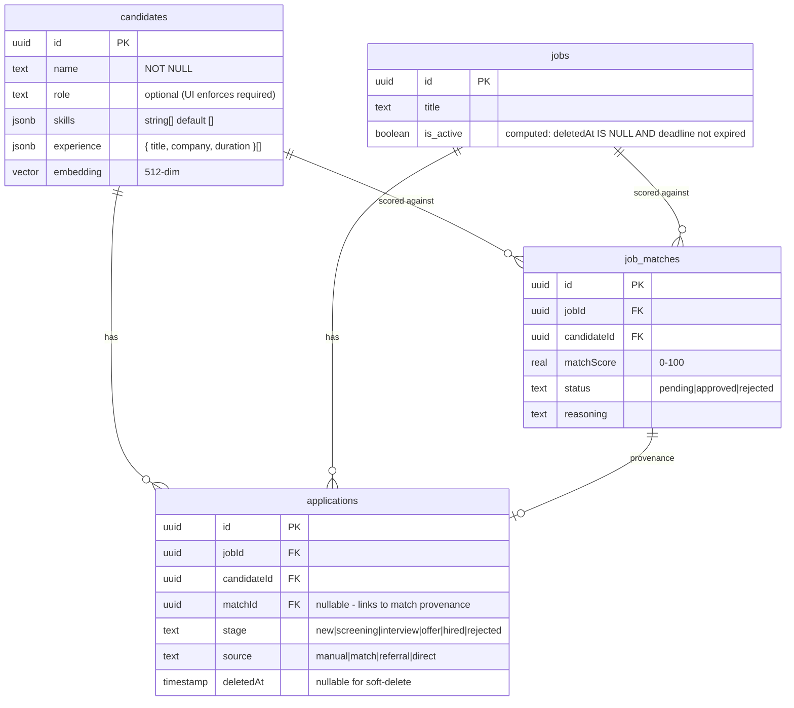

# Kandidaat Profiel + Pipeline Koppeling

## Overview

Build a 2-step candidate creation wizard that combines profile creation with intelligent vacancy linking. After creating a candidate profile (Step 1), the system automatically suggests top-3 matching active vacancies with AI scoring (Step 2). The recruiter confirms 1+ vacancies, and the system creates pipeline applications in `screening` stage. The same linking mechanism works bidirectionally from the vacancy side.

## Problem Statement / Motivation

Currently, creating a candidate and linking them to vacancies are disconnected workflows. A recruiter must:
1. Create a candidate via the `AddCandidateDialog`
2. Navigate to the candidate detail or matching page
3. Manually trigger auto-matching
4. Review matches and approve them
5. Separately create pipeline applications

This friction causes recruiters to skip the matching step entirely, leaving candidates stranded in the talentpool without pipeline placement. By embedding vacancy suggestions directly into the creation flow, we reduce steps from 5 to 2 and ensure immediate pipeline placement for qualified candidates.

## Proposed Solution

### Candidate-Side: 2-Step Wizard

Refactor `AddCandidateDialog` into a multi-step wizard:

**Step 1 — Profiel (Profile)**
- `naam` (required), `rol` (required at UI level)
- Guided skills input (tag-based, `string[]`)
- Guided work experience input (structured: title, company, duration)
- Existing optional fields preserved: email, phone, location, rate, availability, LinkedIn, CV upload, notes
- On submit: persist candidate → await embedding → transition to Step 2

**Step 2 — Koppeling (Linking)**
- Loading state while embedding + matching runs (~2-14s)
- Display top-3 matching active vacancies with scores and reasoning
- Top-1 pre-selected via checkbox
- "Al gekoppeld" badge on already-linked vacancies (disabled checkbox)
- Recruiter confirms → creates 1+ applications in `screening` stage
- Skip option → candidate saved to talentpool only

### Vacancy-Side: 1-Step Linking Dialog

New `LinkCandidatesDialog` on vacancy detail page:
- Shows top-3 matching candidates for the vacancy
- Same checkbox + confirm UX as Step 2 of candidate wizard
- Creates applications in `screening` stage per confirmed candidate

## Technical Approach

### Architecture

```
┌─────────────────────────────────────────────────────────┐
│                    UI Layer                              │
│                                                         │
│  AddCandidateWizard          LinkCandidatesDialog       │
│  ┌──────────┐ ┌──────────┐  ┌──────────────────────┐   │
│  │ Step 1:  │→│ Step 2:  │  │ Top-3 candidates     │   │
│  │ Profile  │ │ Linking  │  │ for vacancy          │   │
│  └──────────┘ └──────────┘  └──────────────────────┘   │
│       │            │              │                      │
└───────┼────────────┼──────────────┼──────────────────────┘
        │            │              │
┌───────┼────────────┼──────────────┼──────────────────────┐
│       ▼            ▼              ▼       API Layer       │
│  POST /api/    POST /api/    POST /api/                  │
│  kandidaten    kandidaten/   opdrachten/                  │
│                [id]/match    [id]/match-kandidaten         │
│                     │              │                      │
└─────────────────────┼──────────────┼─────────────────────┘
                      │              │
┌─────────────────────┼──────────────┼─────────────────────┐
│                     ▼              ▼    Service Layer     │
│          autoMatchCandidateToJobs()                       │
│          autoMatchJobToCandidates()                       │
│          createApplicationsFromMatches()  ← NEW          │
│               │                                          │
│               ▼                                          │
│    createApplication({ stage: "screening" })             │
└──────────────────────────────────────────────────────────┘
```

### ERD Changes



No schema migrations needed — all columns already exist. Only service-level changes required.

### Implementation Phases

#### Phase 1: Service Layer Changes

**Files to modify:**

1. **`src/services/applications.ts`** — Add optional `stage` parameter to `createApplication()`
   - Current: hardcodes `stage: "new"` at line 76
   - Change: accept `stage` in input, default to `"new"`
   - Add new function `createApplicationsFromMatches(candidateId, matches[], stage)` that:
     - Checks for existing applications per (jobId, candidateId)
     - Creates applications only for non-existing pairs
     - Sets `source: "match"` and links `matchId`
     - Returns `{ created: Application[], alreadyLinked: string[] }`

2. **`src/services/jobs.ts`** — Tighten `listActiveJobs()` filter
   - Current: only filters `deletedAt IS NULL` (line 411-419)
   - Add: exclude jobs where `applicationDeadline < now()`

3. **`src/services/auto-matching.ts`** — No changes needed
   - `autoMatchCandidateToJobs(candidateId, topN=3)` already works correctly
   - Already awaits embedding internally (line 186)

**Files to create:**

4. **`app/api/kandidaten/[id]/match/route.ts`** — New API endpoint
   - POST: triggers `autoMatchCandidateToJobs(id)` and returns results
   - Returns: `{ matches: AutoMatchResult[], alreadyLinked: string[] }`
   - Checks existing applications to annotate "already linked" matches

5. **`app/api/opdrachten/[id]/match-kandidaten/route.ts`** — New API endpoint
   - POST: triggers `autoMatchJobToCandidates(id)` and returns results
   - Returns: `{ matches: AutoMatchResult[], alreadyLinked: string[] }`

6. **`app/api/kandidaten/[id]/koppel/route.ts`** — New API endpoint
   - POST: accepts `{ matchIds: string[] }` or `{ jobIds: string[] }`
   - Calls `createApplicationsFromMatches()` with stage `"screening"`
   - Returns: `{ created: Application[], alreadyLinked: string[] }`

**Acceptance criteria:**
- [ ] `createApplication()` accepts optional `stage` parameter
- [ ] `createApplicationsFromMatches()` is idempotent (no duplicate applications)
- [ ] `createApplicationsFromMatches()` links `matchId` for traceability
- [ ] `listActiveJobs()` excludes expired-deadline jobs
- [ ] Match endpoint returns `alreadyLinked` annotations
- [ ] Koppel endpoint creates applications in `screening` stage

#### Phase 2: Candidate Wizard UI

**Files to modify:**

7. **`components/add-candidate-dialog.tsx`** → Refactor into wizard
   - Rename to `components/add-candidate-wizard.tsx`
   - Add `useState<"profile" | "linking" | "done">` for step tracking
   - Step 1: existing form + new skills/experience inputs + `rol` as required
   - Transition: on Step 1 submit, show loading overlay, call create + match
   - Step 2: display match results with checkboxes
   - Confirm: call koppel endpoint, show success, close dialog

**Files to create:**

8. **`components/candidate-wizard/wizard-step-profile.tsx`** — Step 1 form
   - Required: naam, rol
   - Recommended: skills (tag input), experience (repeatable structured fields)
   - Optional: email, phone, location, rate, availability, LinkedIn, CV, notes
   - Submit handler: POST `/api/kandidaten` → returns candidateId

9. **`components/candidate-wizard/wizard-step-linking.tsx`** — Step 2 matching
   - Props: `candidateId`, `onComplete`, `onSkip`
   - On mount: POST `/api/kandidaten/[id]/match` to get suggestions
   - Loading state: skeleton cards with "Bezig met matchen..."
   - Match cards: vacancy title, company, score ring, reasoning summary
   - Checkbox per match (top-1 pre-checked, disabled if already linked)
   - "Al gekoppeld" badge for existing applications
   - Empty state: "Geen passende vacatures gevonden"
   - Confirm button: POST `/api/kandidaten/[id]/koppel` with selected matchIds
   - Skip button: close without linking

10. **`components/candidate-wizard/skills-input.tsx`** — Tag input for skills
    - Free-text input with Enter to add
    - Removable tags/badges
    - Stores as `string[]`

11. **`components/candidate-wizard/experience-input.tsx`** — Repeatable experience fields
    - Add/remove experience entries
    - Each entry: title (text), company (text), duration (text)
    - Stores as `{ title: string, company: string, duration: string }[]`

12. **`components/candidate-wizard/match-suggestion-card.tsx`** — Individual match card
    - Props: match data (title, company, score, reasoning, isLinked)
    - Score ring visualization (reuse pattern from `components/matching/`)
    - Checkbox for selection
    - "Al gekoppeld" disabled state

**Acceptance criteria:**
- [ ] Wizard shows Step 1 (profile) → Step 2 (linking) flow
- [ ] `naam` and `rol` are required in Step 1
- [ ] Skills input allows adding/removing tags
- [ ] Experience input allows structured entries
- [ ] CV upload preserved from existing dialog
- [ ] Step 2 shows loading state during matching
- [ ] Top-3 matches displayed with scores
- [ ] Top-1 is pre-selected
- [ ] Already-linked vacancies show "Al gekoppeld" badge (disabled)
- [ ] Confirm creates applications in `screening` stage
- [ ] Skip closes dialog without linking
- [ ] Success closes dialog and refreshes router

#### Phase 3: Vacancy-Side Linking

**Files to create:**

13. **`components/link-candidates-dialog.tsx`** — Vacancy-side linking
    - Props: `jobId`, `jobTitle`
    - On mount: POST `/api/opdrachten/[id]/match-kandidaten`
    - Same UI pattern as Step 2 of candidate wizard
    - Match cards show candidate name, role, skills, score
    - Confirm creates applications in `screening` stage

**Files to modify:**

14. **`app/opdrachten/[id]/page.tsx`** — Add LinkCandidatesDialog trigger
    - Replace or augment existing "Koppel aan kandidaat" button
    - Opens LinkCandidatesDialog instead of navigating to /matching

**Acceptance criteria:**
- [ ] Vacancy detail page has "Koppel kandidaten" button
- [ ] Dialog shows top-3 matching candidates with scores
- [ ] Top-1 pre-selected
- [ ] Already-linked candidates show "Al gekoppeld" badge
- [ ] Confirm creates applications in `screening` stage
- [ ] Dialog refreshes vacancy page on success

#### Phase 4: Integration & Polish

15. **Revalidation paths** — After application creation:
    - `revalidatePath("/professionals")`
    - `revalidatePath("/pipeline")`
    - `revalidatePath("/overzicht")`
    - `revalidatePath("/opdrachten")`
    - `revalidatePath(\`/professionals/${candidateId}\`)`

16. **Event publishing** — Publish `"application:created"` events (existing pattern in sollicitaties route)

17. **Error handling:**
    - Unique constraint violations → show "Al gekoppeld" gracefully
    - Matching timeout (>15s) → show degraded results with rule-based scores
    - Network errors → toast with retry option

## Design Decisions

| Decision | Choice | Reasoning |
|----------|--------|-----------|
| `role` required at API level? | No — UI only | MCP, CLI, AI tools keep it optional; avoid breaking existing surfaces |
| Persist candidate at Step 1? | Yes | Candidate exists in talentpool even if Step 2 is abandoned |
| "Already linked" definition | Existing application (non-deleted) | Matches are proposals; applications are confirmations |
| Back navigation Step 2 → 1? | No | Candidate already persisted; edit later from detail page |
| Step 2 manual search? | Not in scope | Top-3 AI suggestions only; manual linking via existing matching page |
| Vacancy-side UI | Dialog (not page navigation) | Consistent with candidate-side wizard UX |
| Application source | `"match"` | From AI matching pipeline |
| Application stage | Always `"screening"` | Per spec; configurable later if needed |
| CV upload in Step 1? | Yes, preserved | Significantly improves match quality |

## Acceptance Criteria

### Functional Requirements

- [ ] Candidate wizard has 2 steps: Profile → Linking
- [ ] Step 1: naam required, rol required (UI), skills tag input, experience structured input
- [ ] Step 1: existing fields preserved (email, phone, location, rate, availability, LinkedIn, CV, notes)
- [ ] Step 2: shows top-3 matching active vacancies with scores
- [ ] Step 2: top-1 is pre-selected
- [ ] Step 2: already-linked vacancies show "Al gekoppeld" (disabled)
- [ ] Step 2: confirm creates applications in `screening` stage with `source: "match"`
- [ ] Step 2: applications link to `matchId` for traceability
- [ ] Step 2: skip option saves candidate to talentpool only
- [ ] Step 2: empty state when no matches found
- [ ] Vacancy-side: LinkCandidatesDialog shows top-3 matching candidates
- [ ] Vacancy-side: same checkbox + confirm UX as Step 2
- [ ] Idempotent: no duplicate applications created
- [ ] Bidirectional: same linking logic from both sides

### Non-Functional Requirements

- [ ] Step 2 loading state < 15 seconds (degraded results shown if longer)
- [ ] Dutch UI labels throughout
- [ ] Keyboard accessible (Tab, Enter, Escape)
- [ ] Mobile responsive (dialog scrollable on small screens)

### Quality Gates

- [ ] All existing tests pass (`pnpm test`)
- [ ] TypeScript clean (`pnpm exec tsc --noEmit`)
- [ ] Biome lint clean (`pnpm lint`)
- [ ] New API endpoints have Zod validation

## Dependencies & Prerequisites

- Auto-matching service (`autoMatchCandidateToJobs`) — exists, works ✅
- Application service (`createApplication`) — exists, needs stage param change
- Embedding service (`embedCandidate`) — exists, works ✅
- shadcn Dialog, Tabs, Badge, Checkbox, Skeleton — all available ✅
- No new packages needed

## Risk Analysis & Mitigation

| Risk | Likelihood | Impact | Mitigation |
|------|-----------|--------|------------|
| Matching takes >15s | Medium | Poor UX | Show rule-based scores immediately; deep scores stream in |
| No matches for sparse profile | High | Confused recruiter | Clear empty state with explanation |
| Embedding API failure | Low | Degraded matches | Fallback to rule-based scoring (already implemented) |
| Unique constraint race condition | Low | Error toast | Catch constraint violation, show "Al gekoppeld" |

## File Summary

| # | File | Action | Phase |
|---|------|--------|-------|
| 1 | `src/services/applications.ts` | Modify | 1 |
| 2 | `src/services/jobs.ts` | Modify | 1 |
| 3 | `app/api/kandidaten/[id]/match/route.ts` | Create | 1 |
| 4 | `app/api/opdrachten/[id]/match-kandidaten/route.ts` | Create | 1 |
| 5 | `app/api/kandidaten/[id]/koppel/route.ts` | Create | 1 |
| 6 | `components/add-candidate-wizard.tsx` | Create (replaces add-candidate-dialog.tsx) | 2 |
| 7 | `components/candidate-wizard/wizard-step-profile.tsx` | Create | 2 |
| 8 | `components/candidate-wizard/wizard-step-linking.tsx` | Create | 2 |
| 9 | `components/candidate-wizard/skills-input.tsx` | Create | 2 |
| 10 | `components/candidate-wizard/experience-input.tsx` | Create | 2 |
| 11 | `components/candidate-wizard/match-suggestion-card.tsx` | Create | 2 |
| 12 | `components/link-candidates-dialog.tsx` | Create | 3 |
| 13 | `app/opdrachten/[id]/page.tsx` | Modify | 3 |
| 14 | `app/professionals/page.tsx` | Modify (swap dialog import) | 2 |
| 15 | `src/schemas/koppeling.ts` | Create (Zod schemas for new endpoints) | 1 |

## References & Research

### Internal References

- Database schema: `src/db/schema.ts` (candidates L176-217, applications L256-279, jobMatches L220-253)
- Auto-matching: `src/services/auto-matching.ts` (autoMatchCandidateToJobs L178-204)
- Application service: `src/services/applications.ts` (createApplication L58-77)
- Candidate service: `src/services/candidates.ts` (createCandidate L139-171)
- Current dialog: `components/add-candidate-dialog.tsx` (328 lines)
- Scoring weights: `src/services/scoring.ts` (skills 40, location 20, rate 20, role 20)
- Linking pattern: `app/matching/actions.ts` (linkCandidateToJob idempotent upsert)

### Documented Learnings

- Auto-matching plan: `docs/plans/2026-02-23-feat-auto-matching-cv-upload-plan.md`
- Structured matching plan: `docs/plans/2026-02-23-feat-candidate-intelligence-structured-matching-plan.md`
- Linking plan: `docs/plans/2026-02-23-feat-koppel-opdracht-aan-kandidaat-via-matching-context-plan.md`
- Visual workflow plan: `docs/plans/2026-03-02-feat-matching-pipeline-visual-workflow-plan.md`
- API schema parity gotcha: `docs/solutions/api-schema-gaps/agent-ui-parity-kandidaten-20260223.md`

### Brainstorm

- Source: `docs/brainstorms/2026-03-05-kandidaat-profiel-pipeline-koppeling-brainstorm.md`
