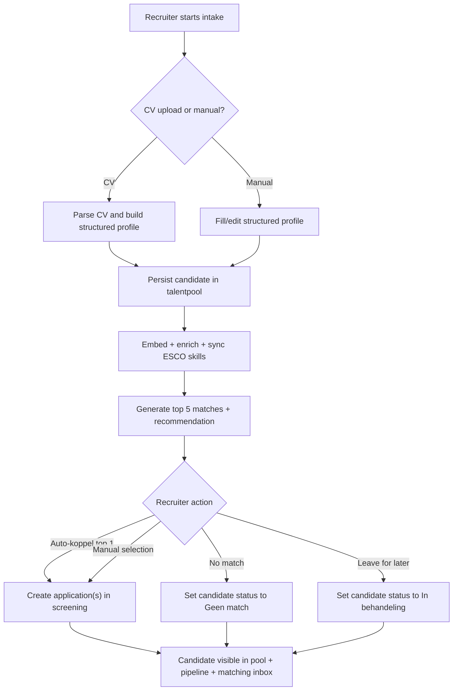
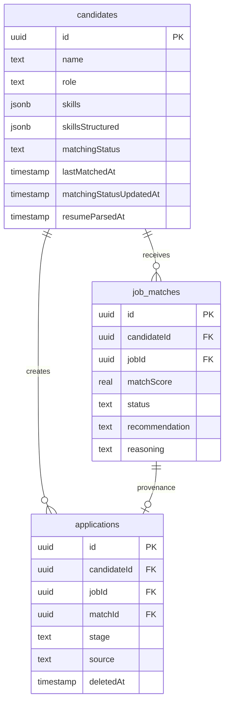

# ✨ Unified Kandidaten Intake + Matching Inbox

## Overview

Unify candidate intake, CV parsing, profile building, top-5 matching, recommendation, and pipeline linking into one candidate-driven flow. A recruiter should be able to start from either CV upload or manual entry, see a structured candidate profile with hard/soft skills and scores, review the top 5 matching opdrachten, and either link manually or use a one-click auto-koppel action for the recommended top match.

The system must keep the candidate in the talentpool immediately after intake and move the candidate into the pipeline as soon as a match is confirmed. Matching remains available afterwards in a persistent candidate-centric inbox with statuses `Open`, `In behandeling`, `Gekoppeld`, and `Geen match` (see brainstorm: `docs/brainstorms/2026-03-06-kandidaten-matching-flow-brainstorm.md`).

## Problem Statement

The current flow is fragmented across multiple surfaces:

- `components/add-candidate-wizard.tsx` already provides a 2-step create → link flow, but it remains narrow and profile-light.
- `app/api/cv-upload/route.ts` and `app/api/cv-upload/save/route.ts` parse and persist CV data, but they are not the primary recruiter intake flow.
- `app/matching/page.tsx` is centered on `jobMatches`, not on candidates as the work unit.
- `src/services/applications.ts` still uses an application-level idempotency pattern that recent reviews flagged as race-prone.

As a result, recruiters can add candidates, parse CVs, match candidates, and create applications, but not through one coherent experience. The desired product behavior is candidate-first intake and candidate-first matching, with direct visibility into scored hard/soft skills, top-5 matches, a single recommended match, and direct path to `screening` applications (see brainstorm: `docs/brainstorms/2026-03-06-kandidaten-matching-flow-brainstorm.md`).

## Proposed Solution

Build a single candidate-first flow with three connected layers:

1. **Unified intake**
   - Recruiter chooses `CV upload` or `Handmatig`.
   - The system builds a structured candidate profile immediately.
   - CV mode parses and pre-fills profile data before save/review.
   - Manual mode supports optional CV enrichment without leaving the flow.

2. **Immediate match review**
   - After the candidate is persisted, the UI shows:
     - hard skills and soft skills with proficiency scores
     - summary/profile information
     - top 5 matching opdrachten
     - one highlighted recommendation
   - Recruiter can:
     - auto-koppel the recommended top match
     - manually choose one or more of the top 5
     - mark no immediate match and use manual job search

3. **Persistent matching inbox**
   - `app/matching/page.tsx` becomes a candidate-driven inbox.
   - Candidates remain visible after action with a recruiter-friendly status.
   - Matching can be re-opened later from the inbox or candidate detail page.

This preserves the brainstorm’s chosen approach:

- central matching inbox as primary workbench
- candidate as the lead entity
- immediate pool persistence
- direct move to pipeline on confirmed link
- hybrid first review: shown during intake and again later in inbox

## Technical Approach

### Architecture

The implementation should reuse the current service stack where it is already strong, and replace only the fragmented orchestration.



### Domain State Changes

The plan needs one explicit source of truth for the candidate inbox state. The current schema can represent `jobMatches` and `applications`, but it cannot reliably distinguish:

- never matched yet
- matching reviewed but no match found
- linked already but still visible in inbox

To support the brainstormed inbox behavior, add candidate-level matching workflow state to `candidates`.



Recommended candidate workflow enum values in code:

- `open`
- `in_review`
- `linked`
- `no_match`

Display labels in Dutch:

- `Open`
- `In behandeling`
- `Gekoppeld`
- `Geen match`

This is the simplest durable model that matches the brainstorm’s persistent inbox requirement (see brainstorm: `docs/brainstorms/2026-03-06-kandidaten-matching-flow-brainstorm.md`).

### Reuse Existing Strengths

The plan should explicitly keep and build on these existing pieces:

- `src/schemas/candidate-intelligence.ts` already models structured hard/soft skills with `proficiency` and `evidence`.
- `src/services/cv-parser.ts` already extracts scored hard/soft skills from PDFs and DOCX files.
- `src/services/candidates.ts:165` already persists candidates and triggers embedding.
- `src/services/candidates.ts:319` already enriches candidates from parsed CV data.
- `src/services/auto-matching.ts` already supports `topN` and is already called with `5` in `app/api/cv-upload/save/route.ts`.
- `components/add-candidate-wizard.tsx` and `components/candidate-wizard/wizard-step-linking.tsx` already provide a working base for create → link.

The main gap is orchestration, state clarity, and inbox design, not raw matching capability.

### Required New/Updated Services

#### 1. `src/services/candidate-intake.ts` (new)

Create one shared orchestration layer for both manual and CV-driven intake.

Responsibilities:

- normalize intake input from manual mode and CV mode
- persist/create candidate or enrich existing candidate
- update candidate matching workflow state
- trigger top-5 matching
- choose one recommended match
- return one response shape for the intake UI

Suggested return shape:

```ts
// src/services/candidate-intake.ts
type CandidateIntakeResult = {
  candidate: Candidate;
  profile: {
    summary: string | null;
    hardSkills: Array<{ name: string; proficiency: number; evidence: string }>;
    softSkills: Array<{ name: string; proficiency: number; evidence: string }>;
  };
  matches: AutoMatchResult[];
  recommendation: AutoMatchResult | null;
  matchingStatus: "open" | "in_review" | "linked" | "no_match";
};
```

#### 2. `src/services/matching-inbox.ts` (new)

Add a dedicated query layer for the inbox instead of forcing `app/matching/page.tsx` to query `jobMatches` directly.

Responsibilities:

- list candidates by inbox status
- hydrate candidate profile summary + latest recommendation + latest linked application info
- support filters on status, query, recommendation presence, and availability
- power both the inbox page and future AI/MCP parity if needed

#### 3. `src/services/applications.ts` (update)

Current `createApplicationsFromMatches()` is serviceable but not strong enough for the new one-click auto-koppel path. Recent review docs already flagged the risk:

- `docs/reviews/2026-03-05-kandidaat-profiel-pipeline-koppeling-data-integrity-review.md`
- `docs/reviews/2026-03-05-arch-review-kandidaat-profiel-pipeline-koppeling.md`

Required changes:

- move batch create to a transaction-safe, database-first idempotency pattern
- use `INSERT ... ON CONFLICT DO NOTHING` or equivalent Drizzle path where possible
- respect soft-delete semantics for unique application pairs
- return both `created` and `alreadyLinked`
- support single-match auto-koppel without needing a separate code path

### API Surface

Keep the Dutch route naming convention from the repo and preserve parity across UI/service/API layers.

Recommended routes:

- `POST /api/kandidaten/intake`
  - shared intake orchestrator for manual and CV-driven save flows
  - returns candidate profile + top 5 matches + recommendation
- `POST /api/kandidaten/[id]/match`
  - re-run top 5 matching for an existing candidate
- `POST /api/kandidaten/[id]/koppel`
  - accepts selected `matchIds`
  - creates `applications` in `screening`
- `POST /api/kandidaten/[id]/geen-match`
  - explicitly moves candidate to `no_match`
- `POST /api/kandidaten/[id]/manual-koppel`
  - creates or approves a manually selected job link when recruiter searches outside the top 5

This keeps the existing candidate-centric route family intact and avoids splitting the flow between `/api/cv-upload/*` and `/api/kandidaten/*`.

### Recommendation Rules

The product wants a recommendation but not black-box auto-placement (see brainstorm: `docs/brainstorms/2026-03-06-kandidaten-matching-flow-brainstorm.md`).

Recommendation behavior:

- the service returns at most one recommended match
- the UI may expose `Auto-koppel top match` only when the recommendation is valid and not already linked
- manual choice from the top 5 always remains available
- if no suitable recommendation exists, the flow still shows the top 5 and allows manual search

Do not encode separate recommendation state in the database yet; derive it from the current best active `jobMatch` for the candidate to avoid over-modeling.

## Implementation Phases

### Phase 1: Candidate Workflow State + Intake Orchestration

**Goal:** establish one durable source of truth for intake and inbox state.

**Files**

- `src/db/schema.ts`
- `src/services/candidate-intake.ts` (new)
- `src/services/matching-inbox.ts` (new)
- `src/services/candidates.ts`
- `src/services/auto-matching.ts`
- `src/schemas/candidate-intelligence.ts`
- `app/api/kandidaten/intake/route.ts` (new)

**Tasks**

- Add candidate workflow status fields to `candidates`.
- Add a migration for the new status fields and defaults.
- Create `candidate-intake` orchestration service for:
  - CV-driven save
  - manual save
  - candidate enrichment
  - match generation
  - recommendation derivation
- Normalize all intake outputs into one DTO used by the UI.
- Ensure top 5 matching is called explicitly for this flow, without globally changing every other caller.
- Update candidate workflow state transitions:
  - intake created → `open`
  - matches ready → `in_review`
  - no good match / recruiter says no match → `no_match`
  - application created → `linked`

**Success criteria**

- Intake has one shared service path for manual and CV modes.
- Candidate inbox status can be read from `candidates` without guesswork.
- The service returns scored hard/soft skills, matches, and one recommendation in one payload.

### Phase 2: Unified Intake UI

**Goal:** turn intake into the product’s primary candidate entry flow.

**Files**

- `components/add-candidate-wizard.tsx`
- `components/candidate-wizard/wizard-step-profile.tsx`
- `components/candidate-wizard/wizard-step-linking.tsx`
- `components/candidate-wizard/skills-input.tsx`
- `components/candidate-wizard/experience-input.tsx`
- `components/candidate-wizard/match-suggestion-card.tsx`
- `components/candidate-wizard/profile-preview-card.tsx` (new)
- `components/candidate-wizard/skill-score-card.tsx` (new)

**Tasks**

- Add intake mode selection: `CV upload` or `Handmatig`.
- In CV mode:
  - upload CV
  - parse CV
  - show extracted profile preview before final save
  - show hard/soft skills with score and evidence
- In manual mode:
  - keep current structured form
  - allow optional CV upload to enrich the same candidate
- Replace the current Step 2 with a richer review surface:
  - top 5 matches instead of top 3
  - clear recommended match
  - `Auto-koppel aanbevolen match`
  - manual multi-select
  - `Geen match` action
  - `Handmatig opdracht zoeken` action

**Success criteria**

- Recruiter can complete the entire happy path without leaving intake.
- Hard and soft skills are visible with explicit scores after CV parse and before final linking.
- Top 5 matches are shown immediately after intake.
- Auto-koppel only targets the single recommended top match.

### Phase 3: Candidate-Centric Matching Inbox

**Goal:** convert `/matching` from a `jobMatches` table into the chosen primary workbench.

**Files**

- `app/matching/page.tsx`
- `components/shared/filter-tabs.tsx`
- `components/shared/empty-state.tsx`
- `components/shared/pagination.tsx`
- `components/chat/genui/match-card.tsx`
- `src/services/matching-inbox.ts`

**Tasks**

- Rework the page to list candidates, not raw match rows.
- Add status tabs for:
  - `Open`
  - `In behandeling`
  - `Gekoppeld`
  - `Geen match`
- Show per candidate:
  - role / summary
  - hard/soft skill snapshot
  - recommended match summary
  - top linked application or latest action
  - CTA to reopen matching flow
- Preserve existing secondary utilities where they still help:
  - `CV Analyse`
  - `AI Grading`
  but reposition them as subtools rather than the primary inbox paradigm.

**Success criteria**

- `/matching` reads as a candidate queue, not a match review table.
- Linked candidates remain visible in the inbox under `Gekoppeld`.
- Candidates with no match are explicitly visible and actionable.

### Phase 4: Pipeline Linking Integrity + Manual Escape Hatch

**Goal:** make linking safe, idempotent, and recruiter-friendly.

**Files**

- `src/services/applications.ts`
- `app/api/kandidaten/[id]/koppel/route.ts`
- `app/api/kandidaten/[id]/manual-koppel/route.ts` (new)
- `app/api/kandidaten/[id]/geen-match/route.ts` (new)
- `app/api/kandidaten/[id]/match/route.ts`
- `components/link-candidates-dialog.tsx`
- `app/opdrachten/[id]/page.tsx`

**Tasks**

- Harden application creation with transaction-safe idempotency.
- Use the recent review docs as implementation guardrails.
- Keep the job-side link dialog, but make it a secondary entrypoint rather than the primary workflow.
- Add candidate-side manual job search for the `Geen match` path.
- Revalidate all affected pages consistently:
  - `/professionals`
  - `/professionals/[id]`
  - `/matching`
  - `/pipeline`
  - `/opdrachten/[id]`

**Success criteria**

- Double submits and concurrent submits do not create duplicate applications.
- A candidate with no top-5 fit can still be linked manually.
- Link actions always create `applications.stage = "screening"` unless future business rules say otherwise.

### Phase 5: States, Feedback, and Verification

**Goal:** close the UX and system gaps identified by spec-flow analysis.

**Files**

- `components/add-candidate-wizard.tsx`
- `components/candidate-wizard/wizard-step-linking.tsx`
- `src/lib/rate-limit.ts`
- `tests/`

**Tasks**

- Define explicit timeout/degraded-result behavior for matching.
- Add retry behavior for:
  - CV parsing failure
  - match generation failure
  - linking failure
- Preserve candidate persistence if review or linking is abandoned.
- Add optimistic and final Dutch UI messages for all outcomes.
- Add integration coverage around intake → matching → application creation.

**Success criteria**

- Partial failure never loses a created candidate.
- Matching and linking failures remain actionable and recoverable.
- State transitions remain correct after retries and abandon/reopen flows.

## Alternative Approaches Considered

### 1. Extend the existing 2-step wizard only

Rejected because it improves intake but leaves the central workbench fragmented. The brainstorm explicitly chose a persistent candidate-centric inbox as the primary surface (see brainstorm: `docs/brainstorms/2026-03-06-kandidaten-matching-flow-brainstorm.md`).

### 2. Keep `professionals` as the primary queue and treat matching as a tab/filter

Rejected because it would blur talentpool browsing and matching operations. The desired flow is one clear matching workbench, not an overloaded candidate list.

### 3. Keep a match-row-first `/matching` page

Rejected because the brainstorm explicitly chose the candidate as the lead object instead of raw match suggestions. Candidate-centric status management also becomes much clearer.

## System-Wide Impact

### Interaction Graph

**CV-driven intake**

`/api/kandidaten/intake`
→ `parseCV()` in `src/services/cv-parser.ts`
→ `findDuplicateCandidate()` / `createCandidate()` / `enrichCandidateFromCV()` in `src/services/candidates.ts`
→ `embedCandidate()` in `src/services/embedding.ts`
→ `syncCandidateEscoSkills()` via candidate services
→ `autoMatchCandidateToJobs(candidateId, 5)` in `src/services/auto-matching.ts`
→ `createMatch()` / `getMatchByJobAndCandidate()` in `src/services/matches.ts`
→ update candidate `matchingStatus`
→ revalidate `/professionals`, `/matching`, and candidate detail surfaces

**Auto-koppel**

`/api/kandidaten/[id]/koppel`
→ `createApplicationsFromMatches()` in `src/services/applications.ts`
→ insert rows in `applications`
→ update candidate `matchingStatus = linked`
→ revalidate `/pipeline`, `/matching`, `/professionals`, `/opdrachten/[id]`

### Error & Failure Propagation

- CV parse can fail in `parseCV()` or upload routes; intake must surface retry while preserving the chosen file/input context.
- Candidate create can succeed while matching fails; candidate remains in talentpool with status `open` or `in_review`, never rolled back silently.
- Match generation can partially degrade if embedding or deep structured match fails; the service should still return any available quick-score result.
- Linking can fail after match review; this must not destroy or reset candidate/match context.

### State Lifecycle Risks

- **Current risk:** `src/services/applications.ts` does check-then-insert, which recent reviews identified as race-prone.
- **Current risk:** there is no durable candidate inbox state, so `Geen match` cannot be expressed safely today.
- **Current risk:** current CV flow and manual wizard each orchestrate their own save/match logic, which invites divergence.

Mitigations in this plan:

- candidate-level workflow state in `candidates`
- one shared intake orchestration service
- database-first idempotent application creation
- explicit no-match and manual-link paths

### API Surface Parity

Relevant parity surfaces:

- UI routes in `app/`
- API routes in `app/api/`
- AI agent tools in `src/ai/tools/`
- MCP tools in `src/mcp/tools/`
- voice agent direct service imports in `src/voice-agent/`

This plan should keep service-level capabilities reusable so AI/MCP/voice can adopt the new flow later. A relevant institutional learning already warns against UI/API parity drift for candidates:

- `docs/solutions/api-schema-gaps/agent-ui-parity-kandidaten-20260223.md`

Do not build the new intake semantics only into the React UI while leaving service contracts underspecified.

### Integration Test Scenarios

1. CV upload intake parses profile, creates candidate, generates top 5, and allows successful auto-koppel of the recommended top match.
2. Manual intake without CV creates candidate, generates top 5, and leaves candidate in `In behandeling` when the recruiter closes without linking.
3. Candidate with no top-5 fit is marked `Geen match` and can still be manually linked to an active job.
4. Double-submit on `koppel` or simultaneous submits create at most one active application per `(candidateId, jobId)`.
5. Reopening a previously linked candidate in the inbox shows the candidate under `Gekoppeld` with prior application context intact.

## Acceptance Criteria

### Functional Requirements

- [ ] Recruiters can start intake from either CV upload or manual entry in the primary candidate intake UI.
- [ ] CV-driven intake builds a structured profile using existing CV parsing capabilities and shows hard skills, soft skills, proficiency scores, and evidence.
- [ ] Manual intake can optionally attach a CV and use it to enrich the profile without leaving the flow.
- [ ] The candidate is persisted to the talentpool immediately after intake creation, not only after matching review (see brainstorm: `docs/brainstorms/2026-03-06-kandidaten-matching-flow-brainstorm.md`).
- [ ] Intake returns top 5 matching opdrachten for the saved candidate.
- [ ] Exactly one recommended top match is highlighted when a recommendation is available.
- [ ] Recruiters can auto-koppel only the recommended top match with one action.
- [ ] Recruiters can manually choose one or more matches from the top 5 instead of auto-koppelen.
- [ ] Recruiters can explicitly mark `Geen match` and still search/select a job manually.
- [ ] Confirming a link creates `applications` in `screening` stage and keeps the candidate visible in the inbox under `Gekoppeld`.
- [ ] `/matching` shows candidates as the primary unit, grouped/filterable by `Open`, `In behandeling`, `Gekoppeld`, and `Geen match`.
- [ ] Candidate detail and job detail pages remain valid secondary entrypoints into matching/linking.

### Non-Functional Requirements

- [ ] Matching requests degrade gracefully if embedding or deep structured match is unavailable.
- [ ] Linking endpoints are idempotent under retry and concurrent submissions.
- [ ] Dutch UI copy remains consistent; code identifiers remain English.
- [ ] Search/pagination patterns on inbox pages follow the repo’s existing URL-driven approach.

### Quality Gates

- [ ] API contracts are backed by Zod schemas and aligned with the UI flow.
- [ ] At least one integration test covers intake → match → application creation.
- [ ] At least one integration or service test covers duplicate-submission protection for linking.
- [ ] Updated plan-to-implementation work includes router revalidation coverage for all affected surfaces.

## Success Metrics

- Recruiter can complete intake-to-link in one contiguous flow without navigating to multiple screens.
- New candidates with parsed CVs consistently expose scored hard/soft skills in the UI.
- A materially higher share of new candidates end up either in `In behandeling`, `Gekoppeld`, or `Geen match` instead of being silently left unreviewed.
- Linking failures and duplicate-application incidents fall to near zero under manual retry behavior.

## Dependencies & Prerequisites

- Existing candidate parsing and matching stack remains available:
  - `src/services/cv-parser.ts`
  - `src/services/candidates.ts`
  - `src/services/auto-matching.ts`
  - `src/services/applications.ts`
- A Drizzle migration is required if candidate matching workflow fields are added.
- Any unique-index changes for `applications` must align with soft-delete behavior from the existing review findings.

## Risk Analysis & Mitigation

- **Risk:** inbox status logic becomes inconsistent with applications/matches.
  - **Mitigation:** use candidate-level workflow status as the durable state, and update it only in service-layer orchestration.

- **Risk:** duplicate applications on auto-koppel.
  - **Mitigation:** transaction-safe create path using database conflict handling and soft-delete-aware uniqueness.

- **Risk:** CV and manual intake drift apart again over time.
  - **Mitigation:** one shared `candidate-intake` service and one shared intake response model.

- **Risk:** inbox redesign becomes too broad and blocks delivery.
  - **Mitigation:** ship the inbox in phases; keep current secondary tools/tabs where useful and focus first on the candidate queue.

## Resource Requirements

- Product/design attention for the exact intake and inbox layout
- Backend/service work for orchestration + migrations
- Frontend work for wizard and inbox redesign
- Test coverage for cross-layer scenarios

## Future Considerations

- Surface the candidate inbox workflow to chat/MCP/voice once the service contracts stabilize.
- Add explicit recruiter notes/priorities later only if the inbox proves insufficient; do not add CRM-style workflow state in this iteration.
- Consider recommendation explainability summaries once the core flow is stable.

## Documentation Plan

- Update `docs/architecture.md` to reflect the candidate-centric matching inbox and unified intake orchestration.
- Add follow-up implementation notes only after code lands, not before.
- Keep the brainstorm as the design origin and this plan as the implementation source of truth.

## Sources & References

### Origin

- **Brainstorm document:** `docs/brainstorms/2026-03-06-kandidaten-matching-flow-brainstorm.md`
  - Carried-forward decisions:
    - candidate-centric inbox is the primary workbench
    - candidate is persisted immediately in the pool
    - top 5 matches with one recommendation are shown directly after intake
    - auto-koppel is limited to the top 1 recommendation
    - linked candidates remain visible in the inbox

### Internal References

- `components/add-candidate-wizard.tsx:1` — current wizard baseline
- `components/candidate-wizard/wizard-step-linking.tsx:1` — current linking step baseline
- `app/matching/page.tsx:1` — current match-row-first page
- `app/professionals/page.tsx:1` — current talentpool entrypoint
- `src/services/candidates.ts:165` — candidate creation and embedding behavior
- `src/services/candidates.ts:319` — CV enrichment path
- `src/services/applications.ts:49` — current application creation contract
- `app/api/cv-upload/save/route.ts:1` — current CV save + auto-match flow
- `src/schemas/candidate-intelligence.ts:1` — structured hard/soft skill schema

### Institutional Learnings

- `docs/solutions/api-schema-gaps/agent-ui-parity-kandidaten-20260223.md`
  - Key insight: keep candidate API schemas and UI capabilities aligned; do not let the UI outrun service contracts.

### Related Work

- `docs/plans/2026-03-05-feat-kandidaat-profiel-pipeline-koppeling-plan.md`
- `docs/reviews/2026-03-05-arch-review-kandidaat-profiel-pipeline-koppeling.md`
- `docs/reviews/2026-03-05-kandidaat-profiel-pipeline-koppeling-data-integrity-review.md`

