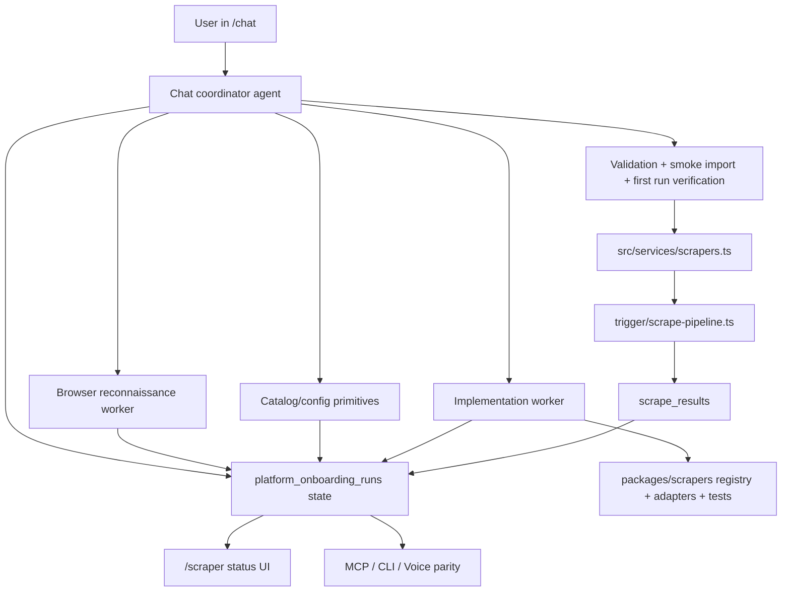
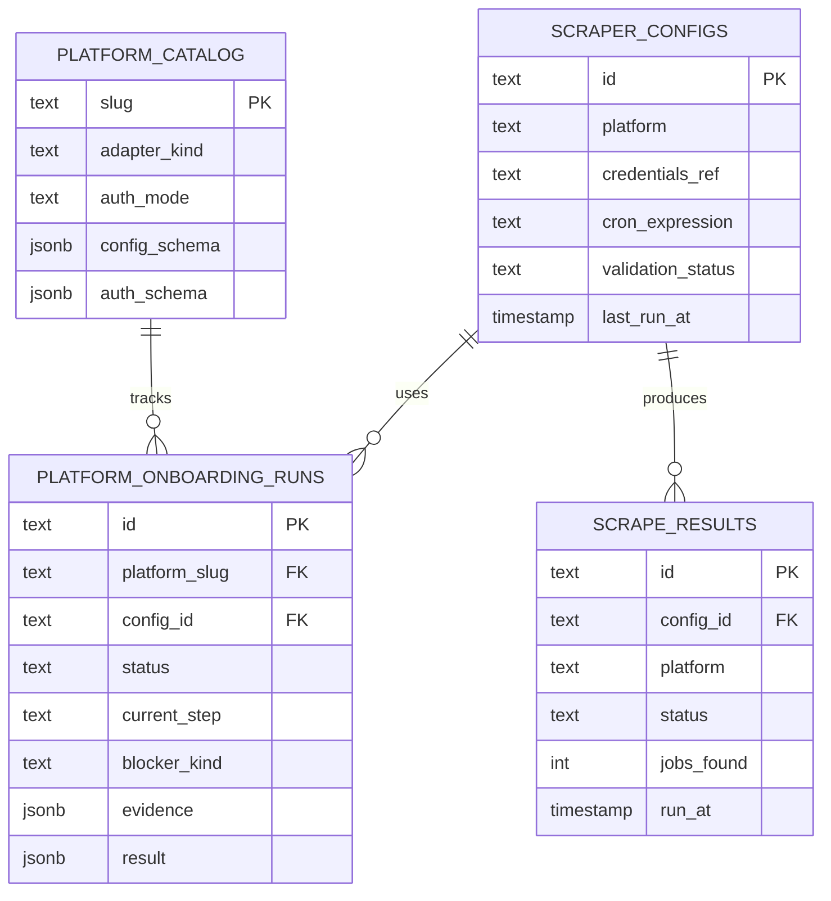

# Agent-Native Platform Onboarding Via Chat

## Overview

We want chat to become the primary operator surface for adding new recruitment platforms to Motian. The intended outcome is not “the agent drafted a config,” but “the first successful scrapes ran and the platform is scheduled for ongoing runs” (see brainstorm: `docs/brainstorms/2026-03-25-agent-native-platform-onboarding-brainstorm.md`).

This is a major feature, not a thin UI enhancement. The current platform onboarding stack already shares core primitives across UI, chat, MCP, CLI, and voice, but it stops at `needs_implementation` when a platform falls outside the existing adapter shapes. This plan closes that gap by adding agent-native parity for browser reconnaissance, credential intake, self-extending adapter implementation, verification, activation, and first-run monitoring.

## Problem Statement

Motian already has the right foundation for shared onboarding:

- Multi-surface architecture exists across chat, MCP, voice, and CLI, all sharing the same service layer (`README.md:179-217`).
- Platform onboarding primitives already exist in the chat tools (`src/ai/tools/platforms.ts:17-160`), service layer (`src/services/scrapers.ts:433-1039`), runbook (`docs/runbooks/platform-onboarding.md:5-71`), and parity tests (`tests/platform-agent-parity.test.ts:9-45`).
- Platform catalog, configs, scrape results, and onboarding runs are already persisted (`packages/db/src/schema.ts:15-117`).

The gap is that the current workflow is only self-serve for boards that already fit the registry and adapter model:

- The runbook explicitly stops unsupported sources at `needs_implementation` (`docs/runbooks/platform-onboarding.md:14`).
- The state machine treats unsupported sources as a terminal follow-up path rather than a resumable implementation loop (`src/services/platform-onboarding.ts:68-71`, `:207-216`).
- The registry is still a code-level switch that requires manual adapter wiring (`packages/scrapers/src/platform-registry.ts:63-110`).
- The chat route supports bounded multi-step tool loops (`app/api/chat/route.ts:209-215`), but the available tools do not yet let the agent complete the full operator outcome.

The result is a parity gap: recruiters and agents share config-time primitives, but only a developer can finish the job when a new board needs browser analysis, credentials handling, adapter code, tests, and scheduling.

## Requirements Trace

This plan preserves the brainstorm decisions explicitly, rather than reinterpreting them loosely:

- **Agent-first outcome, not assistant-only guidance**
  The agent must be able to inspect, configure, implement, validate, activate, and verify a platform end to end (see brainstorm: `docs/brainstorms/2026-03-25-agent-native-platform-onboarding-brainstorm.md`).
- **Arbitrary recruitment sites, including authenticated platforms**
  The workflow must accept any named recruitment site and keep progressing until success or until truly external input is required, such as credentials, CAPTCHA clearance, or legal approval.
- **Completion is operational, not administrative**
  The feature is not done when a config exists or when activation succeeds. It is done only when the first new scrapes have run successfully and future runs are scheduled.
- **Implementation is in scope**
  `needs_implementation` cannot remain a handoff dead end. The plan must preserve a resumable path that can lead from browser evidence to adapter code, tests, activation, and monitoring.

## Proposed Solution

Build a staged, agent-native onboarding loop where chat acts as the coordinator for the full platform lifecycle:

1. The user names any recruitment site in chat.
2. The coordinator agent creates or reuses a platform onboarding run.
3. A browser reconnaissance worker analyzes the site shape, login requirements, consent walls, and extraction candidates.
4. If credentials or external approvals are needed, the run pauses in a resumable waiting state and the agent asks for them in chat.
5. If the site fits an existing adapter family, the agent continues through the current catalog/config/validate/test/activate primitives.
6. If the site does not fit, an implementation worker generates or updates adapter code, registry wiring, config schemas, and targeted tests.
7. The agent validates the new implementation with targeted checks, smoke import, activation, and proof of scheduled execution.
8. The run completes only after first successful scrapes and future scheduling are confirmed (see brainstorm: `docs/brainstorms/2026-03-25-agent-native-platform-onboarding-brainstorm.md`).

This preserves the existing shared onboarding services, but adds the missing agent-native layers:

- Browser reconnaissance as a first-class primitive
- Credential request/resume handling
- Implementation runs with repo write/test capability
- Extended onboarding states for staged visibility
- Outcome-oriented completion checks instead of “activation = done”

## SpecFlow Analysis

### Primary User Flows

1. **Public board, existing adapter shape**
   The user names a public site, the agent inspects it, maps it to an existing adapter family, creates catalog/config, validates, test-imports, activates, and confirms the first scheduled run path.

2. **Authenticated board, credentials required**
   The agent inspects the login gate, pauses the run in `waiting_for_credentials`, asks for credentials in chat, resumes after they are provided, stores only secret references, and completes onboarding.

3. **Arbitrary board, new adapter required**
   The agent inspects the site, determines that no existing adapter shape is enough, creates an implementation run, modifies registry/adapter/test files through a coding-agent worker, reruns validation, then activates and schedules the board.

4. **Blocked by CAPTCHA, legal approval, or anti-bot limits**
   The agent keeps trying across supported strategies, but pauses when external input is needed. The run remains resumable with evidence and recommended next action, rather than failing silently or retrying forever in-process.

5. **Post-activation first-run verification**
   Activation is not completion. The agent must observe at least one real successful scrape and confirm the scheduler will continue to run the platform.

### Critical Gaps To Close

- Missing state for `waiting_for_credentials`, `researching`, `implementing`, `scheduling`, and `monitoring`.
- No browser-analysis primitive in the onboarding workflow.
- No secure, resumable credential request loop tied to onboarding runs.
- No implementation execution plane for code generation and test execution from chat.
- No explicit completion signal for “first successful scrape + scheduled.”
- No parity tests covering the new verbs across chat, MCP, voice, CLI, and UI.

## Technical Approach

### Architecture

The recommended architecture is a coordinator-plus-workers model: keep the chat agent as the orchestration brain, but delegate browser automation and code implementation to specialized execution planes. This keeps the visible UX simple while honoring the agent-native requirement that the system can actually reach the requested outcome (see brainstorm and `README.md:181-217`).

### Agent-Native Design Decisions

These decisions are carried forward directly from the brainstorm and the `agent-native-architecture` guidance:

- **Parity:** Every onboarding action available to operators must be achievable by the agent, including implementation and verification, not only config entry (see brainstorm: `docs/brainstorms/2026-03-25-agent-native-platform-onboarding-brainstorm.md`).
- **Granularity:** Do not add one giant `implementPlatformFromChat` workflow tool. Add composable primitives for reconnaissance, credential state, implementation status, activation, schedule verification, and completion.
- **Composability:** Existing primitives like `platformCatalogCreate`, `platformConfigCreate`, `platformConfigValidate`, `platformTestImport`, `platformActivate`, and `platformOnboardingStatus` stay in place and are reused.
- **Explicit completion:** The workflow needs a durable completion check rather than relying on bounded tool steps alone. The AI SDK’s multi-step loops are useful, but completion should be reflected in persisted state, not model heuristics alone (`app/api/chat/route.ts:209-215`; Vercel AI SDK official docs).

### Capability Map

| Outcome | Current Support | Gap | Planned Capability |
|---------|-----------------|-----|--------------------|
| Discover a platform and classify scraping shape | Partial | No browser reconnaissance primitive | Add `platformInspectSite` style primitive backed by agent-browser/Playwright |
| Ask for missing credentials and resume | Partial | No resumable credential loop | Add onboarding wait state + credential request/resume primitives |
| Create catalog/config | Yes | None | Reuse existing service/tooling |
| Validate/test import existing boards | Yes | None | Reuse existing service/tooling |
| Implement new adapter when unsupported | No | Major parity gap | Add implementation worker with repo write/test capability |
| Verify generated code works | Partial | No outcome-level validation loop | Add targeted test + smoke import + first-run verification |
| Activate and schedule | Partial | Activation exists, scheduling completion does not | Add schedule confirmation and monitored completion |
| Reflect progress across all surfaces | Partial | Status too narrow | Extend onboarding status/step model and parity tests |

### Onboarding State Model

Extend the onboarding run model in `src/services/platform-onboarding.ts` and `packages/db/src/schema.ts` so the workflow can pause and resume cleanly without inventing separate tracking systems (aligns with `docs/runbooks/platform-onboarding.md:69-71`).

Recommended new states:

- `researching`
- `waiting_for_credentials`
- `waiting_for_external_approval`
- `implementing`
- `implementation_failed`
- `validating`
- `scheduling`
- `monitoring`
- `completed`

Recommended new steps:

- `inspect_site`
- `request_credentials`
- `capture_artifacts`
- `implement_adapter`
- `run_targeted_tests`
- `verify_first_scrape`
- `verify_schedule`
- `complete`

Promotion rules that should stay explicit during implementation:

- `draft` or `researching` can move to `waiting_for_credentials` or `waiting_for_external_approval`, but those waiting states should resume into the exact blocked step rather than restarting the flow.
- `needs_implementation` should become a non-terminal classification meaning “implementation required next,” not “workflow ended.”
- `active` should mean “activated and eligible to run,” not “finished.”
- `monitoring` should mean “activation succeeded and the system is waiting for proof of the first real scheduled success.”
- `completed` should require both proof of a successful post-activation scrape and proof that future scheduling remains configured.
- `implementation_failed` should preserve evidence and allow retry with a new implementation attempt idempotently, rather than forcing a fresh onboarding run.

YAGNI recommendation:

- Reuse `platform_onboarding_runs.evidence` and `result` JSONB for the first version.
- Add explicit columns only for query-critical fields such as `waitingFor`, `implementationRef`, or `completionState` if filtering becomes clumsy.
- Do not introduce a second shadow status system for chat versus UI.

### Persistence Model

Use the existing persistence backbone:

- `platform_catalog` for metadata (`packages/db/src/schema.ts:15-31`)
- `scraper_configs` for runtime config and schedule (`packages/db/src/schema.ts:33-58`)
- `platform_onboarding_runs` for durable orchestration state (`packages/db/src/schema.ts:86-117`)
- `scrape_results` for proof of first-run success (`packages/db/src/schema.ts:60-83`)

Conceptual ERD for the extended flow:

### Browser Reconnaissance Layer

Implement a reconnaissance worker that the coordinator can invoke to inspect arbitrary recruitment sites before it commits to an adapter path.

Guidance:

- Use `agent-browser` as the first implementation target because it already fits agent workflows with snapshot-plus-ref interactions and headed/headless session support (`README.md:914-915`; `agent-browser` skill).
- Keep Playwright-compatible storage-state patterns in mind for authenticated flows. Official docs recommend saving reusable authenticated browser state outside git and treating it as sensitive (`https://github.com/microsoft/playwright/blob/main/docs/src/auth.md`).
- Browser output should be structured into evidence, not prose-only summaries: login requirement, consent requirement, pagination pattern, detail-page pattern, API calls observed, selectors/URLs worth testing, and blocker classification.

The browser layer should never silently “guess” that a site is unsupported. It should produce typed evidence that can be consumed by the implementation worker or surfaced to the user.

### Credential Handling

Credential handling needs its own explicit flow rather than piggybacking on `authConfig` inputs.

Plan:

- The coordinator detects that credentials are required from browser evidence or platform definition.
- It transitions the run to `waiting_for_credentials`.
- It asks the user for credentials in chat in a bounded, structured prompt.
- Credentials are stored via secret references, not copied into onboarding evidence or plain-text logs.
- After secret resolution, the run resumes from the exact blocked step.

Security decisions:

- Preserve the current secret redaction pattern from `src/services/scrapers.ts:132-190`.
- Extend regression tests like `tests/platform-config-service-regressions.test.ts:305-347` to cover any new credential-path tooling.
- Treat browser auth state files as ephemeral runtime artifacts, never committed or echoed back in tool responses.

### Self-Extending Implementation Worker

This is the major new capability.

The chat coordinator should not attempt to synthesize and apply source-code diffs inside a single `streamText` request. Instead, it should create an implementation run that executes in a repo-connected coding-agent environment with:

- access to the Motian repo
- a disposable branch or worktree
- the ability to edit adapter and registry files
- the ability to run targeted tests, lint, and typecheck

Expected write scope for a typical new platform:

- `packages/scrapers/src/platform-definitions.ts`
- `packages/scrapers/src/platform-registry.ts`
- `packages/scrapers/src/<new-platform>.ts`
- `src/services/scrapers.ts` only if orchestration needs expansion
- parity surfaces/tests when new verbs or metadata are introduced

This preserves prompt-native behavior while still keeping business logic at the adapter boundary, consistent with the existing registry model (`packages/scrapers/src/platform-definitions.ts:57-166`; `packages/scrapers/src/platform-registry.ts:63-110`; `docs/analysis/2026-03-12-platform-onboarding-visual-explainer-spec.md:281-303`).

### Validation and Completion Model

A platform onboarding run is complete only when all of the following are true:

1. The catalog/config state is valid.
2. Targeted tests for the generated or updated adapter pass.
3. `validateConfig()` succeeds (`src/services/scrapers.ts:778`).
4. `triggerTestRun()` succeeds with non-empty useful output (`src/services/scrapers.ts:860`).
5. `activatePlatform()` succeeds (`src/services/scrapers.ts:948`).
6. The platform is confirmed as scheduled and due under the Trigger schedule logic (`trigger/scrape-pipeline.ts:34-42`, `:46-160`).
7. At least one real post-activation scrape result confirms successful execution.

This explicitly fills the brainstorm gap that activation alone is not an adequate completion signal.

### Cross-Surface Parity

The feature should preserve the project’s shared-surface principle:

- Chat remains the primary entry point.
- `/scraper` becomes the durable visibility surface for runs, blockers, waiting states, and completion evidence.
- MCP, CLI, and voice should receive status and resume primitives for parity, even if chat remains the only surface that initiates full implementation runs in v1.

Use the existing parity suite as the seed and extend it with the new verbs (`tests/platform-agent-parity.test.ts:9-45`, `src/voice-agent/agent.ts:663-725`, `docs/analysis/2026-03-12-platform-onboarding-visual-explainer-spec.md:273-279`).

## Implementation Phases

### Phase 1: State, Prompt, and Parity Foundation

**Goal:** Create a durable orchestration model before adding new worker capabilities.

Tasks:

- Extend onboarding statuses/steps in `src/services/platform-onboarding.ts`.
- Update persisted onboarding run shape in `packages/db/src/schema.ts`.
- Add capability-map documentation for operator and agent actions.
- Update chat system prompt/context so the agent understands the extended onboarding lifecycle and completion rules.
- Add parity tests that fail if any onboarding verb exists on one surface but not in the tracked capability map.

Success criteria:

- Unsupported platforms no longer collapse into a dead-end `needs_implementation` story without a next executable action.
- Chat and `/scraper` can both display research/waiting/implementation/monitoring states.

Estimated effort:

- Medium

### Phase 2: Browser Reconnaissance and Credential Resume

**Goal:** Let the agent inspect arbitrary public or authenticated sites and pause cleanly for user input.

Tasks:

- Introduce a browser-analysis primitive and worker result schema.
- Add structured evidence capture for login walls, consent flows, APIs, pagination, and detail extraction hints.
- Add credential request/resume flow tied to onboarding runs.
- Ensure secrets are stored as references and never leaked in evidence/logs.
- Add UI support to show `waiting_for_credentials` and browser evidence in `/scraper`.

Success criteria:

- The agent can inspect a public site and produce structured onboarding evidence.
- The agent can inspect a protected site, request credentials, and resume without losing context.

Estimated effort:

- Medium to high

### Phase 3: Self-Extending Adapter Implementation

**Goal:** Close the parity gap where arbitrary sites currently require manual developer intervention.

Tasks:

- Add implementation-run orchestration from chat to a repo-connected coding-agent worker.
- Standardize the artifacts passed into generation: browser evidence, chosen adapter family, auth mode, sample URLs, expected output schema.
- Generate or update adapter code, platform definition metadata, registry wiring, and targeted tests.
- Run lint, typecheck, and focused test suites before allowing validation.
- Persist implementation artifacts and test outcomes back into the onboarding run.

Success criteria:

- An unsupported site can move from “researched” to “implemented” without manual code handoff.
- Generated work is validated before touching activation.

Estimated effort:

- High

### Phase 4: First-Run Verification, Scheduling, and Surface Completion

**Goal:** Redefine “done” around operational success rather than config success.

Tasks:

- Add schedule confirmation and first-run verification logic.
- Add completion criteria to onboarding runs.
- Show monitoring state and completion evidence in `/scraper` and chat.
- Extend MCP/CLI/voice status verbs as needed.
- Update docs and runbooks so the workflow is described consistently.

Success criteria:

- Completed runs show both proof of successful scrape and proof of scheduling.
- Operators can inspect why a run is waiting, blocked, failed, or complete from one shared status model.

Estimated effort:

- Medium

## Alternative Approaches Considered

### 1. Config-first expansion only

Rejected because it preserves the current dead-end at `needs_implementation` and therefore fails the agent-first requirement from the brainstorm.

### 2. Full multi-agent specialist system first

Partially borrowed, but not adopted wholesale. We want the staged visibility benefits of a specialist workflow without requiring users to think in separate agent roles or external control planes from day one (see brainstorm: `docs/brainstorms/2026-03-25-agent-native-platform-onboarding-brainstorm.md`).

## System-Wide Impact

### Interaction Graph

Primary happy path:

1. User describes a platform in `/chat`.
2. `app/api/chat/route.ts` streams a multi-step tool loop (`app/api/chat/route.ts:209-215`).
3. The coordinator reads and updates onboarding state via `src/services/scrapers.ts`.
4. Browser analysis and config primitives update `platform_onboarding_runs`, `platform_catalog`, and `scraper_configs`.
5. If implementation is needed, a worker updates adapter/registry/test files and reports artifacts back to the onboarding run.
6. `validateConfig()` and `triggerTestRun()` feed typed evidence into the same persisted run.
7. `activatePlatform()` flips the config active state.
8. `trigger/scrape-pipeline.ts` later evaluates `isDue()` and runs the platform.
9. `src/services/scrape-pipeline.ts` writes `scrape_results` and publishes events (`src/services/scrape-pipeline.ts:61-160`).
10. The onboarding run is promoted to complete only after the first successful scheduled execution is confirmed.

### Error & Failure Propagation

- Browser-level issues should produce typed blocker evidence rather than empty imports.
- Missing credentials should transition to `waiting_for_credentials`, not `failed`.
- Generated adapter/test failures should stay inside `implementing` or `implementation_failed`; they must not leak into activation.
- Validation and smoke-import failures should continue using blocker/evidence semantics already established in the runbook and services.
- Trigger retries and implementation retries must be idempotent to avoid duplicated runs, duplicate branches, or double activation.

### State Lifecycle Risks

- **Secret leakage:** credentials or browser state accidentally written into `evidence`.
- **Orphaned implementation runs:** code changes generated, but onboarding status never updated.
- **Premature activation:** config marked active before tests or smoke import succeed.
- **False completion:** activation succeeds, but the first scheduled run never executes or silently fails.
- **Surface drift:** chat gains new verbs while voice/MCP/CLI/docs fall behind, repeating the parity problem documented in `docs/solutions/integration-issues/voice-agent-tool-parity-migration-VoiceAgent-20260305.md`.

Mitigation:

- Centralize status transitions in the existing onboarding reducer.
- Treat activation as a pre-completion step, not the finish line.
- Add parity tests and documentation updates in the same change sets.
- Use idempotency and queueing for long-running worker tasks (Trigger.dev official docs).

### API Surface Parity

Interfaces that must stay aligned:

- Chat tools in `src/ai/tools/platforms.ts`
- MCP tools in `src/mcp/tools/platforms.ts`
- CLI commands in `src/cli/commands.ts`
- Voice tools in `src/voice-agent/agent.ts`
- `/scraper` UI and its drawers/components

V1 recommendation:

- Chat is the only surface that initiates browser reconnaissance and implementation runs.
- All other surfaces must at least read and resume state safely.
- Activation, validation, and status semantics remain shared.

### Integration Test Scenarios

1. **Public site, existing adapter family**
   Chat inspects the site, creates config, validates, smoke-imports, activates, and records a monitored completion path.

2. **Authenticated site with credential pause**
   The run pauses on missing credentials, resumes with a secret ref, and completes without exposing secrets in responses or persistence.

3. **Unsupported site requiring generated adapter**
   The implementation worker edits adapter/registry/test files, targeted tests pass, and onboarding proceeds to activation.

4. **Blocked site requiring external approval**
   The agent persists evidence, sets a waiting status, and resumes when the approval signal arrives instead of retrying blindly.

5. **Post-activation scheduler verification**
   A platform can only enter `completed` after a real run appears in `scrape_results` and scheduling remains due under configured cadence.

## Acceptance Criteria

### Functional Requirements

- [ ] A recruiter can name an arbitrary recruitment site in chat and start onboarding without pre-seeding the platform.
- [ ] The agent can inspect public and authenticated platforms using a browser reconnaissance worker.
- [ ] The agent requests credentials in chat when required and resumes from the blocked step after they are provided.
- [ ] Existing supported platforms still use the current catalog/config/validate/test/activate primitives.
- [ ] Unsupported platforms no longer stop permanently at `needs_implementation`; they transition into an implementation run.
- [ ] The implementation run can generate or update adapter code, registry wiring, metadata, and targeted tests in a repo-connected worker.
- [ ] A platform is not marked complete until first successful scrapes have run and future scheduling is confirmed (see brainstorm: `docs/brainstorms/2026-03-25-agent-native-platform-onboarding-brainstorm.md`).
- [ ] `/scraper` shows staged visibility for research, waiting, implementation, validation, activation, scheduling, monitoring, and completion.
- [ ] The onboarding status model remains shared across chat, UI, MCP, CLI, and voice.

### Non-Functional Requirements

- [ ] No raw credentials, session cookies, or auth state blobs are written to onboarding evidence, logs, or user-visible messages.
- [ ] Long-running browser and implementation tasks are idempotent and resumable.
- [ ] Concurrency is bounded for implementation and verification tasks.
- [ ] User-facing copy remains Dutch; code and internal field names remain English.
- [ ] Generated adapter work must stay at the adapter boundary and avoid scattering platform-specific branching through the app.

### Quality Gates

- [ ] `pnpm lint` passes or only reports acknowledged pre-existing issues.
- [ ] `pnpm exec tsc --noEmit` passes.
- [ ] Targeted tests cover parity, onboarding state transitions, credential pauses, and generated-adapter validation paths.
- [ ] Outcome-oriented tests prove the agent can add and operate a new platform, rather than only unit-testing helper functions.
- [ ] README, runbook, and architecture docs are updated in the same delivery stream.

## Success Metrics

- Reduced median time from “new board requested” to “first scheduled successful scrape.”
- Fewer onboarding runs ending in unrecoverable `needs_implementation` dead ends.
- High completion rate for credential-paused runs after user response.
- Lower rate of silent post-activation failures because first-run verification is explicit.
- Stable parity score across chat, UI, MCP, CLI, and voice for onboarding verbs.

## Dependencies & Prerequisites

- A repo-connected coding-agent runtime capable of opening a branch/worktree, editing files, and running targeted verification.
- Browser automation runtime, preferably `agent-browser` first, with secure session handling.
- Secret storage / credential reference resolution path that chat can use without exposing raw values.
- Trigger.dev task orchestration for retrying, queueing, and resumable verification where long-running execution is required.
- Agreement on which onboarding states must be surfaced in `/scraper` versus hidden as internal worker detail.

## Risk Analysis & Mitigation

| Risk | Why it matters | Mitigation |
|------|----------------|------------|
| Generated scraper code is flaky | Arbitrary sites vary heavily | Require targeted adapter tests plus smoke import before activation |
| Credentials leak into evidence | High security risk | Persist refs only, redact tool responses, isolate auth state artifacts |
| Browser analysis misclassifies a site | Wrong implementation path wastes time | Persist raw evidence and let the implementation worker consume structured artifacts |
| Worker retries duplicate side effects | Could create duplicate branches or activations | Use idempotency keys and explicit run references |
| Chat times out before work finishes | Multi-step tool loops are bounded | Shift long-running work to durable workers and poll status from chat |
| Surface parity drifts again | Existing agent parity already required fixes | Add parity tests and docs updates as release gates |

## Operational / Rollout Notes

Roll this feature out in a way that preserves the current self-serve onboarding path while introducing the agent-native loop incrementally:

1. Ship the extended state model and status rendering first so operators can see research, waiting, implementation, and monitoring states even before every worker path is fully automated.
2. Gate browser reconnaissance and implementation-run creation behind internal/operator-only access until evidence shape and retry behavior are stable.
3. Treat activation as a controlled checkpoint. The system should refuse completion promotion unless the verification layer records both schedule confirmation and first-run success.
4. Log and persist explicit reason codes for pauses (`credentials_required`, `captcha_blocked`, `legal_hold`, `implementation_failed`) so operational review can distinguish “waiting” from “broken”.
5. Add lightweight monitoring counters from day one:
   - onboarding runs entering `waiting_for_credentials`
   - runs entering `implementation_failed`
   - runs activated but never promoted to `completed`
   - time from draft to completed

This rollout posture keeps the product aligned with the brainstorm’s “keep trying until success, but pause for real external blockers” boundary without creating infinite in-process retries.

## Resource Requirements

- Product/architecture ownership to define completion semantics and admin UX
- Full-stack engineer comfortable with Next.js, AI SDK, Drizzle, and Trigger.dev
- Scraping/browser automation expertise for reconnaissance and adapter patterns
- QA coverage for browser flows, auth flows, and generated adapter verification

## Future Considerations

- Policy controls for “auto-activate” per tenant or per platform risk class
- A reusable library of scraping heuristics and adapter templates derived from successful runs
- Richer evidence viewers in `/scraper` for screenshots, DOM snapshots, and test artifacts
- Remote execution fleet for implementation workers if local repo-bound execution proves too limiting

## Documentation Plan

- Update `docs/runbooks/platform-onboarding.md` with the new state model and completion semantics.
- Update `README.md` multi-surface architecture and scraper workflow sections.
- Update architecture docs to explain coordinator/worker roles and status persistence.
- Add an explicit capability-map document or section covering onboarding parity across surfaces.
- Document operational handling for credential pauses, CAPTCHA/legal holds, and first-run verification.

## File Changes (Planned)

| File | Action | Notes |
|------|--------|-------|
| `src/services/platform-onboarding.ts` | MODIFY | Extend statuses, steps, reducer transitions, completion semantics |
| `packages/db/src/schema.ts` | MODIFY | Extend onboarding persistence shape if query-critical fields are needed |
| `src/services/scrapers.ts` | MODIFY | Add orchestration primitives for reconnaissance, credential pause/resume, implementation run tracking, completion checks |
| `src/ai/tools/platforms.ts` | MODIFY | Add new onboarding primitives while preserving existing verbs |
| `src/ai/agent.ts` | MODIFY | Update capability description and completion rules |
| `app/api/chat/route.ts` | MODIFY | Wire any needed tool/context additions for longer-lived onboarding flows |
| `app/scraper/page.tsx` | MODIFY | Surface staged onboarding progress and completion evidence |
| `components/scraper/*.tsx` | MODIFY/NEW | Add status timeline, waiting states, and evidence views |
| `packages/scrapers/src/platform-definitions.ts` | MODIFY | Support generated metadata for new boards |
| `packages/scrapers/src/platform-registry.ts` | MODIFY | Support generated adapter registration patterns |
| `packages/scrapers/src/<platform>.ts` | NEW/MODIFY | Per-platform adapter implementations |
| `trigger/scrape-pipeline.ts` | MODIFY | Add completion/scheduling verification hooks if needed |
| `tests/platform-agent-parity.test.ts` | MODIFY | Extend parity coverage for new onboarding verbs |
| `tests/platform-config-service-regressions.test.ts` | MODIFY | Extend secret redaction and run-state regressions |
| `tests/scrape-pipeline-run.test.ts` | MODIFY | Cover post-activation first-run verification paths |
| `docs/runbooks/platform-onboarding.md` | MODIFY | Reflect new staged workflow |
| `README.md` | MODIFY | Update architecture and operator guidance |

## Sources & References

### Origin

- **Brainstorm document:** `docs/brainstorms/2026-03-25-agent-native-platform-onboarding-brainstorm.md`
  Carried-forward decisions:
  - Chat is the primary onboarding interface.
  - The agent may fully implement adapter code, tests, activation, and scheduling.
  - Completion requires first successful scrapes plus scheduling confirmation.

### Internal References

- Multi-surface shared architecture: `README.md:179-217`
- Project structure and scraper surfaces: `README.md:517-687`
- Optional browser verification hook: `README.md:914-915`
- Chat tool loop: `app/api/chat/route.ts:209-215`
- Chat platform tools: `src/ai/tools/platforms.ts:17-160`
- Shared platform tool registration: `src/ai/agent.ts:24-34`, `:144-162`
- Onboarding state machine: `src/services/platform-onboarding.ts:3-220`
- Shared onboarding services: `src/services/scrapers.ts:433-1039`
- Scrape pipeline behavior: `src/services/scrape-pipeline.ts:61-205`
- Trigger schedule evaluation: `trigger/scrape-pipeline.ts:34-160`
- Platform catalog/config/run schema: `packages/db/src/schema.ts:15-117`
- Platform definition/registry model: `packages/scrapers/src/platform-definitions.ts:57-166`, `packages/scrapers/src/platform-registry.ts:63-131`
- Existing parity test: `tests/platform-agent-parity.test.ts:9-45`
- Existing scrape pipeline regression coverage: `tests/scrape-pipeline-run.test.ts:41-118`
- Existing platform config regression coverage: `tests/platform-config-service-regressions.test.ts:297-347`
- Prior onboarding architecture analysis: `docs/analysis/2026-03-12-platform-onboarding-visual-explainer-spec.md:273-303`, `:376-470`
- Institutional learning: agent/UI schema parity drift: `docs/solutions/api-schema-gaps/agent-ui-parity-kandidaten-20260223.md`
- Institutional learning: cross-surface tool parity drift: `docs/solutions/integration-issues/voice-agent-tool-parity-migration-VoiceAgent-20260305.md`
- Institutional learning: scheduling and monitoring expectations: `docs/solutions/workflow-issues/scraper-analytics-schedule-optimization-ScraperSystem-20260223.md`

### External References

- Playwright authentication and storage state guidance:
  `https://github.com/microsoft/playwright/blob/main/docs/src/auth.md`
- Trigger.dev idempotency and durable task guidance:
  `https://github.com/triggerdotdev/trigger.dev/blob/main/docs/idempotency.mdx`
- Trigger.dev long-running workflow pattern:
  `https://github.com/triggerdotdev/trigger.dev/blob/main/docs/how-it-works.mdx`
- Vercel AI SDK multi-step tool calling:
  `https://github.com/vercel/ai/blob/main/content/cookbook/01-next/72-call-tools-multiple-steps.mdx`
- Vercel AI SDK explicit completion/tool-call stop pattern:
  `https://github.com/vercel/ai/blob/main/content/docs/07-reference/01-ai-sdk-core/71-has-tool-call.mdx`

### Research Notes

- External research was included because this feature crosses browser auth, long-running orchestration, and agent completion semantics.
- The learnings workflow’s referenced `docs/solutions/patterns/critical-patterns.md` file was not present in this repo during planning; this absence should be noted but does not block implementation.
