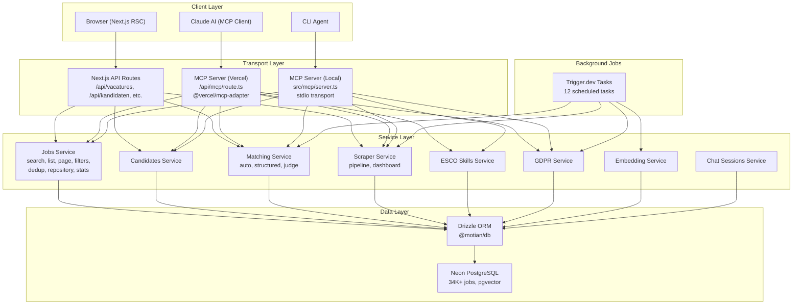
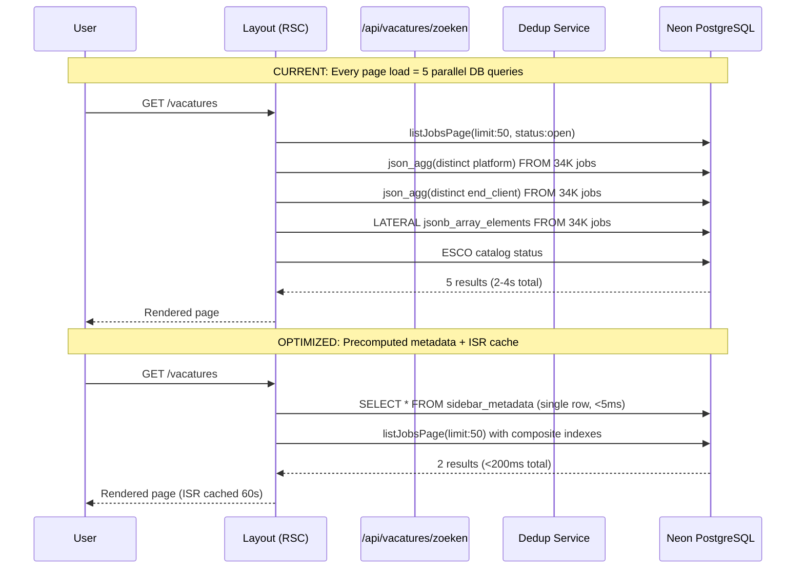
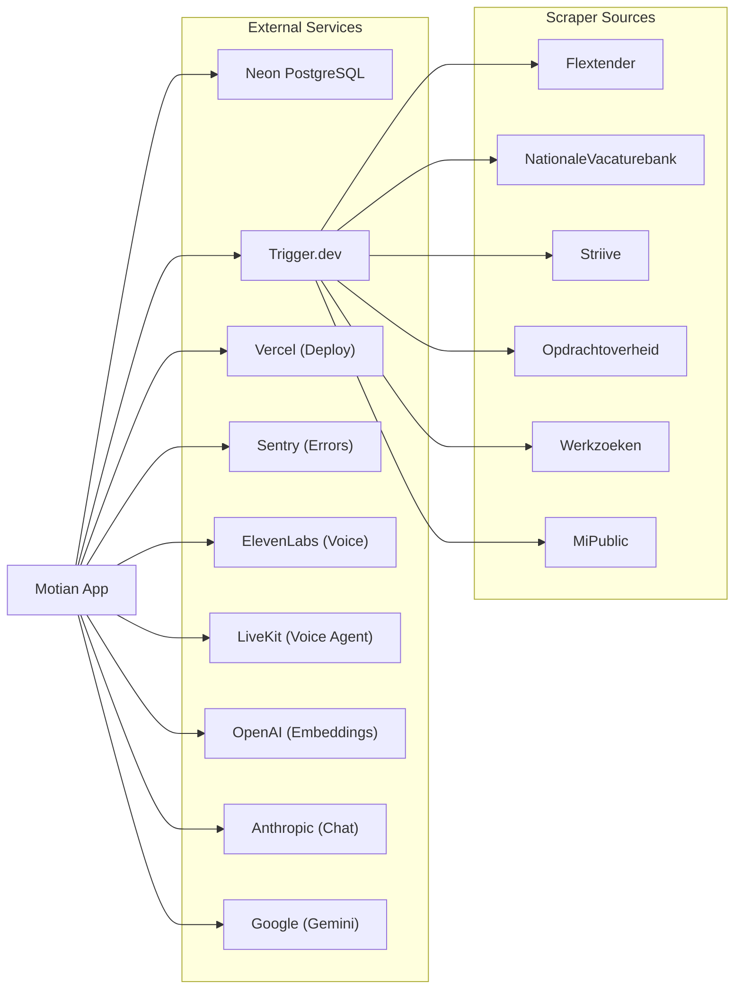
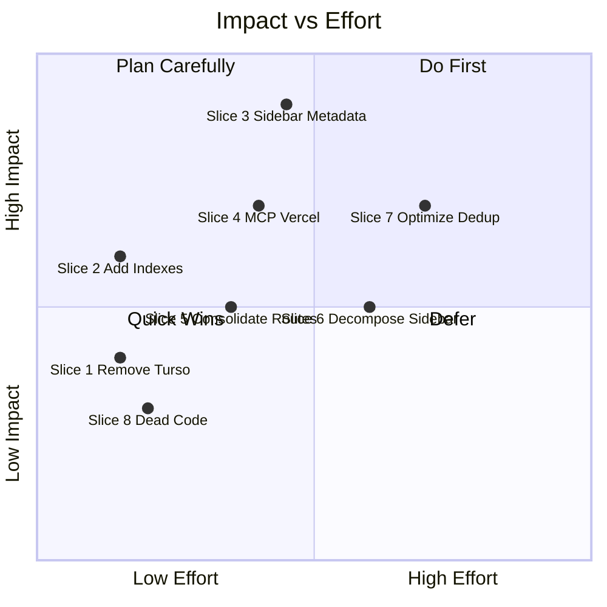

# Motian Performance Optimization & Refactoring Plan

**Date:** 2026-03-26
**Author:** Claude Opus 4.6
**Scope:** Speed optimization, dead code removal, architecture improvements, MCP Vercel deployment

---

## Architecture Overview



## Data Flow: Job Search (Current vs Optimized)



## Integration Points



---

## Vertical Slices (PRs)

Each slice is a complete PR: test first, implement, lint, build, merge.

---

### Slice 1: Remove Turso Fallback Database

**Complexity:** 2/10
**Impact:** Simplifies DB layer, removes 6 files of dead code
**Branch:** `refactor/remove-turso-fallback`

**Definition of Done:**
- [ ] All Turso references removed from codebase
- [ ] `packages/db/src/index.ts` only supports Neon PostgreSQL
- [ ] Tests updated — no Turso fallback tests
- [ ] `pnpm test && pnpm lint && pnpm build` passes
- [ ] `.env.example` updated

**Files to modify:**

| File | Action | Lines Removed |
|------|--------|---------------|
| `packages/db/src/index.ts` | Remove `getTursoConfig()`, `createTursoDatabaseClient()`, fallback logic | ~60 |
| `tests/db-env-guard.test.ts` | Remove Turso test cases | ~30 |
| `vitest.config.ts` | Remove `TURSO_DATABASE_URL` mock | ~1 |
| `.env.example` | Remove Turso env vars | ~3 |
| `scripts/verify-db-connection.ts` | Remove Turso fallback checks | ~15 |
| `.factory/services.yaml` | Remove Turso service definition | ~6 |

**TDD Flow:**
```bash
# 1. Write test (update existing)
# Edit tests/db-env-guard.test.ts — remove Turso cases, add "throws without DATABASE_URL"
pnpm test tests/db-env-guard.test.ts  # FAIL (Turso tests still exist)

# 2. Implement
# Simplify packages/db/src/index.ts to Neon-only
# Remove @libsql/client from dependencies
pnpm test tests/db-env-guard.test.ts  # PASS

# 3. Clean up remaining references
# Remove from .env.example, vitest.config.ts, scripts/, .factory/
pnpm test && pnpm lint  # ALL PASS

# 4. Commit
git commit -m "refactor: remove Turso fallback, use Neon PostgreSQL only"
```

**Research prompt for junior:**
> "Read about Drizzle ORM's PostgreSQL dialect: https://orm.drizzle.team/docs/get-started/neon-new
> Understand why we don't need a SQLite fallback when using Neon's serverless driver."

---

### Slice 2: Add Performance Indexes

**Complexity:** 2/10
**Impact:** 30-50% faster filtered queries on 34K jobs
**Branch:** `perf/add-composite-indexes`

**Definition of Done:**
- [ ] Migration file `drizzle/0020_performance_composite_indexes.sql` created
- [ ] 4 composite indexes added
- [ ] `pnpm db:push` succeeds
- [ ] Query EXPLAIN shows index usage
- [ ] All tests pass

**Migration content:**
```sql
-- Composite index for ESCO skill filtering (EXISTS subquery)
CREATE INDEX IF NOT EXISTS "idx_job_skills_esco_job"
  ON "job_skills" ("esco_uri", "job_id");

-- Partial index for "open jobs" (most common filter)
CREATE INDEX IF NOT EXISTS "idx_jobs_open_active"
  ON "jobs" ("status", "scraped_at" DESC)
  WHERE "deleted_at" IS NULL AND "status" = 'open';

-- Pipeline count aggregation
CREATE INDEX IF NOT EXISTS "idx_applications_job_active"
  ON "applications" ("job_id")
  WHERE "deleted_at" IS NULL;

-- Platform + active filter
CREATE INDEX IF NOT EXISTS "idx_jobs_platform_active"
  ON "jobs" ("platform", "scraped_at" DESC)
  WHERE "deleted_at" IS NULL;
```

**TDD Flow:**
```bash
# 1. Write test
# Add test in tests/job-performance-indexes.test.ts verifying index names exist in schema
pnpm test tests/job-performance-indexes.test.ts  # FAIL

# 2. Create migration
pnpm db:generate  # Generate migration
pnpm db:push      # Push to Neon

# 3. Verify
pnpm test  # ALL PASS
```

**Research prompt:**
> "Read about PostgreSQL partial indexes: https://www.postgresql.org/docs/current/indexes-partial.html
> Understand why `WHERE deleted_at IS NULL` on an index is better than indexing all rows."

---

### Slice 3: Precompute Sidebar Metadata

**Complexity:** 5/10
**Impact:** 60-70% faster /vacatures layout render (biggest win)
**Branch:** `perf/precompute-sidebar-metadata`

**Definition of Done:**
- [ ] `sidebar_metadata` table added to schema
- [ ] Trigger.dev task refreshes metadata every 5 min
- [ ] Layout reads from metadata table (single row, <5ms)
- [ ] Fallback to live query if metadata stale >10 min
- [ ] `force-dynamic` replaced with `revalidate: 60`
- [ ] All tests pass

**Subtasks:**

#### 3a. Add `sidebarMetadata` table to schema (Complexity: 2/10)
```typescript
// packages/db/src/schema.ts
export const sidebarMetadata = pgTable("sidebar_metadata", {
  id: text("id").primaryKey().default("default"),
  totalCount: integer("total_count").notNull().default(0),
  platforms: jsonb("platforms").notNull().default([]),
  endClients: jsonb("end_clients").notNull().default([]),
  categories: jsonb("categories").notNull().default([]),
  skillOptions: jsonb("skill_options").notNull().default([]),
  skillEmptyText: text("skill_empty_text").notNull().default(""),
  computedAt: timestamp("computed_at").notNull().defaultNow(),
});
```

#### 3b. Create metadata refresh service (Complexity: 3/10)
```typescript
// src/services/sidebar-metadata.ts
export async function refreshSidebarMetadata(): Promise<void> { /* ... */ }
export async function getSidebarMetadata(): Promise<SidebarMetadata | null> { /* ... */ }
```

#### 3c. Create Trigger.dev task (Complexity: 2/10)
```typescript
// trigger/sidebar-metadata-refresh.ts
export const sidebarMetadataRefresh = schedules.task({
  id: "sidebar-metadata-refresh",
  cron: "*/5 * * * *",
  run: async () => { await refreshSidebarMetadata(); }
});
```

#### 3d. Update layout to use metadata (Complexity: 3/10)
- Replace `loadSidebarSummary()` with `getSidebarMetadata()`
- Add fallback to live query if metadata is stale
- Change `export const dynamic = "force-dynamic"` to `export const revalidate = 60`

**Research prompt:**
> "Read about Next.js ISR (Incremental Static Regeneration): https://nextjs.org/docs/app/building-your-application/data-fetching/incremental-static-regeneration
> Understand `revalidate` vs `force-dynamic` and when to use each."

---

### Slice 4: Deploy MCP Server to Vercel

**Complexity:** 4/10
**Impact:** MCP accessible via HTTP (not just local stdio)
**Branch:** `feat/vercel-mcp-deployment`

**Definition of Done:**
- [ ] `@vercel/mcp-adapter` installed
- [ ] `app/api/mcp/route.ts` created with HTTP transport
- [ ] All 9 tool categories work via HTTP
- [ ] Local stdio server preserved for dev
- [ ] Smoke test passes against deployed endpoint
- [ ] All tests pass

**Subtasks:**

#### 4a. Extract shared server setup (Complexity: 2/10)
```typescript
// src/mcp/create-server.ts — shared between stdio and HTTP
export function createMotianMCPServer() {
  const server = new Server(
    { name: "motian-recruitment", version: "0.1.0" },
    { capabilities: { tools: {} } },
  );
  server.setRequestHandler(ListToolsRequestSchema, ...);
  server.setRequestHandler(CallToolRequestSchema, ...);
  return server;
}
```

#### 4b. Create Vercel route handler (Complexity: 3/10)
```typescript
// app/api/mcp/route.ts
import { createMcpHandler } from "@vercel/mcp-adapter";
import { createMotianMCPServer } from "@/src/mcp/create-server";

const server = createMotianMCPServer();

export const { GET, POST, DELETE } = createMcpHandler(server, {
  redisUrl: process.env.REDIS_URL, // optional for SSE
  basePath: "/api/mcp",
  maxDuration: 60,
});
```

#### 4c. Update local server to use shared setup (Complexity: 1/10)
```typescript
// src/mcp/server.ts
import { createMotianMCPServer } from "./create-server";
const server = createMotianMCPServer();
const transport = new StdioServerTransport();
await server.connect(transport);
```

**Research prompt:**
> "Read Vercel MCP deployment docs: https://vercel.com/docs/mcp/deploy-mcp-servers-to-vercel
> Study the `@vercel/mcp-adapter` package: https://github.com/vercel/mcp-adapter"

---

### Slice 5: Consolidate Duplicate API Routes

**Complexity:** 4/10
**Impact:** Remove ~239 lines of duplicated route handlers
**Branch:** `refactor/consolidate-api-routes`

**Definition of Done:**
- [ ] `/api/vacatures/` routes become the canonical routes
- [ ] `/api/opdrachten/` routes redirect or re-export from vacatures
- [ ] All component fetch calls updated
- [ ] All tests pass
- [ ] No duplicate business logic

**Files to modify:**

| Opdrachten Route | Vacatures Route | Action |
|-----------------|-----------------|--------|
| `/api/opdrachten/route.ts` | `/api/vacatures/route.ts` | Make opdrachten re-export vacatures |
| `/api/opdrachten/[id]/route.ts` | `/api/vacatures/[id]/route.ts` | Same |
| `/api/opdrachten/[id]/raw/route.ts` | `/api/vacatures/[id]/raw/route.ts` | Same |
| `/api/opdrachten/[id]/match-kandidaten/route.ts` | `/api/vacatures/[id]/match-kandidaten/route.ts` | Same |
| `/api/opdrachten/[id]/koppel/route.ts` | `/api/vacatures/[id]/koppel/route.ts` | Merge koppel logic |
| `/api/opdrachten/zoeken/route.ts` | `/api/vacatures/zoeken/route.ts` | Same |

**TDD Flow:**
```bash
# 1. Write integration test
# Verify /api/opdrachten/[id] returns same data as /api/vacatures/[id]
pnpm test tests/api-route-parity.test.ts  # FAIL

# 2. Make opdrachten routes thin re-exports
# 3. Update component fetch URLs where needed
pnpm test  # ALL PASS
```

---

### Slice 6: Decompose opdrachten-sidebar.tsx (1614 lines)

**Complexity:** 6/10
**Impact:** Maintainability — largest component in codebase
**Branch:** `refactor/decompose-sidebar`

**Definition of Done:**
- [ ] `components/opdrachten-sidebar.tsx` split into 5+ focused components
- [ ] Each new component under 300 lines
- [ ] No visual/behavioral changes
- [ ] All tests pass

**Target decomposition:**
```
components/
├── opdrachten-sidebar.tsx         → Container (orchestration only, <100 lines)
├── sidebar/
│   ├── job-list.tsx               → Job card list with virtual scroll
│   ├── job-filters.tsx            → Filter controls (platform, status, rate)
│   ├── job-search-bar.tsx         → Search input with debounce
│   ├── job-sort-controls.tsx      → Sort dropdown
│   └── job-list-item.tsx          → Individual job card
```

**Research prompt:**
> "Read about React composition patterns: https://react.dev/learn/passing-data-deeply-with-context
> Study virtual scrolling for large lists: https://tanstack.com/virtual/latest"

---

### Slice 7: Optimize Deduplication Query

**Complexity:** 7/10
**Impact:** 20-40% faster job listing on unfiltered queries
**Branch:** `perf/optimize-dedup-query`

**Definition of Done:**
- [ ] Materialized dedup view or pre-computed dedupe_rank
- [ ] Trigger.dev task refreshes after each scrape
- [ ] Fallback to live CTE when materialized data is stale
- [ ] p95 list query under 500ms (current SLO)
- [ ] All tests pass

**Subtasks:**

#### 7a. Add `job_dedupe_ranks` table (Complexity: 3/10)
```typescript
export const jobDedupeRanks = pgTable("job_dedupe_ranks", {
  jobId: text("job_id").primaryKey().references(() => jobs.id),
  dedupeRank: integer("dedupe_rank").notNull(),
  computedAt: timestamp("computed_at").notNull().defaultNow(),
});
```

#### 7b. Create refresh function (Complexity: 4/10)
```typescript
export async function refreshDedupeRanks(): Promise<void> {
  // INSERT INTO job_dedupe_ranks SELECT ... FROM dedup CTE
  // ON CONFLICT UPDATE
}
```

#### 7c. Use materialized ranks in listJobsPage (Complexity: 4/10)
```typescript
// Instead of running CTE on every request:
// SELECT j.* FROM jobs j
// INNER JOIN job_dedupe_ranks r ON r.job_id = j.id
// WHERE r.dedupe_rank = 1
// ORDER BY ...
```

**Research prompt:**
> "Read about PostgreSQL materialized views vs manual refresh tables:
> https://www.postgresql.org/docs/current/rules-materializedviews.html
> Consider trade-offs: freshness vs query speed."

---

### Slice 8: Remove Dead Code & Unused Dependencies

**Complexity:** 3/10
**Impact:** Cleaner codebase, smaller bundle
**Branch:** `chore/remove-dead-code`

**Definition of Done:**
- [ ] Unused ESCO re-export stubs removed (3 files)
- [ ] `@libsql/client` removed from deps (after Turso removal)
- [ ] Commented-out code blocks removed
- [ ] Orphaned files removed
- [ ] `pnpm test && pnpm lint && pnpm build` passes

**Files to remove/clean:**
```
src/services/esco.ts              → Direct import from @motian/esco
src/services/esco-import.ts       → Direct import from @motian/esco
src/services/esco-backfill.ts     → Direct import from @motian/esco
app/opdrachten/[id]/job-detail-fields.tsx  → Already deleted
app/opdrachten/[id]/json-viewer.tsx        → Already deleted
```

**Unused dependencies to check:**
```bash
# Run depcheck
npx depcheck --ignores="@types/*,vitest,@vitest/*"
```

---

### Slice 9: Fix MCP Server .env.local Loading

**Complexity:** 1/10
**Impact:** MCP tools work locally without manual env setup
**Branch:** `fix/mcp-env-loading`
**Status:** DONE (committed in earlier session)

---

## Priority Matrix



## Recommended Execution Order

| Order | Slice | Complexity | Depends On | Estimated Time |
|-------|-------|-----------|------------|----------------|
| 1 | Slice 1: Remove Turso | 2/10 | None | 30 min |
| 2 | Slice 2: Add Indexes | 2/10 | None | 15 min |
| 3 | Slice 8: Dead Code | 3/10 | Slice 1 | 30 min |
| 4 | Slice 9: MCP env fix | 1/10 | None | DONE |
| 5 | Slice 5: Consolidate Routes | 4/10 | None | 1 hour |
| 6 | Slice 4: MCP Vercel | 4/10 | None | 1.5 hours |
| 7 | Slice 3: Sidebar Metadata | 5/10 | Slice 2 | 2 hours |
| 8 | Slice 6: Decompose Sidebar | 6/10 | None | 2 hours |
| 9 | Slice 7: Optimize Dedup | 7/10 | Slice 2, 3 | 3 hours |

**Total estimated time:** ~11 hours of focused work

---

## Conventions

- **Branch naming:** `{type}/{short-description}` (e.g., `perf/add-composite-indexes`)
- **Commit style:** Conventional commits (`feat:`, `fix:`, `refactor:`, `perf:`, `chore:`)
- **Testing:** Write test FIRST, run (fail), implement, run (pass), commit
- **File limit:** Keep files under 500 lines; split if larger
- **Type safety:** TypeScript everywhere, Zod for runtime validation
- **Linting:** `pnpm lint` (Biome) must pass before commit
- **Build:** `pnpm build` must pass before merge to main
