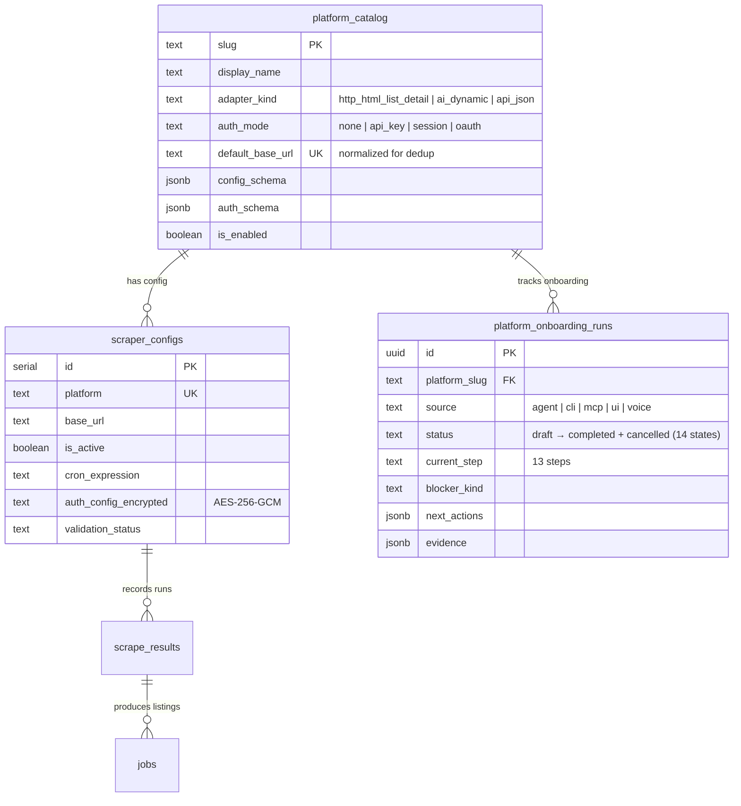

# Agent-Native Platform Onboarding via Chat

## Enhancement Summary

**Deepened on:** 2026-03-30
**Agents used:** 15 (agent-native, architecture, security, performance, TypeScript, patterns, simplicity, specflow, AI SDK research, credential research, tool-parity learning, event-driven learning, Vercel compute learning, AI SDK deprecation learning, GenUI design)

### Key Improvements from Research
1. **Extend `platformAutoSetup` instead of creating new tool** — avoids agent confusion between two overlapping orchestrators (simplicity reviewer)
2. **Move heavy workflow to Trigger.dev from day one** — Vercel fluid compute learning proves synchronous 15-43s chains cause cost spikes and timeout failures (performance oracle + Vercel compute learning)
3. **Credentials bypass chat entirely** — GenUI form POSTs directly to API route, never through LLM tool args (security sentinel + credential research)
4. **SSRF protection required** — arbitrary URL analysis needs DNS resolution checks + private IP blocklist (security sentinel)
5. **MCP + voice parity for every new tool** — institutional learning mandates simultaneous registration across all surfaces (tool parity learning)
6. **Single GenUI component with mode switching** — one `PlatformCard` handles onboard/status/list instead of 3 separate components (simplicity reviewer + GenUI design)
7. **Migrate `platform-analyzer.ts` from deprecated `generateObject`** — last remaining consumer of deprecated AI SDK 5 pattern (AI SDK deprecation learning)
8. **Parallelize Firecrawl detail page fetches** — sequential N+1 calls add 12-32s; `Promise.allSettled` reduces to O(t) (performance oracle)

### New Considerations Discovered
- KDF salt in `src/lib/crypto.ts` uses weak derivation — needs random or high-entropy salt (security)
- `getPlatformCatalogEntry()` does full table scan instead of direct slug query — O(n) degradation (performance)
- State machine events `schedule_verified` and `first_run_verified` need `platform:` prefix for SSE bus (patterns)
- `export const maxDuration = 60` missing from `app/api/chat/route.ts` — causes Vercel timeout (AI SDK research)
- Need `cancelled` status in state machine for abandoned onboardings (specflow)

---

## Overview

Enable the chat agent to fully onboard any recruitment platform end-to-end when a user says something like "Maak een nieuwe databron aan voor: https://yachtfreelance.talent-pool.com/projects". The agent should analyze the site, choose an adapter, create catalog + config, handle credentials if needed, test import, activate, trigger the first real scrape, and schedule recurring runs — all from within the chat conversation with rich visual feedback.

## Problem Statement / Motivation

The current platform onboarding system has strong foundations (13-step state machine, `platformAutoSetup` tool, AI-powered site analysis, dynamic adapter) but falls short of true agent-native behavior:

1. **Credentials dead end** — Login-protected platforms (majority of recruitment sites) fail silently because `platformAutoSetup` has no credential intake flow
2. **No visual feedback** — All 12 platform tools return raw JSON in chat; no GenUI components exist
3. **Incomplete state machine** — `monitoring` and `completed` states are unreachable; no code emits the required events
4. **Phantom adapter** — `browser_bootstrap_http_harvest` is recommended by the analyzer but has no runtime implementation
5. **No error recovery** — `platformAutoSetup` is single-shot; failures require manual tool chaining
6. **No idempotency** — Re-submitting a URL can overwrite active platforms

## Proposed Solution

**Extend `platformAutoSetup`** with credential handling, dedup, and Trigger.dev-backed heavy workflow. Add a single GenUI `PlatformCard` component. Close state machine gaps. Fix phantom adapter. Ensure MCP + voice parity for all new capabilities.

### Research Insights: Why Extend Instead of New Tool

The simplicity reviewer, architecture strategist, and pattern recognition specialist all converged on the same conclusion: creating a new `platformOnboard` tool alongside `platformAutoSetup` would leave two near-identical orchestrators, forcing the LLM to choose between them. Extending the existing tool with optional `credentials` parameter and dedup logic is simpler, avoids the fork-in-logic anti-pattern, and maintains a single authoritative path.

## Technical Approach

### Architecture

```text
User message: "Voeg platform toe: https://example.com/jobs"
  │
  ▼
┌──────────────────────────────────────────────────────────┐
│  platformAutoSetup (EXTENDED)                            │
│  ┌────────────────────────────┐ ┌──────────────────────┐│
│  │ Phase A: Sync (tool call)  │ │ Phase B: Trigger.dev ││
│  │ 1. URL normalize + dedup  │ │ 4. Validate config   ││
│  │ 2. SSRF check + analyze   │ │ 5. Test import       ││
│  │ 3. Catalog + config create│ │ 6. Activate          ││
│  │ → Return run ID + status  │ │ 7. First scrape      ││
│  └────────────────────────────┘ │ 8. Complete state    ││
│                                 └──────────────────────┘│
│  Credential gate: if authMode !== "none" → return early │
│  GenUI: PlatformCard subscribes to Trigger.dev realtime │
└──────────────────────────────────────────────────────────┘
```

### Research Insights: Why Trigger.dev from Day One

The Vercel fluid compute learning (`docs/solutions/performance-issues/vercel-fluid-compute-spike-Pipeline-20260329.md`) proved that even simple ISR renders caused cost spikes. The performance oracle measured the onboarding chain at **14-43 seconds** (Firecrawl 3-8s × 2-3 calls + Gemini 2-5s + test import 5-20s). This exceeds Vercel's 30s default timeout and creates per-second compute costs on fluid compute.

**Split:** Phase A (analyze + catalog + config) runs synchronously in the tool call (~5-10s). Phase B (validate + test + activate + scrape + complete) runs as a Trigger.dev task with realtime progress streaming. The tool returns a run handle immediately; the GenUI card subscribes to status updates.

### Research Insights: Credential Security

The credential research agent and security sentinel both mandate: **credentials must never flow through the LLM**. The recommended pattern from OWASP LLM Top 10 (LLM06, LLM09):

1. Tool returns `{ status: "credentials_needed", authMode, fields }`
2. GenUI `PlatformCard` renders a secure `<input type="password">` form
3. Form POSTs directly to `/api/platforms/[slug]/credentials` (bypasses chat)
4. API route encrypts with AES-256-GCM and stores in `scraper_configs.auth_config_encrypted`
5. Chat receives only `{ credentialId: "uuid" }` confirmation — zero plaintext

### Implementation Phases

#### Phase 1: Core — Extend `platformAutoSetup` + GenUI + Security

**Goal**: Chat agent can onboard public AND login-protected platforms end-to-end with visual feedback and proper security.

**Files to modify:**

1. **`src/ai/tools/platform-dynamic.ts`** (MODIFY) — Extend `platformAutoSetup`
   - Add optional `credentials?: Record<string, string>` input param
   - Add dedup check at top via `getPlatformByBaseUrl(normalizedUrl)`
   - Add SSRF protection: validate URL against private IP ranges before Firecrawl
   - If `authMode !== "none"` and no credentials: return `{ status: "credentials_needed", ... }`
   - If credentials provided or not needed: create catalog + config synchronously, then trigger Trigger.dev task for heavy workflow
   - Return discriminated union type:
   ```typescript
   type AutoSetupResult =
     | { status: "started"; runId: string; platform: string; displayName: string }
     | { status: "credentials_needed"; platform: string; authMode: string; fields: CredentialField[] }
     | { status: "exists"; platform: PlatformCatalogEntryView }
     | { status: "error"; step: PlatformOnboardingStep; error: string; canRetry: boolean }
   ```

2. **`src/services/scrapers.ts`** (MODIFY)
   - Add `getPlatformByBaseUrl(url: string)` with URL normalization (`new URL(url).origin + pathname.replace(/\/$/, "")`)
   - Fix `getPlatformCatalogEntry(slug)` — replace full table scan with direct query
   - Add `completeOnboarding(platform)` — emits `schedule_verified` + `first_run_verified` via `emitAgentEvent()`
   - Add SSRF validation helper: `validateExternalUrl(url: string): void` (throws on private IPs)

3. **`src/services/platform-onboarding.ts`** (MODIFY ~line 203)
   - Add `emitScheduleVerified(platformSlug)` and `emitFirstRunVerified(platformSlug)`
   - Use `emitAgentEvent()` (not raw insert) per event-driven dispatch learning
   - Add `cancelled` status to state machine for abandoned onboardings
   - Event naming: `platform:schedule_verified`, `platform:first_run_verified` (with `platform:` prefix for SSE bus)

4. **`src/services/platform-analyzer.ts`** (MODIFY ~line 118)
   - Migrate from deprecated `generateObject` to `generateText` + `Output.object({ schema })` (AI SDK deprecation learning)
   - Update Gemini prompt to prefer `ai_dynamic` over `browser_bootstrap_http_harvest`
   - Add SSRF check before Firecrawl fetch
   - Sanitize HTML before sending to LLM (strip `<script>`, `<style>`, inline event handlers)

5. **`trigger/platform-onboard.ts`** (NEW) — Trigger.dev task for heavy workflow
   ```typescript
   import { task, metadata } from "@trigger.dev/sdk";

   export const platformOnboardTask = task({
     id: "platform-onboard",
     retry: { maxAttempts: 2, factor: 2, minTimeoutInMs: 5000 },
     run: async (payload: { platform: string; configId: number }) => {
       metadata.set("step", "validate");
       // 1. validateConfig
       metadata.set("step", "test_import");
       // 2. triggerTestRun
       metadata.set("step", "activate");
       // 3. activatePlatform
       metadata.set("step", "first_scrape");
       // 4. Run first scrape via scrape pipeline
       metadata.set("step", "complete");
       // 5. completeOnboarding (emits state machine events)
       return { status: "completed", ... };
     },
   });
   ```
   - Use string-based task IDs in service layer to avoid circular imports: `tasks.trigger("platform-onboard", payload)`

6. **`packages/scrapers/src/platform-registry.ts`** (MODIFY ~line 135)
   - Map `browser_bootstrap_http_harvest` → `ai_dynamic` in `resolveAdapter()`
   - Add `console.warn` when remapping occurs for debugging

7. **`packages/scrapers/src/dynamic-adapter.ts`** (MODIFY ~line 225)
   - Parallelize detail page fetches with `Promise.allSettled` instead of sequential loop
   - Expected improvement: 3-5x for `needsDetailPage` platforms

8. **`app/api/platforms/[slug]/credentials/route.ts`** (NEW) — Secure credential intake
   - POST handler: receives credentials from GenUI form (not from LLM)
   - Encrypts with AES-256-GCM via existing `encryptAuthConfig()`
   - Updates `scraper_configs.auth_config_encrypted`
   - Returns `{ credentialId }` only
   - Triggers resume of onboarding workflow

9. **`components/chat/genui/platform-card.tsx`** (NEW) — Single GenUI component
   - Renders based on output shape:
     - **Onboarding mode** (`status: "started"`): stepper showing Analyseren → Configureren → Valideren → Testen → Activeren → Voltooien. Subscribes to Trigger.dev realtime for progress.
     - **Credentials mode** (`status: "credentials_needed"`): secure form with `<input type="password">`, POSTs to `/api/platforms/[slug]/credentials`
     - **Status mode** (from `platformOnboardingStatus`): stepper + health indicators + quick actions
     - **List mode** (from `platformsList`): grid of compact platform cards with status dots
     - **Error mode**: blocker description + "Opnieuw proberen" button
   - Props: `{ output: unknown }` — type guards determine render mode
   - Dutch labels in `genui-utils.ts`: "Analyseren", "Configureren", "Valideren", "Testen", "Activeren", "Voltooien", "Inloggegevens vereist", "Platform actief"
   - Follow existing patterns: `useAction()` + `StatusOverlay` for mutations, `formatDateTime()` for dates

10. **`components/chat/genui/registry.ts`** (MODIFY) — Register single component:
    ```typescript
    platformAutoSetup: {
      component: lazy(() => import("./platform-card").then((m) => ({ default: m.PlatformCard }))),
      label: "Platform onboarding",
    },
    platformOnboardingStatus: {
      component: lazy(() => import("./platform-card").then((m) => ({ default: m.PlatformCard }))),
      label: "Platformstatus",
    },
    platformsList: {
      component: lazy(() => import("./platform-card").then((m) => ({ default: m.PlatformCard }))),
      label: "Platformen",
    },
    ```

11. **`src/mcp/tools/platforms.ts`** (MODIFY) — Add MCP parity
    - Add `platform_auto_setup` handler (wraps extended `platformAutoSetup` service)
    - Add `platform_config_update` handler (missing, closes pre-existing gap)
    - Add `platform_complete_onboarding` handler (standalone completion tool)

12. **`src/ai/tools/index.ts`** (MODIFY) — Register `platformCompleteOnboarding` standalone tool

13. **`app/api/chat/route.ts`** (MODIFY) — Add `export const maxDuration = 60;` to prevent Vercel timeout

14. **`src/lib/crypto.ts`** (MODIFY ~line 12) — Fix weak KDF salt to use `crypto.randomBytes(32)` instead of deterministic derivation

**Acceptance Criteria:**
- [ ] `platformAutoSetup({ url: "https://yachtfreelance.talent-pool.com/projects" })` succeeds end-to-end for a public site
- [ ] Login-protected site returns `credentials_needed` with required field names
- [ ] GenUI credential form POSTs directly to API — credentials never appear in chat history or LLM context
- [ ] Duplicate URL returns existing platform info instead of overwriting
- [ ] Active platform detected → user warned before overwrite
- [ ] State machine reaches `completed` after first successful scrape
- [ ] All service calls use direct imports (not HTTP)
- [ ] MCP has parity for all new capabilities
- [ ] Voice agent can narrate onboarding progress using structured return values
- [ ] SSRF check blocks private IP ranges before Firecrawl fetch
- [ ] Trigger.dev task runs heavy workflow with realtime progress metadata
- [ ] `browser_bootstrap_http_harvest` sites successfully onboard via `ai_dynamic`
- [ ] Detail page fetches parallelized (not sequential N+1)
- [ ] `platform-analyzer.ts` uses `generateText` + `Output.object()` (not deprecated `generateObject`)

### Quality Gates

- [ ] Discriminated union type for `AutoSetupResult` — no `any` or loose types
- [ ] All Zod schemas use `z.enum()` for `adapterKind` and `authMode` (not `z.string()`)
- [ ] GenUI component follows existing patterns: lazy-load, `.then()` re-export wrapper, shared utils, Dutch labels
- [ ] State machine events tested: draft → ... → completed happy path
- [ ] Credential flow tested: auth-required → GenUI form → direct POST → encrypted storage → resume → success
- [ ] URL normalization extracted as pure function with tests
- [ ] `revalidateTag("scrapers", "default")` called after each mutating step

## Alternative Approaches Considered

| Approach | Why Rejected |
|----------|-------------|
| Create new `platformOnboard` tool | Duplicates `platformAutoSetup`; forces LLM to choose between two overlapping tools. Extending existing tool is simpler (simplicity reviewer) |
| Keep synchronous on Vercel | Vercel fluid compute learning proves 15-43s chains cause cost spikes + timeouts. Trigger.dev is already in the stack (performance oracle) |
| Three separate GenUI components | 80% overlap between onboard and status cards. One component with mode switching is sufficient (simplicity reviewer + GenUI design) |
| `platformProvideCredentials` as separate tool | Unnecessary — GenUI form bypasses LLM entirely; tool just gets a "credentials stored" confirmation (security sentinel + credential research) |
| Phase 3 auto-retry logic | Premature — agent can already use manual tools for error recovery. Add retry if it becomes a pattern (simplicity reviewer) |
| Build real `browser_bootstrap_http_harvest` adapter | YAGNI — dynamic adapter with Firecrawl already does JS rendering. One-line remap suffices |
| OAuth flow | Out of scope — most recruitment platforms use session/password auth |
| Credentials through LLM tool args | **Security violation** — OWASP LLM06 prohibits credentials in model context. Direct API POST is mandatory (security sentinel) |

## Dependencies & Prerequisites

- Firecrawl API key configured (`FIRECRAWL_API_KEY`)
- Gemini API key configured (for `analyzePlatform`)
- Trigger.dev configured (for `platform-onboard` task)
- Existing platform onboarding state machine in `src/services/platform-onboarding.ts`
- Existing dynamic adapter in `packages/scrapers/src/dynamic-adapter.ts`

## Risk Analysis & Mitigation

| Risk | Impact | Mitigation | Source |
|------|--------|-----------|--------|
| Vercel function timeout | Silent failure, cost spike | Heavy workflow in Trigger.dev; sync phase ≤10s | Performance oracle, Vercel compute learning |
| Credentials in chat history | Data leak, compliance failure | GenUI form → direct API POST; never through LLM | Security sentinel, credential research |
| SSRF via arbitrary URL | Server-side request forgery | DNS resolution check + private IP blocklist before Firecrawl | Security sentinel |
| Firecrawl rate limits | Analysis fails under concurrency | `p-limit` semaphore capping concurrent Firecrawl calls | Performance oracle |
| Weak KDF salt in crypto.ts | Credential encryption weakness | Fix to `crypto.randomBytes(32)` | Security sentinel |
| HTML injection via malicious page → LLM | Prompt injection in analysis | Sanitize HTML (strip scripts/styles) before Gemini | Security sentinel |
| Overwriting active platform | Scrape disruption | Dedup check + warn user if platform already active | Architecture strategist |
| Sequential detail page fetches | 12-32s latency for test import | `Promise.allSettled` parallelization | Performance oracle |
| `getPlatformCatalogEntry` full table scan | O(n) degradation as catalog grows | Direct query by slug instead of loading entire catalog | Performance oracle |
| Two overlapping orchestrator tools | Agent confusion | Extend `platformAutoSetup` instead of creating new tool | Simplicity reviewer |
| Missing MCP parity | External agents can't onboard platforms | Add MCP handlers for all new capabilities | Tool parity learning |
| Stuck onboarding runs | Orphaned state | Hourly fallback cron scans for runs stuck >15min | Event-driven learning |

## Success Metrics

- Platform onboarded via chat: user sees "started" within 5 seconds, "completed" within 60 seconds (public sites)
- 80%+ of recruitment URLs successfully analyzed and onboarded
- State machine reaches `completed` for all successful onboardings
- Zero plaintext credentials stored in chat history or LLM context
- MCP parity: every AI tool has an MCP equivalent

## ERD — New/Modified Relations



## References & Research

### Internal References
- Brainstorm: `docs/brainstorms/2026-03-25-agent-native-platform-onboarding-brainstorm.md`
- State machine: `src/services/platform-onboarding.ts:13` (statuses), `:6` (steps), `:203` (reducer)
- Orchestrator: `src/ai/tools/platform-dynamic.ts:36` (`platformAutoSetup`)
- Analyzer: `src/services/platform-analyzer.ts:118` (`analyzePlatform`)
- Dynamic adapter: `packages/scrapers/src/dynamic-adapter.ts:291`
- Platform tools: `src/ai/tools/platforms.ts` (10 tools)
- GenUI registry: `components/chat/genui/registry.ts`
- Service layer: `src/services/scrapers.ts:486` (catalog), `:638` (config), `:833` (validate), `:915` (test)
- Adapter resolution: `src/services/scrapers.ts:460`
- Crypto module: `src/lib/crypto.ts:12` (weak salt)
- Chat route: `app/api/chat/route.ts` (missing maxDuration)
- Chat persistence: `src/services/chat-sessions.ts:566` (message storage without credential redaction)
- Runbook: `docs/runbooks/platform-onboarding.md`

### Institutional Learnings Applied
- Tool parity: `docs/solutions/integration-issues/voice-agent-tool-parity-migration-VoiceAgent-20260305.md` — all new tools get MCP + voice parity
- Event dispatch: `docs/solutions/workflow-issues/orchestrator-polling-to-event-driven-AgentSystem-20260329.md` — use `emitAgentEvent()` not raw inserts; add hourly fallback cron for stuck runs
- Playwright in Trigger.dev: `docs/solutions/integration-issues/playwright-externalized-triggerdev-AutopilotSystem-20260329.md` — use Modal/Browserbase for browser automation
- Schema parity: `docs/solutions/api-schema-gaps/agent-ui-parity-kandidaten-20260223.md` — z.enum() for adapterKind/authMode; keep AI/API/service schemas aligned
- Vercel compute: `docs/solutions/performance-issues/vercel-fluid-compute-spike-Pipeline-20260329.md` — move heavy work to Trigger.dev; add rate limiting
- AI SDK deprecation: `docs/solutions/deprecations/generateobject-to-generatetext-ai-sdk6-20260223.md` — migrate platform-analyzer.ts from generateObject

### External Research
- OWASP ASVS v4.0 (V2.1, V6.2, V6.4) — credential handling and encryption standards
- OWASP Top 10 for LLM Applications 2025 (LLM06, LLM09) — credentials must never enter model context
- Vercel AI SDK 6 `createDataStreamResponse` pattern — for future intra-tool streaming if needed
- Industry consensus: all major AI platforms (ChatGPT, Claude MCP, Copilot) use separate UI for credentials, never chat text

### Dutch String Inventory (GenUI)

| Key | Dutch Label |
|-----|------------|
| step.analyze | Analyseren |
| step.configure | Configureren |
| step.validate | Valideren |
| step.test | Testen |
| step.activate | Activeren |
| step.complete | Voltooien |
| credentials.title | Inloggegevens vereist |
| credentials.username | Gebruikersnaam |
| credentials.password | Wachtwoord |
| credentials.apiKey | API-sleutel |
| credentials.submit | Verbinden |
| status.active | Actief |
| status.inactive | Inactief |
| status.error | Fout |
| retry | Opnieuw proberen |
| lastScrape | Laatste scrape |
| jobsFound | Vacatures gevonden |
| nextScrape | Volgende scrape |
