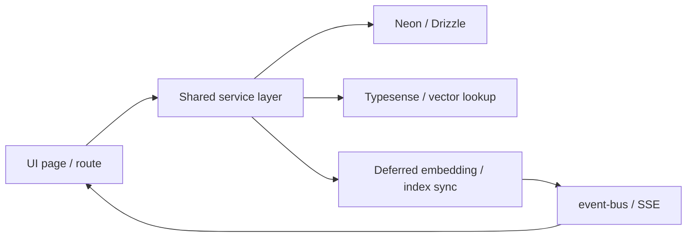

# Refactor: bootstrap local app and optimize performance hot paths

## Overview

This plan combines two tightly related goals:

1. Bootstrap the local workspace so the Motian app can be installed, configured, and verified in this checkout.
2. Implement the highest-ROI performance improvements identified in the current codebase review, focusing on hot user-facing paths and request-path work that can be moved out of band.

The requested scope is intentionally bounded to improvements that should produce measurable wins quickly without reopening broad architecture work. The plan builds on earlier optimization work around sidebar metadata, unified vacature search, and search observability (see origin and prior plans in `docs/plans/2026-03-26-performance-optimization-and-refactoring-plan.md` and `docs/plans/2026-03-06-refactor-unified-vacature-search-parity-plan.md`).

## Problem Frame

The repository is missing local install state in this worktree, which blocks reliable measurement and browser verification. At the same time, the current app still has several hot paths that bypass shared search services, perform expensive fallback queries, or keep non-critical AI/indexing work on the synchronous request path.

The highest-value issues are:

- Kandidaten list/search still uses page-local SQL instead of the shared candidate search service.
- Vacatures list/search still has a slow CTE fallback when `job_dedupe_ranks` freshness lapses.
- Candidate/job write paths await embedding and Typesense sync work that should not block user requests.
- Vacature detail reads still assemble several expensive reads inline in the page module.
- Auto-matching still falls back to broad in-memory scoring over large collections.
- SSE-driven refresh currently triggers `router.refresh()` too eagerly.
- Typesense collection bootstrap still sits on the hot query path.

## Scope

### In scope

- Install repo dependencies needed to run this checkout.
- Create `.env.local` from `.env.example` if absent.
- Refactor kandidaten page data loading to use shared candidate search/count services.
- Improve dedupe-rank freshness behavior so vacatures pages stay on the fast path more reliably.
- Move embedding/index sync work off synchronous write paths where feasible.
- Extract or centralize vacature detail data loading to trim page-level overhead.
- Reduce auto-matching fallback work by preferring smaller semantic shortlists.
- Debounce or coalesce SSE-triggered `router.refresh()` calls.
- Remove Typesense collection-ensure work from hot search requests and relocate it to a bootstrap/maintenance path.
- Add or update tests for the touched service behavior.

### Out of scope

- Large schema redesigns or unrelated migration work.
- Full chat/CV-pipeline optimization pass.
- Comprehensive infra rollout or production ops changes beyond what is needed to keep the dedupe/index bootstrap path hot.
- Secret provisioning beyond copying `.env.example` into `.env.local`.

## Relevant Context and Existing Patterns

- Shared vacature search contract already exists in [src/services/jobs.ts](src/services/jobs.ts) and related `jobs/*` service modules.
- Candidate shared search/count logic already exists in [src/services/candidates.ts](src/services/candidates.ts).
- Search/dedupe observability already exists in [src/lib/query-observability.ts](src/lib/query-observability.ts), plus benchmark/explain scripts under [scripts](scripts).
- Sidebar metadata precomputation is an accepted pattern in [src/services/sidebar-metadata.ts](src/services/sidebar-metadata.ts).
- Prior learning indicates performance work should prefer precomputed metadata / event-driven refresh over repeated heavy polling and synchronous long-lived work (`docs/solutions/workflow-issues/orchestrator-polling-to-event-driven-AgentSystem-20260329.md`, `docs/solutions/performance-issues/vercel-fluid-compute-spike-Pipeline-20260329.md`).
- Existing analysis flags embedding completion and concurrent embedding/matching as a known fragility for candidate workflows (`docs/analysis/2026-03-05-arch-review-action-items.md`).

## Decision on Plan Depth

This is a **Standard** plan.

Rationale:

- It touches multiple hot paths and services, so it needs sequencing and service-boundary decisions.
- It does not require new product behavior or a high-risk security/payments/migration design.
- The codebase already contains the main architectural primitives we want to lean on.

## High-Level Technical Design

The implementation should preserve current service-layer boundaries and tighten them:

- UI pages should consume shared search services, not re-implement query logic.
- Performance-critical list routes should prefer precomputed data and stable fast-path joins.
- Writes should persist core records synchronously, then enqueue or defer derived/indexing work.
- Revalidation and live refresh should be event-driven but coalesced to avoid repeated full-page RSC refreshes.
- Search infrastructure bootstrap should happen before or outside user-triggered search requests.

Directional flow:

## Implementation Units

### 1. Bootstrap the local checkout

- [ ] Install workspace dependencies and generate a runnable local checkout baseline.
- [ ] Copy `.env.example` to `.env.local` if `.env.local` does not already exist.
- [ ] Record any remaining runtime blockers caused by missing real secrets or external services.

Files:

- [package.json](package.json)
- [.env.example](.env.example)
- [.env.local](.env.local)

Execution note:

- This is bootstrap work, not product behavior. Prefer minimal setup changes over env/schema churn.

Verification:

- `pnpm install` completes in the root workspace.
- `.env.local` exists.
- `pnpm lint`, `pnpm exec tsc --noEmit`, and at least one app boot command can run far enough to prove the checkout is configured, subject to secret availability.

### 2. Route kandidaten page queries through shared candidate search/count services

- [ ] Replace page-local filtering/count logic in the kandidaten listing page with calls to shared service helpers.
- [ ] Preserve Dutch UI labels and current pagination/filter semantics.
- [ ] Keep the page’s result projection lean enough for the card UI instead of using a wider-than-needed select.

Files:

- [app/kandidaten/page.tsx](app/kandidaten/page.tsx)
- [src/services/candidates.ts](src/services/candidates.ts)
- [tests](tests)

Technical design:

- Add or expose a page-oriented candidate search helper if the existing `searchCandidates()` return shape is too broad.
- Reuse `countCandidates()` rather than maintaining separate page-local count SQL.
- If the page needs a specialized projection, create a thin shared helper in `src/services/candidates.ts` instead of keeping ad hoc SQL in the page.

Verification:

- Kandidaten search still supports query, availability, and ESCO skill filters.
- Search behavior uses Typesense-first / fallback behavior from the shared service layer.
- Added tests cover search/count behavior and page-level parameter mapping.

### 3. Keep vacature dedupe on the fast path

- [ ] Audit and tighten `job_dedupe_ranks` freshness usage so list/search paths rarely hit the CTE fallback.
- [ ] Add a deterministic refresh trigger for rank updates on relevant job writes or maintenance points.
- [ ] Ensure the fast path remains compatible with current filter/sort behavior.

Files:

- [src/services/jobs/deduplication.ts](src/services/jobs/deduplication.ts)
- [src/services/jobs/repository.ts](src/services/jobs/repository.ts)
- [src/services/jobs/page-query.ts](src/services/jobs/page-query.ts)
- [src/services/jobs/list.ts](src/services/jobs/list.ts)
- [tests](tests)

Technical design:

- Prefer refreshing or invalidating precomputed dedupe ranks when writes touch fields used in dedupe grouping/order.
- Avoid broad synchronous recomputation inside the request if a deferred refresh plus temporary stale-safe read is sufficient.
- Keep `knownTotal` optimization intact for sidebar/list callers.

Verification:

- Service tests confirm fast-path selection behavior.
- No regression in ordering or total-count semantics for list/search callers.

### 4. Move derived embedding/index sync work off critical write paths

- [ ] Refactor candidate creation so embedding generation and index sync no longer block the mutation response.
- [ ] Refactor job write paths so Typesense sync and similar derived work happen out of band where possible.
- [ ] Preserve eventual consistency via events or background scheduling, and ensure failures remain observable.

Files:

- [src/services/candidates.ts](src/services/candidates.ts)
- [src/services/jobs/repository.ts](src/services/jobs/repository.ts)
- [src/services/embedding.ts](src/services/embedding.ts)
- [src/lib/event-bus.ts](src/lib/event-bus.ts)
- [tests](tests)

Technical design:

- Core persistence remains synchronous.
- Derived work should be triggered via event publication, deferred Promise scheduling, or existing background-task primitives already accepted in the repo.
- Surface-level UI updates should rely on live refresh after background completion, not blocked mutation latency.

Verification:

- Mutation response paths return before embedding/index work finishes.
- Failures in deferred work are logged and do not corrupt the primary mutation.
- Tests cover deferred trigger behavior at the service boundary.

### 5. Trim vacature detail data loading

- [ ] Extract the detail page’s DB work into a shared service/repository function.
- [ ] Reduce repeated broad reads where a purpose-built query can return only the data the page needs.
- [ ] Keep related jobs, recruiter cockpit data, grading, and end-client metadata behavior intact.

Files:

- [app/vacatures/[id]/page.tsx](app/vacatures/[id]/page.tsx)
- [src/services/jobs/repository.ts](src/services/jobs/repository.ts)
- [src/services/jobs](src/services/jobs)
- [tests](tests)

Technical design:

- Create a dedicated read model helper such as `getJobDetailPageData(id)` rather than leaving orchestration in the page.
- Co-locate the SQL with other jobs read models so performance behavior can be tested and evolved centrally.

Verification:

- Detail page still renders all current sections.
- Service-level tests cover missing-job and normal-job data assembly behavior.

### 6. Narrow auto-matching fallback workloads

- [ ] Reduce broad in-memory fallback scoring in auto-matching by using smaller candidate/job shortlists.
- [ ] Prefer vector shortlist paths where embeddings exist, and degrade cleanly when they do not.
- [ ] Avoid re-fetch churn around embedding creation where possible.

Files:

- [src/services/auto-matching.ts](src/services/auto-matching.ts)
- [src/services/embedding.ts](src/services/embedding.ts)
- [src/services/candidates.ts](src/services/candidates.ts)
- [src/services/jobs/list.ts](src/services/jobs/list.ts)
- [tests](tests)

Technical design:

- Use vector search as the preferred shortlist generator in both directions.
- If embeddings are missing, bound the fallback collection more aggressively and keep the matching pipeline focused on likely candidates.
- Carry forward the existing degraded-quality fallback instead of failing hard.

Verification:

- Matching still returns valid results when embeddings are present and when they are absent.
- Tests cover shortlist sizing / degraded fallback decisions.

### 7. Coalesce client refreshes and move search bootstrap out of request-time hot paths

- [ ] Debounce or coalesce `router.refresh()` calls from SSE/data-change listeners.
- [ ] Remove Typesense collection-ensure work from hot search requests and relocate it to startup/reindex/healthcheck/bootstrap paths.
- [ ] Preserve resiliency when Typesense is unavailable.

Files:

- [components/data-refresh-listener.tsx](components/data-refresh-listener.tsx)
- [src/hooks/use-event-source.ts](src/hooks/use-event-source.ts)
- [src/services/search-index/typesense-client.ts](src/services/search-index/typesense-client.ts)
- [src/services/search-index/typesense-search.ts](src/services/search-index/typesense-search.ts)
- [scripts/reindex-typesense.ts](scripts/reindex-typesense.ts)
- [tests](tests)

Technical design:

- `DataRefreshListener` should treat bursts of matching events as one refresh window.
- Search code should assume collections are already bootstrapped in healthy environments, while maintenance scripts or health/bootstrap code ensure that invariant.
- If bootstrap is still needed, do it once at a controlled lifecycle edge instead of per search request.

Verification:

- Burst event traffic causes at most one refresh per debounce window.
- Search behavior still degrades gracefully when Typesense is down.
- Tests cover debounce behavior and search bootstrap assumptions.

## Risks and Dependencies

- Copying `.env.example` to `.env.local` may still leave real-service secrets unresolved; app startup may be partial until valid credentials are supplied.
- Dedupe-rank freshness work must not regress result ordering or stale-read correctness.
- Moving derived work off the request path introduces eventual-consistency windows; UI refresh behavior must remain understandable.
- Auto-matching changes must preserve current fallback behavior when embeddings or vector search are unavailable.

## Verification Strategy

- Root install/bootstrap:
  - `pnpm install`
  - `pnpm lint`
  - `pnpm exec tsc --noEmit`
- Targeted tests for touched services/pages under [tests](tests)
- If the environment can run:
  - `pnpm dev`
  - Browser verification of kandidaten search, vacatures detail, and mutation/live-refresh flows
- If dependencies and secrets allow:
  - `pnpm benchmark:hybrid-search`
  - `pnpm metrics:search-explain`

## Sources and References

- **Origin document:** [docs/brainstorms/2026-03-06-motian-optimalisatie-baseline-en-backlog-brainstorm.md](docs/brainstorms/2026-03-06-motian-optimalisatie-baseline-en-backlog-brainstorm.md)
- Related prior plan: [docs/plans/2026-03-26-performance-optimization-and-refactoring-plan.md](docs/plans/2026-03-26-performance-optimization-and-refactoring-plan.md)
- Related prior plan: [docs/plans/2026-03-06-refactor-unified-vacature-search-parity-plan.md](docs/plans/2026-03-06-refactor-unified-vacature-search-parity-plan.md)
- Key code:
  - [app/kandidaten/page.tsx](app/kandidaten/page.tsx)
  - [src/services/candidates.ts](src/services/candidates.ts)
  - [src/services/jobs/deduplication.ts](src/services/jobs/deduplication.ts)
  - [src/services/jobs/repository.ts](src/services/jobs/repository.ts)
  - [app/vacatures/[id]/page.tsx](app/vacatures/[id]/page.tsx)
  - [src/services/auto-matching.ts](src/services/auto-matching.ts)
  - [components/data-refresh-listener.tsx](components/data-refresh-listener.tsx)
  - [src/services/search-index/typesense-client.ts](src/services/search-index/typesense-client.ts)
