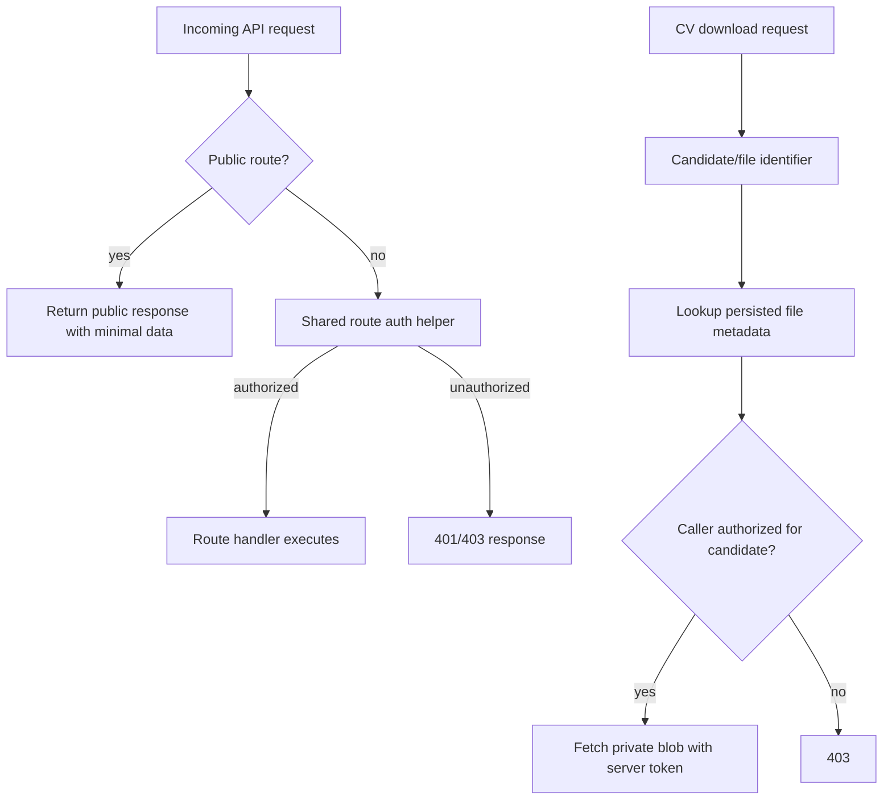

# fix: Harden API auth, CV file handling, and vulnerable runtime dependencies

## Summary

This plan closes the highest-risk security findings from the repository audit: first-party API authentication relies on a spoofable browser-origin signal, public diagnostics expose internals, private CV access is URL-based instead of candidate-bound, upload validation trusts client metadata, and the runtime dependency audit is red while pnpm overrides are ignored.

---

## Problem Frame

Motian handles candidate PII, private CV files, scraper credentials, and recruitment workflow data. The current boundary mixes CORS/origin handling with authentication, leaves a public debug endpoint enabled, and proxies private blob URLs without checking candidate/file ownership. Dependency hygiene also needs repair before the app can claim a defensible production security posture.

---

## Requirements

**Authentication and diagnostics**

- R1. Sensitive API routes must require server-verifiable authorization, not just a missing or allowed `Origin` header.
- R2. Browser-origin/CORS checks must remain browser isolation only and must not be treated as identity.
- R3. Debug diagnostics must be unavailable publicly in production and must not return stack traces or schema inventory to unauthenticated callers.

**CV file privacy and upload validation**

- R4. Private CV download/proxy access must be bound to a stored candidate/file record and an authorized caller.
- R5. The CV file proxy must reject arbitrary caller-supplied blob URLs, even when they point at Vercel Blob hostnames.
- R6. CV uploads must validate file content signatures/container structure before storing or parsing, not just extension or client MIME type.

**Dependency hygiene**

- R7. High/critical reachable runtime advisories reported by `pnpm audit --prod --audit-level high` must be remediated or explicitly documented with a bounded residual reason.
- R8. pnpm package extensions, peer dependency rules, and overrides must live in a location that the installed pnpm version actually reads.

**Verification**

- R9. Targeted route/service tests must cover the new auth, diagnostics, CV proxy, upload validation, and dependency/config contracts.
- R10. Existing project gates must continue to pass: lint, typecheck, Vitest, and the pre-PR harness.

---

## Key Technical Decisions

- **KTD1. Classify the API surface before enforcing auth.** The implementation must inventory every `app/api` route and mark it `public`, `authenticated-user`, `service-bearer`, `cron-only`, `admin-only`, or `deferred residual` before changing route behavior.
- **KTD2. Browser-facing auth must use a browser-safe server-verifiable principal.** A shared bearer/API secret is acceptable only for server-to-server, cron, or admin tooling; it must not be exposed to browser code or presented as per-candidate authorization.
- **KTD3. Introduce a shared protected-route authorization helper after principal discovery.** The helper keeps `proxy.ts` from becoming the only security boundary and gives route handlers a testable server-side gate that can return a principal for object checks.
- **KTD4. Preserve public health/docs/feed behavior narrowly.** `/api/gezondheid`, documented API surfaces, and intentionally public feed routes can stay public, but debug and PII-bearing routes move behind explicit route classifications.
- **KTD5. Migrate CV downloads from raw URL input to principal-and-record-bound access.** A caller should request a candidate/file identifier; the server resolves the blob URL from persisted state and checks that the authenticated principal can read that candidate/file before attaching `BLOB_READ_WRITE_TOKEN`.
- **KTD6. Add content-based CV validation before storage.** PDF validation should check file structure enough to reject malformed/truncated/polyglot inputs; DOCX validation should bound ZIP expansion and require expected Office entries.
- **KTD7. Treat dependency cleanup as a separate, bounded security unit.** Upgrading packages without moving ignored pnpm config would leave the repo vulnerable to the same silent override failure later, but remaining high/critical advisories need durable residual records with owner and expiry if they cannot be fixed in this PR.

---

## High-Level Technical Design

The proxy keeps rate limiting, CORS, and coarse request routing, but route handlers enforce identity for sensitive operations. CV file access becomes an object-authorization flow rather than a URL allowlist.

---

## Scope Boundaries

### In Scope

- Harden sensitive API authentication and tests around the proxy/route boundary.
- Disable or protect debug diagnostics.
- Replace arbitrary CV blob URL proxying with record-bound access.
- Add content-signature validation for PDF/DOCX uploads.
- Remediate high/critical reachable runtime dependency advisories and fix ignored pnpm configuration.

### Deferred to Follow-Up Work

- Full multi-tenant role/permission modeling if the product needs recruiter/team-level authorization beyond the current deployment model.
- Large UI redesigns for CV download links if a compatibility shim can keep the existing interface working safely during this fix.
- Broader low/moderate dependency audit cleanup outside high/critical reachable runtime advisories.

### Out of Scope

- Reworking the matching/search/scoring findings from the audit.
- Drizzle migration journal reconciliation.
- Platform expansion or scraper architecture refactors.

---

## Implementation Units

### U1. Inventory and classify the full API route surface

- **Goal:** Prevent partial hardening by classifying every `app/api` route before changing route behavior.
- **Requirements:** R1, R2, R3, R4, R5, R9.
- **Dependencies:** None.
- **Files:** `proxy.ts`, `tests/api-auth-boundary.test.ts`, route files under `app/api/**/route.ts` as classification evidence, optional `src/lib/api-route-classification.ts` if a durable classification map is useful.
- **Approach:** Build a complete inventory and assign each route one policy: `public`, `public-get-only`, `authenticated-user`, `service-bearer`, `cron-only`, `admin-only`, or `deferred residual`. Include nested surfaces such as `cv-upload/save`, GDPR export/delete, chat/session, matching, interviews, messages, settings, commercial CV, platform activation/validation/test-import, scraper dashboard/results, and embeddings backfill.
- **Patterns to follow:** Existing `PUBLIC_PATHS`, `FIRST_PARTY_PATHS`, and specialized bearer checks in `proxy.ts` and route files.
- **Test scenarios:**
  - Every route currently listed in `FIRST_PARTY_PATHS` is represented in the classification.
  - Routes classified as public are limited to intentional health/docs/feed/read-only surfaces.
  - Routes classified as deferred residual are named in a durable residual section or tracker item with reason and owner.
- **Verification:** The implementation cannot silently harden only headline endpoints while leaving unclassified sensitive routes behind.

### U2. Define browser-safe principal authentication and shared auth helpers

- **Goal:** Establish a reusable server-side authorization contract that does not expose shared secrets to browser code.
- **Requirements:** R1, R2, R9.
- **Dependencies:** U1.
- **Files:** `proxy.ts`, `src/lib/api-auth.ts`, `tests/api-auth-boundary.test.ts`, relevant route test utilities under `tests/` if needed.
- **Approach:** Discover whether Motian already has a server-verifiable user/session mechanism. If it does, wrap it in a helper that returns a principal. If it does not, keep shared bearer/API-secret auth strictly for service, cron, and admin-tool callers; do not use it as browser authentication. For browser-facing product routes, introduce or explicitly defer a safe principal mechanism such as HttpOnly session cookies or a server-side BFF path.
- **Patterns to follow:** `src/lib/api-cors.ts`, `src/lib/api-handler.ts`, `app/api/salesforce-feed/route.ts`, `tests/salesforce-feed-auth.test.ts`.
- **Test scenarios:**
  - Request to a sensitive route without a principal and without service credentials returns unauthorized.
  - Request to a sensitive route with an allowed browser `Origin` but no principal returns unauthorized.
  - Service/cron route with valid bearer/API secret reaches the route without exposing that secret to browser code.
  - Unsafe cookie-authenticated browser requests require the chosen CSRF defense: SameSite semantics, Origin/Sec-Fetch-Site validation, or token proof.
  - Public health/feed routes retain their intended public behavior.
- **Verification:** Sensitive route access can no longer be obtained by omitting `Origin`, and no test/client path requires exposing a shared server secret to browser JavaScript.

### U3. Apply authorization to classified sensitive routes

- **Goal:** Move sensitive routes from proxy-only protection to route-local authorization according to the route inventory.
- **Requirements:** R1, R2, R4, R5, R9.
- **Dependencies:** U1, U2.
- **Files:** `app/api/kandidaten/route.ts`, `app/api/kandidaten/[id]/route.ts`, `app/api/cv-upload/route.ts`, `app/api/cv-upload/save/route.ts`, `app/api/cv-analyse/route.ts`, `app/api/cv-file/route.ts`, `app/api/gdpr/**/route.ts`, `app/api/platforms/**/route.ts`, `app/api/scrape/starten/route.ts`, `app/api/scraper-configuraties/**/route.ts`, other classified non-public route files, targeted tests in `tests/`.
- **Approach:** Add the shared auth helper at the top of each non-public handler before reading bodies or touching services. Preserve specialized cron authorization for cron-only routes, but remove reliance on first-party origin as identity.
- **Patterns to follow:** Thin App Router handlers that delegate business logic to `src/services/`, existing Zod request validation in candidate and credentials routes.
- **Test scenarios:**
  - Candidate, CV save/analyse/file, GDPR export/delete, and credential endpoints reject unauthenticated requests.
  - Platform credentials and platform action endpoints reject unauthenticated writes before persisting credentials or triggering work.
  - Existing cron/bearer callers still work for cron/service routes.
  - Invalid auth returns Dutch/user-safe error bodies without leaking internals.
- **Verification:** Every route classified as non-public has route-local authorization coverage or a documented deferred residual.

### U4. Remove public production diagnostics

- **Goal:** Ensure debug diagnostics cannot expose environment, schema, or stack details publicly.
- **Requirements:** R3, R9.
- **Dependencies:** U1, U2 if the endpoint remains available behind auth.
- **Files:** `proxy.ts`, `app/api/debug-error/route.ts`, `tests/debug-error-route.test.ts` or an existing proxy/auth test file.
- **Approach:** Remove `/api/debug-error` from public paths. Prefer disabling the route outside local development; if retained, require the shared auth helper and redact stack/schema details from responses.
- **Patterns to follow:** Public health endpoint behavior in `app/api/gezondheid/` and route-level error handling via `src/lib/api-handler.ts`.
- **Test scenarios:**
  - Production-mode unauthenticated request to `/api/debug-error` returns not found or unauthorized.
  - Authenticated/local-development diagnostic response does not include stack trace fragments or schema table inventory.
  - `/api/gezondheid` remains public and minimal.
- **Verification:** No public path exposes debug stack/schema details.

### U5. Make CV file proxy principal-and-record-bound

- **Goal:** Replace arbitrary `?url=` CV proxy access with candidate/file identifier authorization.
- **Requirements:** R4, R5, R9.
- **Dependencies:** U1, U2, U3.
- **Files:** `app/api/cv-file/route.ts`, `src/lib/file-storage.ts`, `src/services/candidates.ts` or the service that owns CV metadata, `tests/cv-file-route.test.ts`, any UI/component file that currently builds `/api/cv-file?url=` links.
- **Approach:** Resolve the stored blob URL server-side from a candidate/file identifier and authorize access using both the authenticated principal and candidate/file record before fetching from Vercel Blob. Keep a temporary compatibility path only if it still maps the URL to persisted metadata and enforces the same principal check.
- **Patterns to follow:** Candidate service lookup patterns in `src/services/candidates.ts`; blob token handling in `src/lib/file-storage.ts`; route import/test style from existing API tests.
- **Test scenarios:**
  - Missing identifier returns bad request.
  - Unknown candidate/file identifier returns not found without fetching upstream.
  - Valid identifier with an authorized principal fetches the stored blob URL using the server token.
  - Valid identifier with a principal that cannot read that candidate/file returns 403 and does not fetch upstream.
  - Raw Vercel Blob URL supplied by the caller is rejected unless safely mapped to a persisted authorized record.
  - Upstream blob failure returns a safe status/body without leaking token or raw provider details.
- **Verification:** CV proxy tests prove the server no longer acts as a privileged fetcher for arbitrary caller-supplied blob URLs.

### U6. Validate CV upload content before storage

- **Goal:** Reject spoofed CV uploads whose extension or client MIME does not match file content.
- **Requirements:** R6, R9.
- **Dependencies:** None, but coordinate with U2 and U3 for route auth.
- **Files:** `src/lib/cv-upload.ts`, `app/api/cv-upload/route.ts`, `tests/cv-upload-validation.test.ts` or the existing CV upload test suite.
- **Approach:** Extend validation to inspect bytes before upload. PDF validation should reject wrong-header, truncated, encrypted/unsupported, and obvious polyglot inputs where feasible. DOCX validation should require ZIP structure plus expected Word document entries, reject path traversal entries, bound entry count/name length, and enforce uncompressed-size or decompression-ratio limits before parser/AI processing.
- **Patterns to follow:** Current `validateCvUploadFile` return shape and Dutch error messages in `src/lib/cv-upload.ts`.
- **Test scenarios:**
  - Valid PDF content with PDF MIME/extension is accepted.
  - Valid DOCX-like container with DOCX MIME/extension is accepted.
  - `.pdf` filename with plain text content is rejected.
  - DOCX MIME with non-ZIP content is rejected.
  - DOCX ZIP with missing `word/document.xml`, traversal entry names, or excessive expansion ratio is rejected.
  - Oversized file remains rejected before expensive parsing.
- **Verification:** Upload validation tests cover both metadata and byte-level checks.

### U7. Remediate high/critical runtime advisories and pnpm config drift

- **Goal:** Make the production dependency audit green for high/critical reachable runtime advisories or leave explicit bounded residuals.
- **Requirements:** R7, R8, R10.
- **Dependencies:** None.
- **Files:** `package.json`, `pnpm-lock.yaml`, `pnpm-workspace.yaml` or `.npmrc`/`pnpm-workspace.yaml` config as appropriate, package manifests under `agent/` and `extension/` if dependency alignment requires it, targeted dependency tests as needed.
- **Approach:** Move ignored pnpm settings out of the unsupported `package.json.pnpm` location into the pnpm-supported workspace configuration. Upgrade direct runtime dependencies with high/critical advisories first: `next`, `drizzle-orm`, `@whiskeysockets/baileys`, `langsmith`, and any direct/transitive package whose advisory remains reachable after a lock refresh.
- **Patterns to follow:** Existing root workspace package management and `pnpm-workspace.yaml` layout.
- **Test scenarios:**
  - `pnpm audit --prod --audit-level high` no longer reports high/critical reachable advisories, or each remaining item has a durable residual record with advisory ID, dependency chain, reachability, compensating control, owner, and revisit date.
  - No warning appears that pnpm config in `package.json` is ignored.
  - App typecheck/build-related tests still compile against upgraded framework/ORM packages.
- **Verification:** Package manager config is honored and dependency audit posture is materially improved.

### U8. Run integrated verification and document residuals

- **Goal:** Prove the hardening work holds together across lint, typecheck, tests, and harness gates.
- **Requirements:** R9, R10.
- **Dependencies:** U1, U2, U3, U4, U5, U6, U7.
- **Files:** Existing changed files only; optional `docs/solutions/security-issues/` note if implementation discovers a reusable security pattern worth preserving.
- **Approach:** Run targeted tests after each unit, browser/client compatibility checks for changed recruiter flows, then the repo-level gates. If a dependency advisory cannot be remediated safely, record the residual in a tracker ticket or committed security note plus PR body without exposing secret values.
- **Patterns to follow:** Root `package.json` scripts and AGENTS.md quality gates.
- **Test scenarios:**
  - Full test suite passes after targeted route/service tests pass.
  - Typecheck catches no new route signature or dependency type errors.
  - Browser or integration coverage proves CV upload/save/view, candidate mutation, scraper configuration, and platform credential flows use the new auth/file contracts.
  - Harness pre-PR gate passes or failures are unrelated and documented with evidence.
- **Verification:** The final branch has passing local gates or durable residual notes for any blocked gate.

---

## System-Wide Impact

- **API boundary:** Sensitive App Router endpoints gain route-local authorization, reducing dependence on proxy behavior and Next.js middleware/proxy semantics.
- **Privacy:** CV files move from URL possession semantics toward object-level authorization.
- **Operations:** Debug diagnostics become local/auth-only, so production troubleshooting should rely on health checks, logs, Sentry, and existing observability docs.
- **Package management:** Dependency upgrades may affect Next.js proxy behavior and Drizzle SQL typing; tests must cover both.

---

## Risks & Dependencies

- **Auth compatibility risk:** Existing frontend calls may not send bearer/session credentials. Mitigate by using the project’s actual server-verifiable auth mechanism if present, or by adding a minimal internal API secret path with explicit tests and follow-up for richer sessions.
- **CV link migration risk:** UI components that pass raw blob URLs may break. Mitigate with a short compatibility shim that still maps URLs to persisted records before proxying.
- **Dependency upgrade risk:** Next.js and Drizzle upgrades can change runtime or type behavior. Mitigate with targeted API/proxy tests, DB query tests, typecheck, and full Vitest run.
- **Audit residual risk:** Some transitive advisories may remain if upstream packages have not released fixes. Mitigate by documenting the affected chain, reachability, and upgrade blocker.

---

## Documentation / Operational Notes

- Update any customer or runbook docs that mention `/api/debug-error` if it is removed or local-only.
- If a new auth helper becomes the standard route pattern, add a short solution note under `docs/solutions/security-issues/` only if the implementation reveals reusable guidance beyond this fix.
- Do not record secret values in docs, tests, logs, PR body, or residual findings.

---

## Sources / Research

- `proxy.ts` currently lists `/api/debug-error` as public and PII/CV/platform routes as first-party paths.
- `app/api/debug-error/route.ts` returns environment status, DB/sidebar errors, stack fragments, and schema table names.
- `app/api/cv-file/route.ts` currently accepts caller-supplied blob URLs and fetches them with `BLOB_READ_WRITE_TOKEN`.
- `src/lib/cv-upload.ts` accepts PDF/DOCX based on MIME or extension.
- `pnpm audit --prod --audit-level high` reported high/critical runtime advisories and warned that `package.json.pnpm` configuration is ignored.
