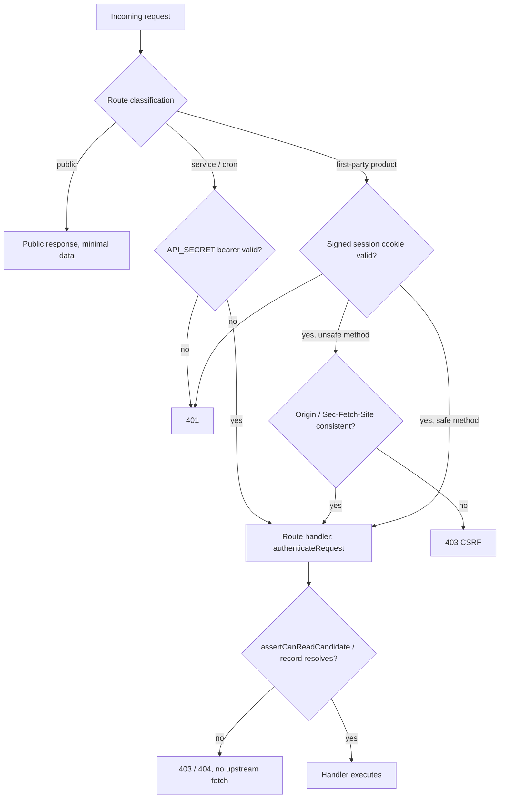

# fix: API trust boundary hardening

## Summary

Move the `app/api` boundary from browser-header trust to a server-verifiable principal, bind
private CV access to persisted records, stop leaking scraper credentials and internal exception
detail, treat report markdown as untrusted, and restore the verification gates that currently pass
without enforcing anything. Dependency and workspace hygiene ride along as a bounded unit because
the same silent-drift failure mode produced several of these findings.

This plan **supersedes** `docs/plans/2026-06-14-001-fix-api-security-hardening-plan.md`. That plan's
R1–R8 are absorbed into R1–R25 of the requirements document; its U1–U8 are re-cut here as WP0–WP10
with the newer report-rendering, coverage-gate, and workspace findings folded in. Do not execute both
plans.

---

## Problem Frame

The current admission decision lives in `proxy.ts:117-151`. A request to a `FIRST_PARTY_PATHS` route
is admitted when it carries `Sec-Fetch-Site: same-origin` with no `Origin` (`proxy.ts:130-132`), or
an `Origin` matching `request.nextUrl.origin` (`proxy.ts:134-136`), or an `Origin` matching a
`Host`-derived origin (`proxy.ts:142-145`). All three are headers any non-browser caller can set.
Behind that list sits a single shared secret (`proxy.ts:189-213`), which cannot express "this caller
may read this candidate."

The repository has **no authentication library and no user/session table**: greps for `next-auth`,
`better-auth`, `lucia`, `iron-session`, `jose`, and `getServerSession` return nothing, and
`packages/db/src/schema.ts` has no user, session, or ownership table. So R1 is not "wire up the
existing mechanism" — it is "introduce the first one," under the constraint that
`packages/db/src/schema.ts` is HIGH risk tier (`harness.config.json`) and must not change without
human review.

The consequences fan out past authentication:

- `src/services/scrapers.ts:855-862` (`listScraperConfigsPage`) returns raw `db.select()` rows, so
  `authConfigEncrypted` and `credentialsRef` reach the client — even though `sanitizeConfig`
  already exists at `src/services/scrapers.ts:221-225` and is simply not called on this path. The
  route then marks that body `public, s-maxage=300` (`app/api/scraper-configuraties/route.ts:27`).
- `validateExternalUrl` (`src/services/scrapers.ts:73-90`) is solid and DNS-rebinding aware, but its
  only callers are `src/services/platform-analyzer.ts`, `src/ai/tools/platform-dynamic.ts`, and
  `src/mcp/tools/platforms.ts`. It is **not** called when a config is saved
  (`src/services/scrapers.ts:905-953`, `:1018-1063`) nor immediately before a scrape run's outbound
  fetch.
- `app/api/cv-upload/route.ts:99-102` interpolates the raw exception message into the client
  response.
- `app/api/cv-file/route.ts:11-37` accepts any caller-supplied `?url=` on a Vercel Blob hostname and
  fetches it with `BLOB_READ_WRITE_TOKEN`. No candidate or file record is consulted.
- `src/lib/markdown-fast.ts:47-55` returns `/api/reports/<id>` from an in-process `Map`
  (`src/lib/markdown-fast.ts:111`). `app/api/reports/route.ts` has no `[id]` segment and its GET
  requires `?matchId=`, so that URL cannot resolve — and the `Map` does not survive the instance.
- `app/reports/[id]/page.tsx:41-87` hand-rolls markdown-to-HTML with no escaping and injects it via
  `dangerouslySetInnerHTML` (`:106`), on a route the proxy matcher does not even cover
  (`proxy.ts:231-233` matches only `/api/:path*` and `/pipeline/:path*`).

The verification layer that should have caught these is inert. `.github/workflows/ci.yml:308-312`
overrides every coverage threshold to `1`, so the committed floor in `vitest.config.ts:36-41` never
applies. `biome.json:22-33` scopes lint to `src`, `app`, `components`, `trigger`, `scripts`, `tests`
— `packages/**` is absent, so workspace package code is never linted. Root `tsconfig.json:18-31`
excludes `tests` and `scripts` from typecheck. `packages/esco/package.json:15` declares
`drizzle-orm@^0.38.4` while root and `packages/db` are on `^0.45.2`; `pnpm ls -r` confirms 0.38.4 is
actually installed for `@motian/esco`.

The cost shape is not one exploit. It is that no gate distinguishes a hardened state from an
unhardened one, so each fix decays back without a durable assertion.

---

## Proposed Decisions on the Three Blocking Questions

These were listed as "Resolve before planning" in the requirements. Each is answered here as a
**Proposed Decision** with rationale and rejected alternatives. A human should confirm PD1 before
WP1 starts; PD2 and PD3 are safe to proceed on.

### PD1 — Principal mechanism: `API_SECRET` bearer / BFF (internal app)

> **User override 2026-07-27:** no login UI; internal app — bearer/BFF admission instead of
> operator password session.

**Decision (supersedes the earlier HMAC session-cookie draft).** Sensitive `/api/**` routes admit
only via `Authorization: Bearer` with `API_SECRET` (or the same secret attached server-side by a
BFF: RSC / Route Handlers / Server Actions). Forgeable browser headers (`Origin`, `Sec-Fetch-Site`,
Host-derived origin) are never admission credentials. There is **no** `/inloggen` page and **no**
operator password session cookie.

- **Module split remains load-bearing.** `src/lib/session.ts` holds Edge-safe helpers only
  (`timingSafeEqual*`) and must stay free of Node-only and database imports, because `proxy.ts`
  imports it. `src/lib/api-auth.ts` holds `requirePrincipal` / `authenticateRequest` and may later
  touch the database.
- Secret: existing `API_SECRET`, validated in `src/lib/runtime-config.ts` for production.
- Pages are not gated by the proxy. Public routes stay public per
  `docs/security/api-route-classification.md`.
- Origin / Sec-Fetch-Site may remain as CSRF *isolation* helpers for any future cookie-light path;
  they never alone admit.
- Service, cron, and admin callers use the bearer path. Browser product traffic should not embed
  the secret in client JS — prefer server-side attachment.

**Earlier draft (rejected by user override).** A stateless HMAC-signed HttpOnly `motian_sessie`
cookie issued by `/inloggen` + `/api/sessie` with `SESSION_SECRET` / `OPERATOR_PASSWORD_HASH` was
proposed to avoid DB session tables. That UX is wrong for an internal app that must not require
operator password login.

**Rationale.**

1. Satisfies R1/R2 without a login gate or schema change: server-verifiable secret, not forgeable
   headers.
2. Keeps WP2 simple: `requirePrincipal` checks bearer only; classification ledger stays the inventory.
3. Leaves room for BFF migration so the browser never sees `API_SECRET`.

**Rejected alternatives.**

| Option | Why rejected |
|---|---|
| Operator password login + HMAC session cookie | User override: internal app — no login UI. |
| `better-auth` / `next-auth` with DB sessions | Requires user/session tables in `packages/db/src/schema.ts` → HIGH risk tier. |
| External identity provider (Clerk/Auth0/Keycloak) | Unnecessary for an internal single-deployment app. |
| Header-only first-party admission (`Origin` / `Sec-Fetch-Site`) | Forgeable; was finding #1. |
| Full BFF / SSR migration (drop all browser API calls in one PR) | Correct long-term shape, but rewriting every mutation call site in `components/**` at once stalls R6/R7. Sequence BFF per surface after bearer admission lands. |
| Header-only first-party admission without a secret | Explicitly forbidden; forgeable Origin/Sec-Fetch-Site were finding #1. |

**Residual risk.** Until first-party UI routes go through BFF, production browser `fetch("/api/...")`
calls without a server-attached bearer will 401. Local/dev without `API_SECRET` stays open via
`shouldAllowMissingApiSecret`. Per-candidate scoping remains WP3 (`assertCanReadCandidate`).

### PD2 — "Authorized for this candidate" = authenticated operator, enforced through a single seam

**Decision.** In the current deployment, any authenticated operator principal is authorized for
every candidate record. The per-object check is therefore **record-binding**, not ownership:
the server must resolve the requested candidate/file from persisted, non-soft-deleted state, and
must refuse anything it cannot resolve — *before* issuing any upstream storage fetch.

Implement it as one seam, not scattered conditionals:

```ts
// src/lib/api-auth.ts
export type Principal =
  | { kind: "operator"; sub: string; candidateAccess: "all" }
  | { kind: "service"; sub: string; candidateAccess: "all" | { allow: string[] } };

export async function assertCanReadCandidate(
  principal: Principal,
  candidateId: string,
): Promise<"allow" | "deny">;
```

`candidateAccess` is not speculative machinery: the deny branch is real, reachable code exercised by
a direct unit test, and it is the single line that changes when multi-operator or client-scoped
access arrives (a Deferred direction). Every CV/candidate route calls it; none of them re-derive
authorization.

**Rationale.** The requirements' own Dependencies section assumes a single-operator deployment.
There is no ownership column in `packages/db/src/schema.ts` to key an ownership model on, and adding
one is a HIGH-tier schema change explicitly out of scope. Inventing an ownership model now would
mean writing an authorization rule with no product meaning behind it.

**Honest limitation on AE2.** AE2 posits "a CV record belonging to a candidate that principal may not
read." With PD2 there is no such candidate for an operator principal, so AE2 splits:

- **Enforceable now, at the route:** no principal → 401; unresolvable or soft-deleted candidate/file
  → 404; caller-supplied storage URL that does not map to a persisted record → 403. In all deny
  cases, zero upstream fetch — asserted by a mock that fails the test if `fetch` is called.
- **Enforceable now, at the seam:** a `service` principal with `candidateAccess: { allow: [...] }`
  requesting an out-of-list candidate → `"deny"`, asserted by unit test on
  `assertCanReadCandidate`.
- **Deferred:** cross-*tenant* denial for two human operators. Listed under Deferred Product
  Directions, blocked on multi-tenant modeling.

This gap is stated rather than papered over, because pretending AE2 passes end-to-end is exactly the
"hardened state indistinguishable from unhardened" failure this effort exists to stop.

### PD3 — Coverage floor: statements 30 / lines 30 / functions 50 / branches 60, after making coverage measurable

**Decision.** Two parts, in order.

**(a) Make the measurement possible.** `pnpm test:coverage` currently **cannot complete on a
developer machine**: with no `coverage.include` in `vitest.config.ts:22-42`, the v8 provider
instruments the whole dependency surface and dies with
`FATAL ERROR: Reached heap limit Allocation failed - JavaScript heap out of memory` after ~167s.
So the committed floor is not just unenforced — it is currently unmeasurable. Fix by adding an
explicit `coverage.include` scoped to first-party source and raising the heap for the coverage
script only:

```ts
// vitest.config.ts
coverage: {
  include: ["app/**", "components/**", "src/**", "packages/*/src/**", "trigger/**"],
  // existing exclude list stays
}
```

```json
// package.json
"test:coverage": "NODE_OPTIONS=--max-old-space-size=8192 vitest run --coverage"
```

**(b) Set the floor from a real measurement.** With that scoping the run completes in ~90s and
reports:

| Metric | Measured | Committed floor | Headroom |
|---|---|---|---|
| Statements | 31.39% (22138/70521) | **30** | 1.39 |
| Lines | 31.39% (22138/70521) | **30** | 1.39 |
| Functions | 53.39% (1029/1927) | **50** | 3.39 |
| Branches | 65.03% (3351/5153) | **60** | 5.03 |

Also **replace the derived-threshold scheme**. `vitest.config.ts:38` computes branches as
`0.8 × statements`, which would set branches to 24 against an actual 65 — a 41-point blind spot that
lets branch coverage collapse silently. Commit four independent numbers.

And **remove the CI override** at `.github/workflows/ci.yml:308-312`: CI runs `pnpm test:coverage`
with no `--coverage.thresholds.*` flags, so the committed floor is the only floor. Keep the
`COVERAGE_THRESHOLD` env escape hatch out of CI entirely; if it stays for local use, CI must not set
it.

**Rationale for the specific numbers.** They are the measured values minus a small headroom band, so
the branch can actually meet them today (R18's stated constraint) while still failing on a real
regression. Ratcheting is a follow-up bead, not part of this effort. The numbers are only valid
against the `coverage.include` list in (a) — changing that list changes the denominator, so the two
changes must land together and the include list must be treated as part of the committed floor.

### The four questions the requirements deferred to planning

All four are answered inline; this table exists so nobody has to hunt for them.

| Deferred question | Answer | Where |
|---|---|---|
| How R23 converges, and whether ESCO depends on 0.38-vs-0.45 behavior | Remove the unused declaration; ESCO imports `drizzle-orm` nowhere | WP8a |
| Whether R14's durability needs a DB store, the existing generation path, or dropping the integration | Deterministic regeneration from the match record; markdown.fast retained as optional | WP5, KTD4 |
| Whether R19 is satisfied by root scope or per-package scripts | Extend root Biome scope; no per-package scripts | WP7 |
| Whether R4 removes the diagnostic route or retains it behind the principal | Retain behind the principal, and shrink the payload to booleans | WP2 |

**Caveat to re-verify in WP7.** These numbers come from a local run on the current dirty working
tree. CI's number can differ (different skipped tests, Playwright-dependent suites). WP7 must
confirm against one green CI run before the floor is treated as final, and adjust downward by no more
than 2 points if CI reports lower — never by disabling the gate.

---

## Key Technical Decisions

- **KTD1 — The ledger gets a test, not a promise.** R5 fails without a durable assertion, so a
  structural test enumerates `app/api/**/route.ts` and fails when a route is missing from
  `docs/security/api-route-classification.md`. Documentation alone has already drifted once.
- **KTD2 — Authorization is route-local; the proxy is a pre-filter.** The proxy rejects the
  obviously unauthenticated early, but each non-public handler independently establishes its
  principal. A single-layer boundary is what produced this finding set.
- **KTD3 — Reuse what already exists before writing anything new.** `sanitizeConfig`,
  `validateExternalUrl`, `withApiHandler`, `validateCvUploadBuffer`, and the CORS helpers are all
  present and correct; several findings are "existing correct helper not called on this path." Wiring
  beats rewriting.
- **KTD4 — Report durability comes from determinism, not storage.** Instead of adding a
  published-reports table (HIGH tier) to back `src/lib/markdown-fast.ts`'s in-process `Map`, the
  fallback URL becomes `/reports/<matchId>` and the page regenerates markdown from the match record
  via the existing `generateReport`. Any instance can serve it; the `Map` is deleted.
- **KTD5 — Report content is escaped at the boundary, and the renderer stays hand-rolled.** Escape
  every text node before markup assembly in `app/reports/[id]/page.tsx`. No sanitizer dependency is
  added: the generator emits a closed set of constructs, and `streamdown` (already a dependency) is a
  React streaming renderer, not an HTML sanitizer for this path.
- **KTD6 — Preserve the in-flight CV work by testing it first.** R10 is enforced by locking current
  behavior with assertions before touching the files, not by careful merging.
- **KTD7 — Dependency work is convergence and advisory remediation only.** Per R24: align
  `drizzle-orm`, confirm pnpm config location, remediate high/critical reachable advisories, record
  residuals. No version bumps beyond that.



---

## Work Packages

Ordered. WP0 → WP4 is the trust-boundary-first spine; WP5 → WP10 can partially parallelize once WP2
lands. Each package names its requirements, its files, and the assertion that makes reverting it fail.

**Suggested PR boundaries.** WP0+WP1 together (the boundary change is not safely splittable — see
WP1's rollout note), then WP2+WP3, then WP4+WP5+WP6, then WP7+WP8a, then WP8b alone, then WP9+WP10.
WP8b is sized like its own project; see its measured numbers.

### WP0. Baseline lock and measurability (pre-flight)

- **Requirements:** R10, R18(a), R20.
- **Dependencies:** none.
- **Files:** `tests/cv-upload-validation.test.ts`, `tests/cv-upload-api.test.ts`,
  `vitest.config.ts`, `package.json`.
- **Approach.** The working tree already carries in-progress CV work (`app/api/cv-upload/route.ts`,
  `src/lib/cv-upload.ts`, `proxy.ts`, `tests/cv-upload-validation.test.ts` untracked,
  `packages/db/package.json`). Before changing any of it: run `pnpm test` and record which CV
  assertions pass today, then add the missing regression locks so the byte-level PDF header check
  (`src/lib/cv-upload.ts:114-117`), the DOCX container walk (`:161-216`), and the entry/ratio limits
  (`:38-41`) each have a test that fails if removed. Then land PD3(a): `coverage.include` in
  `vitest.config.ts` and the heap flag on `test:coverage`.
- **Test scenarios.**
  - `pnpm test:coverage` completes without OOM and prints a summary (currently it cannot).
  - Removing the PDF header check fails a test; removing the DOCX ratio limit fails a test.
- **Verification.** `pnpm test`, `pnpm test:coverage`. R10 is now enforced by assertions rather than
  by merge discipline.

### WP1. Server-verifiable principal — the trust boundary

- **Requirements:** R1, R2, R3.
- **Dependencies:** WP0. **Confirm PD1 with a human before starting.**
- **Files:** `src/lib/session.ts` (new, edge-safe), `src/lib/api-auth.ts` (new, may touch DB),
  `app/api/sessie/route.ts` (new), `app/inloggen/page.tsx` (new), `proxy.ts`,
  `src/lib/runtime-config.ts`, `.env.example`, `tests/helpers/session.ts` (new),
  `tests/api-auth-boundary.test.ts` (new), `tests/session-cookie.test.ts` (new),
  `tests/proxy-autopilot-first-party.test.ts` (rewrite), `tests/salesforce-feed-auth.test.ts`
  (rewrite).
- **Approach.**
  1. `src/lib/session.ts`: `signSession`, `verifySession`, `buildSessionCookie`,
     `clearSessionCookie` — Web Crypto HMAC-SHA256, constant-time comparison, explicit `exp` check.
     No Node-only imports, so it loads in the proxy.
  2. `src/lib/api-auth.ts`: `authenticateRequest(request): Promise<Principal | null>` resolving the
     session cookie first, then the `API_SECRET` bearer; `requirePrincipal(request)` returning a
     Dutch 401 `Response` on failure; plus `assertCanReadCandidate` from PD2.
  3. `app/api/sessie/route.ts`: `POST` verifies `OPERATOR_PASSWORD_HASH` (PBKDF2, Web Crypto) and
     sets the cookie; `DELETE` clears it. Rate-limited via `withApiHandler`'s `rateLimit` option
     (`src/lib/api-handler.ts:45-61`) — this is a credential endpoint. It is `public` in the
     classification because it *is* the login path; its body must never echo whether the password or
     the configuration was wrong.
  4. `proxy.ts`: replace `isFirstPartyBrowserRoute` (`proxy.ts:117-151`) with
     `hasVerifiablePrincipal`, imported from `src/lib/session.ts` — **not** from
     `src/lib/api-auth.ts`, which reaches the database. Retain `Origin`/`Sec-Fetch-Site` comparison
     as a **CSRF isolation check applied to unsafe methods only**, returning 403 on mismatch. Header
     signals no longer grant access on any path.
  5. `src/lib/runtime-config.ts`: production validation for `SESSION_SECRET` and
     `OPERATOR_PASSWORD_HASH` mirroring the `API_SECRET` rule at `:44-46`.
- **Rollout, in one commit — this is where WP1 can go wrong.** The moment header-based admission is
  removed, every browser call from an unauthenticated session gets 401. Three things must therefore
  land together, not sequentially:
  1. **Page gating.** `proxy.ts:231-233` currently matches only `/api/:path*` and `/pipeline/:path*`,
     so page routes are ungated. Without page gating an unauthenticated visitor loads a fully
     rendered recruiter page whose data calls all fail — worse UX than a login redirect and it still
     leaks server-rendered PII. Extend the matcher to the app routes and redirect principal-less page
     requests to `/inloggen`, excluding `/inloggen` itself and static assets. This also closes the
     server-component read path, which route-level auth alone never touches.
  2. **A test session helper.** Add `tests/helpers/session.ts` exposing a signed-cookie factory, so
     suites can present a valid principal. Without it, every existing API test has to hand-roll
     HMAC.
  3. **Update the suites that encode the old boundary.** `tests/proxy-autopilot-first-party.test.ts`
     and `tests/salesforce-feed-auth.test.ts` assert today's header-based admission and will fail by
     design. Rewrite them to assert the new contract — do not delete them; they are the closest
     thing to an existing boundary regression test.
- **Non-browser first-party callers must move to the bearer path.** Anything that reached
  `FIRST_PARTY_PATHS` by setting an `Origin` header — `agent/`, `extension/`, the LiveKit voice agent,
  the MCP server, and any script under `scripts/` — loses access when PD1 lands. Inventory these
  before WP1 merges and move each to `Authorization: Bearer ${API_SECRET}`. A missed consumer looks
  like a silent production breakage in a background surface, which is the least observable failure
  mode in this plan.
- **Test scenarios.**
  - **AE1:** `Sec-Fetch-Site: same-origin` with no `Origin` and no cookie → rejected; the same
    request with a valid session cookie → admitted.
  - `Origin` matching a `Host`-derived origin with no cookie → rejected (kills `proxy.ts:142-145` as
    an admission path).
  - Tampered signature, expired `exp`, and truncated cookie each → rejected.
  - Valid cookie + `POST` + cross-site `Origin` → 403.
  - `API_SECRET` bearer on a service route → admitted, and no test path exposes the secret to
    browser code.
  - `/api/gezondheid`, `/api/openapi`, `/api/feed/**` stay public.
  - Missing `SESSION_SECRET` in production → fails closed like `API_SECRET` does today.
- **Verification.** Removing a header can no longer grant access to any non-public route.

### WP2. Route-local authorization and a ledger that fails on drift

- **Requirements:** R1, R4, R5.
- **Dependencies:** WP1.
- **Files:** every non-public `app/api/**/route.ts` (candidate, CV, GDPR, platform, matches,
  interviews, messages, settings, chat, scraper-config, commercial-CV surfaces per
  `docs/security/api-route-classification.md`), `app/api/debug-error/route.ts`,
  `docs/security/api-route-classification.md`, `tests/api-route-classification.test.ts` (new),
  `tests/debug-error-route.test.ts` (new).
- **Approach.**
  1. Call `requirePrincipal` at the top of each non-public handler, before reading a body or
     touching a service.
  2. Extend the ledger with `Owner` and `Enforced by` columns and a residual section naming any
     route left unhardened with a reason and an owner.
  3. `tests/api-route-classification.test.ts` enumerates `app/api/**/route.ts` from disk and fails
     when a route is absent from the ledger, or classified `public` without appearing in
     `PUBLIC_PATHS`/`PUBLIC_GET_PATHS`. This is the assertion R5 needs.
  4. **R4 decision (was deferred to planning): retain `/api/debug-error` behind the principal, and
     shrink its payload.** Keep the existing production 404 (`app/api/debug-error/route.ts:6-8`),
     add `requirePrincipal`, and reduce every field to a boolean or coarse enum — drop
     `e.message` at `:26`, `:38`, `:51`, drop `result.rows[0]` at `:22`, drop `tableCount` at `:47`,
     drop the `env` block at `:13-16`. Retaining beats removing because preview-environment
     troubleshooting has no substitute today; the payload shrink is what actually satisfies R4.
- **Test scenarios.**
  - A new `app/api/**/route.ts` added without a ledger entry fails the suite.
  - Candidate, CV save/analyse/file, GDPR export/delete, platform credentials, and scrape-start
    reject unauthenticated requests before persisting or triggering work.
  - Existing cron/service bearer callers still succeed.
  - `/api/debug-error`: production unauthenticated → 404; authenticated non-production response
    contains no `message`, no stack fragment, no table count, no env inventory.
  - Auth failures return Dutch, provider-free bodies.
- **Verification.** Every route classified non-public has route-local coverage or a named residual.

### WP3. CV and candidate PII binding

- **Requirements:** R6, R7, R9, R10.
- **Dependencies:** WP1, WP2.
- **Files:** `app/api/cv-file/route.ts`, `app/api/cv-upload/route.ts`,
  `app/api/_shared/cv-helpers.ts`, `src/services/candidates.ts`, `src/lib/api-auth.ts`,
  `components/cv-document-viewer.tsx`, `src/lib/api-docs.ts`,
  `tests/cv-file-route.test.ts` (new), `tests/cv-upload-api.test.ts`.
- **Approach.**
  1. `app/api/cv-file/route.ts` takes `kandidaatId` (optionally `bestandId`), resolves the stored URL
     server-side from `src/services/candidates.ts`, runs `assertCanReadCandidate`, and only then
     attaches `BLOB_READ_WRITE_TOKEN`. The hostname allowlist at `:20-26` stays as defense in depth
     but is no longer the authorization decision.
  2. Compatibility path for `?url=`: accept it only when the server can match it to a persisted,
     non-soft-deleted candidate file record; otherwise 403 with no upstream fetch. This keeps
     `components/cv-document-viewer.tsx:28` working during migration; that call site moves to
     `kandidaatId` in the same package, and `src/lib/api-docs.ts:183` is updated to document the new
     contract.
  3. **R9:** replace `app/api/cv-upload/route.ts:99-102` with a fixed Dutch message
     (`"CV verwerking mislukt. Probeer het opnieuw of neem contact op met support."`). The exception
     keeps going to `console.error` and Sentry — only the response body changes.
- **Test scenarios.**
  - **AE2 (enforceable part):** missing identifier → 400; unknown/soft-deleted identifier → 404 with
    `fetch` never called; raw blob URL not matching a record → 403 with `fetch` never called.
  - **AE2 (seam):** `assertCanReadCandidate` with `candidateAccess: { allow: [...] }` and an
    out-of-list id → `"deny"`.
  - Authorized identifier → upstream fetched with the server token; upstream failure → safe status,
    no token or provider detail in the body.
  - **AE3:** `.pdf` filename with text bytes → rejected before storage and before `parseCV`, Dutch
    message naming no provider (extends WP0's locks).
  - **R9:** a thrown storage/AI error produces a response body containing no provider name and no
    exception text.
- **Verification.** The server is no longer a privileged fetcher for caller-supplied URLs, and no CV
  failure body carries internal detail.

### WP4. Scraper configuration confidentiality and outbound target validation

- **Requirements:** R11, R12, R13.
- **Dependencies:** WP2 (route auth already applied).
- **Files:** `src/services/scrapers.ts`, `app/api/scraper-configuraties/route.ts`,
  `app/api/scraper-configuraties/[id]/route.ts`, `src/services/scrape-pipeline.ts`,
  `tests/scraper-config-privacy.test.ts` (new), `tests/scraper-url-validation.test.ts` (new).
- **Approach.**
  1. **R11:** route `listScraperConfigsPage` (`src/services/scrapers.ts:855-862`) output through the
     existing `sanitizeConfig` (`:221-225`) or `PublicScraperConfig` shape (`:124-127`), so
     `authConfigEncrypted` and `credentialsRef` are replaced by `hasAuthConfig` / `hasCredentialsRef`
     booleans. Audit `[id]` and platform sub-routes for the same raw-row pattern.
  2. **R12:** change `app/api/scraper-configuraties/route.ts:27` from
     `public, s-maxage=300, stale-while-revalidate=600` to `private, no-store`, matching the POST
     path at `:53`.
  3. **R13:** call the existing `validateExternalUrl` (`src/services/scrapers.ts:73-90`) at both
     points — on save (`:905-953` create, `:1018-1063` update) and immediately before the outbound
     fetch in `src/services/scrape-pipeline.ts`. Two call sites, deliberately: a target that became
     internal after being saved must still be refused (AE5's "and separately").
- **Test scenarios.**
  - **AE4:** a config holding a credential reference read through the API → no `credentialsRef` or
    `authConfigEncrypted` key in the body, and no `public` in `Cache-Control`.
  - **AE5:** saving a loopback/link-local base URL → rejected; a config whose DNS resolution *becomes*
    private between save and run → rejected at the fetch step (mock `dns.promises.lookup` to change
    between calls).
  - Multi-record DNS with one private address → rejected (already the helper's behavior; lock it).
- **Verification.** Credential fields cannot leave through the config API or a shared cache, and a
  scrape cannot fetch an internal target.

### WP5. Report publishing durability and untrusted content rendering

- **Requirements:** R14, R15. **Plus one discovered scope addition — see below.**
- **Dependencies:** WP1 (for the discovered addition only).
- **Files:** `src/lib/markdown-fast.ts`, `app/reports/[id]/page.tsx`,
  `app/api/reports/route.ts`, `proxy.ts`, `tests/report-render-escaping.test.ts` (new),
  `tests/report-publish-fallback.test.ts` (new), `tests/report-api.test.ts`,
  `tests/ws4-report-gdpr-compliance.test.ts`, `tests/markdown-fast.test.ts`.
- **Approach.**
  1. **R14 decision (was deferred to planning): deterministic regeneration, and keep markdown.fast
     as an optional external path.** Delete the in-process `reportStore` `Map`
     (`src/lib/markdown-fast.ts:111`) and `listLocalReports` (`:120-130`). The fallback URL becomes
     `/reports/<matchId>`; the page loads the match and calls the existing `generateReport`. Any
     instance can serve it, so AE6 passes without a schema change. Keep the markdown.fast branch
     (`:20-44`) behind `MARKDOWN_FAST_TOKEN` — it is still a real integration and removing it is a
     product decision, not a hardening one. `getReport` keeps its external lookup and loses its
     `Map` read; the page stops calling it, because a local id is now a `matchId` the page resolves
     itself.
     - **Keep the `/reports/[id]` path.** Renaming to `/rapporten` would better match the Dutch route
       convention, but it is churn this effort did not ask for and it would invalidate any URL already
       handed out. Route renaming belongs in a separate change. (For the avoidance of doubt:
       `autopilotRuns.reportUrl` is a **blob upload URL** produced by
       `src/autopilot/reporting/upload.ts:45`, not a markdown.fast URL, so it is unaffected by
       anything in this package.)
     - **Three structural test suites pin the current design and must be rewritten, not deleted.**
       `tests/report-api.test.ts:48-50` and `tests/ws4-report-gdpr-compliance.test.ts:149-152` assert
       that `app/reports/[id]/page.tsx` contains the string `getReport`, and
       `tests/markdown-fast.test.ts:11-23` asserts the module's exported function names by reading its
       source. These are source-string assertions, not behavior — they will fail on this refactor
       while proving nothing about it. Replace them with behavioral assertions (AE6/AE7 below). This
       is a concrete instance of the problem R17 names, found inside the very suite whose filename
       claims GDPR compliance.
     - **Discovered while tracing callers: `revokeReport` has no callers anywhere.**
       `src/lib/markdown-fast.ts:86-101` is asserted to exist by
       `tests/markdown-fast.test.ts:21-23` and is invoked by nothing, so published-report revocation
       is claimed by a test and never performed. Do not silently delete it — either wire it into the
       GDPR deletion path or record it as a named residual with an owner. Deciding which is a product
       call; leaving the current state is not an option, because it is a test asserting a capability
       the system does not have.
  2. **R15:** escape `&`, `<`, `>`, `"` in every text fragment inside
     `app/reports/[id]/page.tsx:41-87` before assembling tags — heading text (`:47-48`), table cells
     (`:57-62`), list items (`:67`, `:70`), paragraphs (`:76`) — and apply inline `**`/`*` handling
     after escaping so emphasis still renders. Replace the `biome-ignore` justification at `:105`,
     which currently asserts the input is trusted.
  3. **Discovered scope addition (flagged for human accept/reject).** `/reports/[id]` renders
     candidate name, role, location, and match reasoning, and it is **not covered by the proxy
     matcher** (`proxy.ts:231-233` matches only `/api/:path*` and `/pipeline/:path*`). Any anonymous
     visitor with an id sees candidate PII. This is not literally in R1–R25 — the classification
     ledger is API-only — but it is the same trust boundary over the same data, and R6's intent is
     defeated if the report page is open. **Proposal:** cover `/reports/:path*` with the WP1 page
     gating and require the principal. If a shareable external report is a product requirement, that
     needs a signed, expiring, revocable link — a separate bead, not a silent open page.
- **Test scenarios.**
  - **AE6:** publish with markdown.fast unavailable, then fetch the returned URL from a fresh module
    instance (fresh import / cleared module registry) → the report renders.
  - **AE7:** a candidate or vacancy field containing `` → the output
    contains the escaped text and no executable attribute.
  - Emphasis and table rendering still work after escaping.
  - Report page without a principal → redirected/401 (if the addition is accepted).
- **Verification.** A published URL resolves from any instance, and injected markup renders as text.

### WP6. Recruiter surface data paths

- **Requirements:** R16, R17.
- **Dependencies:** none; can run in parallel from WP2 onward.
- **Files:** `app/kandidaten/page.tsx`, `app/kandidaten/data.ts`,
  `tests/kandidaten-parallel-fetch.test.ts` (new), `tests/job-detail-render.test.ts` (new or
  extended), `tests/candidate-embedding.test.ts` (new or extended).
- **Approach.**
  1. **R16:** `app/kandidaten/page.tsx:66-71` awaits `getSkillsFilterData()` before the
     `Promise.all` at `:94-104`. On a cache miss that serializes an ESCO catalog read ahead of every
     other read. Move it into the `Promise.all`. Constraint: `escoCatalogAvailable` currently feeds
     `useSearch` and `searchOptions` (`:85-92`), so the search-vs-list branch must be computed after
     the parallel await — fetch candidates for both branches is wrong, so restructure as: resolve
     `skillsData`, `stats`, and the skill-independent inputs in parallel, then branch. Keep the
     existing `try/catch` degradation at `:66-70`.
  2. **R17:** add behavioral coverage that fails on observable-output change, not structure:
     job-detail rendering asserts the rendered fields for a fixture job (title, company, location,
     contract, deadline states), and candidate-embedding generation asserts vector dimension, input
     text composition, and the skip-when-unchanged path.
- **Test scenarios.**
  - Skills-filter fetch is not awaited before the other server-side reads (assert call ordering /
    concurrent start via instrumented mocks).
  - ESCO catalog failure still renders the page with the disabled filter and the Dutch message.
  - Job-detail render test fails when a displayed field is dropped.
  - Embedding test fails when dimension or input composition changes.
- **Verification.** The candidate page has no serialized pre-fetch, and both surfaces have
  outcome-sensitive tests.

### WP7. Verification gates and workspace hygiene

- **Requirements:** R18, R19, R20.
- **Dependencies:** WP0(a) for measurability; run after WP1–WP6 so the floor reflects new tests.
- **Files:** `.github/workflows/ci.yml`, `vitest.config.ts`, `biome.json`, `tsconfig.json`,
  `tests/ci-coverage-gate.test.ts` (new).
- **Approach.**
  1. **R18:** delete the four `--coverage.thresholds.*` flags at `.github/workflows/ci.yml:308-312`;
     CI runs `pnpm test:coverage` bare. Replace the derived thresholds in `vitest.config.ts:36-41`
     with the four committed numbers from PD3(b). Keep `COVERAGE_THRESHOLD` out of the CI env.
  2. **R19 decision (was deferred to planning): extend root gate scope; do not add per-package
     scripts.** One gate in one place beats three package scripts that drift, and it matches the
     requirements' "gates enforce the committed floor, in one place." R19 needs exactly one change:
     add `packages/*/src/**/*.ts` to `biome.json:22-33`, because `packages/**` is currently absent
     from the include list and therefore never linted. Typecheck already satisfies R19 —
     root `tsconfig.json:10-17` picks up `packages/*/src/**` via `**/*.ts` and does not exclude it.
  3. **Optional, flagged as beyond R19 — the `tests`/`scripts` typecheck gap.** Root
     `tsconfig.json:25,:27` excludes `tests` and `scripts`, so neither is ever typechecked even
     though `tests/**` is where every assertion in this plan lives. Fixing it means a
     `tsconfig.check.json` extending root with those directories included, wired into
     `pnpm exec tsc --noEmit` and `harness:pre-pr` (keeping `agent` and `extension` excluded — they
     are separate workspace members with their own configs). This is a real gap but it is **not**
     what R19 asks for, and the error count is unknown until tried. Treat it as a separate commit
     that can be dropped without failing R19; if it produces a large backlog, open a bead instead of
     expanding this PR.
  4. Expect first-time lint findings in `packages/**`. Fix them; do not narrow the scope to make them
     disappear.
- **Test scenarios.**
  - **AE8:** `.github/workflows/ci.yml` contains no `--coverage.thresholds` string, and
    `vitest.config.ts` exports four numeric thresholds (structural test — this repo already uses
    structural tests for Dutch API paths, so the pattern exists).
  - A deliberate local drop below the floor fails `pnpm test:coverage`.
  - `pnpm lint` reports on a seeded violation inside `packages/*/src/`.
  - If step 3 is taken: `pnpm exec tsc --noEmit -p tsconfig.check.json` reports on a seeded type
    error in `tests/`.
- **Verification.** The committed floor is the only floor, and no first-party directory escapes lint
  or typecheck.

### WP8a. Version convergence and package-manager config (cheap)

- **Requirements:** R22, R23, R24.
- **Dependencies:** none; keep it in its own commit so a regression is attributable.
- **Files:** `packages/esco/package.json`, `packages/esco/AGENTS.md`, `pnpm-lock.yaml`,
  `package.json`, `pnpm-workspace.yaml`, `tests/workspace-config.test.ts` (new).
- **Approach.**
  1. **R23 decision (was deferred to planning): remove the unused declaration rather than bump it.**
     `packages/esco/package.json:15` declares `drizzle-orm@^0.38.4`, but `rg drizzle-orm
     packages/esco/src` returns **no imports at all** — the package reaches the database only
     through `@motian/db` (`workspace:*`), which declares `^0.45.2`. Deleting the line converges the
     tree on one version with zero behavioral surface, which also answers the requirements'
     sub-question about behavior changes between 0.38 and 0.45: there is no ESCO code depending on
     either. Fallback if resolution complains: align to `^0.45.2`. Update the `drizzle-orm` bullet
     in `packages/esco/AGENTS.md:37` either way.
  2. **R22:** pnpm config already lives in `pnpm-workspace.yaml` (`packageExtensions`,
     `peerDependencyRules`, `overrides`) and root `package.json` has no `pnpm` key — so the prior
     plan's U7 premise is already resolved. Verify with a clean `pnpm install` that emits no
     ignored-configuration warning, and add a test asserting `package.json` has no `pnpm` key and
     `pnpm-workspace.yaml` carries `overrides`, so it cannot silently move back.
  3. **R24:** nothing else moves. If a listed requirement genuinely needs another bump, name the
     requirement in the commit message.
- **Test scenarios.**
  - `pnpm ls drizzle-orm -r --depth 0` reports a single version for root, `@motian/db`, and
    `@motian/esco`.
  - `pnpm install` produces no ignored-pnpm-config warning.
  - Typecheck and tests still pass against the converged ORM version.
- **Verification.** One ORM version on the Neon connection path and honored package-manager config.

### WP8b. Advisory triage and residual ledger (expensive — ship as its own PR)

- **Requirements:** R21, R24.
- **Dependencies:** WP8a.
- **Files:** `pnpm-workspace.yaml`, `pnpm-lock.yaml`,
  `docs/security/dependency-residuals.md` (new).
- **Measured reality — this package is much larger than the requirements imply.** A run of
  `pnpm audit --prod --audit-level high` on 2026-07-27 reports **182 vulnerabilities: 4 critical, 64
  high, 103 moderate, 11 low**, and takes roughly four minutes. R21 covers the 68 high-and-critical
  items. Almost all are transitive, and several are build-time rather than request-path code — two
  representative examples: `postcss@8.4.31` (GHSA-r28c-9q8g-f849) reached through `next@16.2.9` and
  `@vercel/speed-insights`, and `brace-expansion@5.0.5` (GHSA-mh99-v99m-4gvg, patched `>=5.0.8`)
  reached through `minimatch@10.2.5` under `@livekit/agents` and `@sentry/bundler-plugin-core`.
  Note that `pnpm-workspace.yaml` already pins `"minimatch": ">=10.2.3"`, which does **not** fix this
  — the vulnerable package is `brace-expansion` underneath it. That is the shape of most of the 68:
  an override one level deeper than the one already present.
- **Approach.**
  1. **Triage before remediation.** Produce the machine-readable list
     (`pnpm audit --prod --audit-level high --json`) and classify each advisory as request-path
     reachable, build-time only, or dev-tooling reachable. R21 says "reachable runtime advisories";
     without this classification the package has no definition of done and turns into the
     "upgrade everything" sweep R24 forbids.
  2. **Remediate request-path-reachable items first**, preferring a deeper `overrides` entry in
     `pnpm-workspace.yaml` (the established pattern) over bumping a direct dependency, so the diff
     stays attributable.
  3. **Record every remaining high/critical** in `docs/security/dependency-residuals.md` with
     advisory ID, dependency chain, reachability classification, compensating control, owner, and
     revisit date. No secret values in that file.
  4. **Restate the target honestly.** The requirements' success criterion says
     "`pnpm audit --prod --audit-level high` is clean, **or** every remaining item has a durable
     residual record." At 68 items across `next`, `@sentry/nextjs`, and `@livekit/agents` transitive
     trees, "clean" is not a realistic outcome of this effort. The achievable and requirement-
     satisfying target is: **every high and critical item is either fixed by an override or carries a
     residual record**, with request-path-reachable items biased toward fixed. Anyone reading the exit
     code as the gate will conclude this package failed; the residual ledger is the gate.
- **Test scenarios.**
  - Every high/critical advisory ID in the current audit output appears either as an `overrides` entry
    or as a row in `docs/security/dependency-residuals.md` (a script or test can enforce this
    correspondence, and should — it is the durable assertion R21 needs).
  - Typecheck, tests, and build pass after each override batch.
- **Verification.** No unrecorded high or critical advisory, and a diff a reviewer can attribute
  advisory-by-advisory.

### WP9. Documentation accuracy

- **Requirements:** R25, R5 (ledger upkeep).
- **Dependencies:** WP1–WP8b (document what shipped).
- **Files:** `README.md`, `README.en.md`, `docs/security/api-route-classification.md`,
  `docs/architecture.md`, `.env.example`.
- **Approach.** Reconcile README integration and API claims against the shipped surface: the
  markdown.fast dependency's actual status after WP5, `/api/cv-file`'s new contract, the new
  `/api/sessie` and `/inloggen` surfaces, `/api/debug-error`'s auth requirement, and the
  `SESSION_SECRET` / `OPERATOR_PASSWORD_HASH` env vars. Correct rather than aspirationally reword.
  `harness.config.json` docs-drift rules already point service changes at `docs/architecture.md`, so
  expect that trigger to fire.
- **Test scenarios.** Documented API paths that no longer exist, or shipped routes that are
  undocumented, are corrected; the ledger test from WP2 passes.
- **Verification.** No integration or API claim in the READMEs describes an unshipped surface.

### WP10. Integrated verification

- **Requirements:** R20, and the requirements' "hardened state is distinguishable" success criterion.
- **Dependencies:** all.
- **Files:** changed files only.
- **Approach.** Run `pnpm lint`, `pnpm exec tsc --noEmit -p tsconfig.check.json`, `pnpm test`,
  `pnpm test:coverage`, then `pnpm harness:pre-pr`. Walk the recruiter flows manually or with browser
  evidence: login, candidate list, candidate detail, CV upload → save → view, scraper config
  read/write, report open. Confirm each absorbed finding has at least one test that fails when the
  fix is reverted (spot-check by reverting three at random locally).
- **Verification notes for the harness.** These changes touch `app/api/**` and `src/services/**` →
  **medium** tier under `harness.config.json`, requiring `risk-policy-gate`, `typecheck`, `test`,
  `lint`. `app/reports/[id]/page.tsx` and `app/inloggen/page.tsx` are `.tsx` under `app/**`, so
  `evidenceRequirements` asks for a browser screenshot; the `browser-evidence` CI job only runs on
  high tier or Symphony-labeled PRs, so capture evidence locally via
  `scripts/harness/capture-browser-evidence.ts` and attach it. Nothing here touches
  `packages/db/src/schema.ts`, `src/services/gdpr.ts`, `src/lib/crypto.ts`, `app/api/cron/**`, or
  `drizzle/**`, so no HIGH-tier review is triggered — **if a work package finds it needs a schema
  change, stop and escalate rather than proceeding.**
- **Verification.** Green local gates, or a durable residual note for any blocked gate.

---

## Requirement Coverage Map

| Req | Work package | Assertion that fails on revert |
|---|---|---|
| R1 | WP1, WP2 | AE1 + per-route 401 tests |
| R2 | WP1 | Header-only admission rejected |
| R3 | WP1 | Cross-site unsafe method → 403 |
| R4 | WP2 | debug-error payload has no message/stack/schema/env |
| R5 | WP2 | Ledger enumeration test |
| R6 | WP3 | AE2 route + seam tests |
| R7 | WP3 | Raw URL not matching a record → 403, no fetch |
| R8 | WP0, WP3 | AE3 + byte-level validation locks |
| R9 | WP3 | Failure body contains no provider/exception text |
| R10 | WP0 | CV validation regression locks land first |
| R11 | WP4 | AE4 body has no credential keys |
| R12 | WP4 | AE4 `Cache-Control` is not public |
| R13 | WP4 | AE5 both save-time and fetch-time rejection |
| R14 | WP5 | AE6 fresh-instance render |
| R15 | WP5 | AE7 escaped markup |
| R16 | WP6 | Call-ordering test on the candidate page |
| R17 | WP6 | Job-detail + embedding outcome tests |
| R18 | WP0, WP7 | AE8 + measurable coverage run |
| R19 | WP7 | Seeded violation in `packages/*/src` and `tests/` caught |
| R20 | WP10 | Full gate run |
| R21 | WP8b | Every high/critical ID is an override entry or a residual row |
| R22 | WP8a | Workspace-config test |
| R23 | WP8a | Single `drizzle-orm` version across workspace |
| R24 | WP8a, WP8b | Diff contains no unrelated version bumps |
| R25 | WP9 | READMEs match the shipped surface |

---

## Verification Plan

Per package: targeted Vitest file(s), then `pnpm lint`, then
`pnpm exec tsc --noEmit -p tsconfig.check.json`.

Before PR: `pnpm harness:pre-pr` (lint + typecheck + full test + risk gate), plus
`pnpm test:coverage` against the committed floor, plus `pnpm audit --prod --audit-level high`.

Commands, in the order a reviewer should run them:

```bash
pnpm lint
pnpm exec tsc --noEmit -p tsconfig.check.json
pnpm test
pnpm test:coverage
pnpm audit --prod --audit-level high
pnpm ls drizzle-orm -r --depth 0
pnpm harness:pre-pr
```

Measured runtimes, so nobody assumes a hang: full `pnpm test:coverage` with WP0's scoping is ~90s;
`pnpm audit --prod --audit-level high` is ~4 minutes.

Known verification hazards:

- `pnpm test:coverage` OOMs at default heap; WP0 must land before this command is meaningful.
- `pnpm exec tsc --noEmit -p tsconfig.check.json` only exists if WP7's optional step 3 is taken;
  otherwise use `pnpm exec tsc --noEmit`.
- `pnpm audit --prod --audit-level high` exits non-zero today and will still exit non-zero after
  WP8b. Read the residual ledger, not the exit code.
- The `browser-evidence` CI job does not run on medium tier, so UI evidence for
  `app/reports/[id]/page.tsx` and `app/inloggen/page.tsx` must be captured locally.
- `harness.config.json` docs-drift will demand `docs/architecture.md` updates once
  `src/services/*.ts` changes land (WP4, WP6).

---

## Deferred Product Directions

Not part of this effort. Listed so they are not silently absorbed.

- Multi-tenant role and permission modeling (recruiter-team or client-level authorization). This is
  the trigger that converts PD2's seam into a real ownership model.
- Shareable external report links with signed, expiring, revocable URLs — the product answer if
  WP5's discovered addition turns out to be unwanted.
- Whether markdown.fast remains an intended integration at all. WP5 keeps it working; removing it is
  a product call.
- Outcome-calibrated matching (scoring that learns from placement outcomes).
- Provider-gated channel submission behind per-provider policy gates.
- Source-quality intelligence (rating scrape sources by yield quality).
- Governed Autopilot remediation under an approval policy.
- Low and moderate dependency advisories outside the high/critical reachable set.
- Drizzle migration journal reconciliation.
- Coverage ratchet above PD3's committed floor.
- Session revocation before expiry (PD1's residual), triggered by a second human operator.

## Outside This Effort's Identity

- Reworking matching, search, or scoring behavior. WP5 touches report *output*, not the scores it
  presents.
- Scraper architecture refactors or new platform adapters. WP4 constrains target validation only.
- A general dependency upgrade sweep (R24).
- UI redesign of CV download or report surfaces beyond what WP3 and WP5 need to keep existing flows
  working.

---

## Risks and Open Items

- **PD1 needs human confirmation before WP1.** It introduces the repository's first authentication
  mechanism and two new env vars. Everything downstream (WP2, WP3, WP5's addition) depends on it.
- **WP1 is the one package that cannot be split or partially landed.** Removing header-based
  admission without page gating, a test session helper, and the migrated non-browser callers produces
  an app that looks broken and background surfaces that fail silently. See WP1's rollout note.
- **WP8b is mis-sized by the requirements.** The measured audit is 68 high/critical items, not a
  handful. If it is treated as a tail-end chore inside a large PR it will either be skipped or will
  swallow the trust-boundary work. Ship it separately, after triage.
- **Three structural test suites will fail by design in WP5**, and one of them
  (`tests/ws4-report-gdpr-compliance.test.ts`) asserts a `revokeReport` capability nothing invokes.
  Do not "fix" these by reverting the WP5 refactor to satisfy a source-string assertion.
- **Login is a new failure mode.** If `SESSION_SECRET` or `OPERATOR_PASSWORD_HASH` is unset in
  production, the app fails closed and nobody can log in. `.env.example` and the deployment runbook
  must land in the same PR as WP1, not in WP9.
- **WP7 will surface pre-existing debt.** `packages/**` has never been linted and `tests/**` has
  never been typechecked. The count of new findings is unknown; if it is large, split WP7 into
  "enable the gate" and "fix the findings" commits rather than widening the scope of this PR.
- **PD3's numbers are from a local dirty-tree run.** Re-verify against one green CI run before
  treating the floor as final; adjust down by at most 2 points if CI reports lower.
- **WP6's R16 fix has a real ordering constraint.** `escoCatalogAvailable` feeds the search branch,
  so naive parallelization either double-fetches or changes which query runs. Restructure, do not
  just move the line.
- **The `?url=` compatibility path in WP3 is a deliberate temporary weakening.** It must be removed
  once `components/cv-document-viewer.tsx` and `src/lib/api-docs.ts` are migrated; leaving it
  indefinitely re-creates the finding in a subtler form. Track its removal as a bead.
- **AE2 does not fully pass under PD2**, by design and by disclosure. See PD2's "Honest limitation."

---

## Sources

- `docs/brainstorms/2026-07-27-api-trust-boundary-hardening-requirements.md` — authoritative R1–R25,
  AE1–AE8, and the three blocking questions answered above.
- `docs/plans/2026-06-14-001-fix-api-security-hardening-plan.md` — superseded predecessor.
- `docs/security/api-route-classification.md` — the ledger R5 governs.
- `proxy.ts:63-92`, `:117-151`, `:189-213`, `:231-233` — public/first-party lists, the header-based
  admission logic, the shared-secret path, and the matcher that omits `/reports`.
- `src/lib/runtime-config.ts:31-33`, `:44-46` — the fail-closed pattern PD1's env validation mirrors.
- `src/lib/api-handler.ts:33-71` — the wrapper and rate-limit option WP1's login route reuses.
- `app/api/cv-file/route.ts:11-37` — URL-possession CV access.
- `app/api/cv-upload/route.ts:99-102` — internal message in the response body.
- `src/lib/cv-upload.ts:114-232` — the in-flight byte-level validation WP0 locks.
- `src/services/scrapers.ts:73-90` (`validateExternalUrl`), `:221-225` (`sanitizeConfig`),
  `:855-862` (`listScraperConfigsPage` raw rows), `:905-953`, `:1018-1063` (save paths missing
  validation).
- `app/api/scraper-configuraties/route.ts:27` — publicly cacheable config read.
- `src/lib/markdown-fast.ts:47-55`, `:111`, `:120-130` — unresolvable fallback URL and in-process
  store.
- `app/api/reports/route.ts:114-126` — GET requires `?matchId=`, has no `[id]` segment.
- `app/reports/[id]/page.tsx:41-87`, `:105-106` — unescaped renderer and the trusted-input assertion.
- `app/kandidaten/page.tsx:66-71`, `:85-104` and `app/kandidaten/data.ts:51-82` — the serialized
  skills-filter read.
- `vitest.config.ts:8-11`, `:22-42` — the derived thresholds and the missing `coverage.include`.
- `.github/workflows/ci.yml:305-313` — the threshold override that makes the floor inert.
- `biome.json:21-34` — lint scope omitting `packages/**`.
- `tsconfig.json:10-31` — typecheck scope omitting `tests` and `scripts`.
- `packages/esco/package.json:15`, `packages/db/package.json`, `package.json:47`,
  `pnpm-workspace.yaml` — the split `drizzle-orm` versions and the pnpm config location.
- `harness.config.json` — risk tiers, merge policy, evidence requirements, docs-drift triggers.
- `tests/report-api.test.ts:48-50`, `tests/ws4-report-gdpr-compliance.test.ts:143-152`,
  `tests/markdown-fast.test.ts:11-23` — source-string assertions that pin the current report design.
- `src/autopilot/reporting/upload.ts:45` — proof that `autopilotRuns.reportUrl` is a blob URL, not a
  markdown.fast URL.
- `tests/proxy-autopilot-first-party.test.ts`, `tests/salesforce-feed-auth.test.ts` — the suites that
  encode today's header-based admission.
- Local measurements, 2026-07-27: unscoped `pnpm test:coverage` OOMs at ~167s
  (`Reached heap limit`); scoped-include run at 8 GB heap completes in ~90s reporting
  statements/lines 31.39%, branches 65.03%, functions 53.39%.
- Local measurement, 2026-07-27: `pnpm audit --prod --audit-level high` reports 182 vulnerabilities
  (4 critical, 64 high, 103 moderate, 11 low) in ~4 minutes; representative chains are
  `next@16.2.9 > postcss@8.4.31` (GHSA-r28c-9q8g-f849) and
  `minimatch@10.2.5 > brace-expansion@5.0.5` (GHSA-mh99-v99m-4gvg).
- `pnpm ls drizzle-orm -r --depth 0` — confirms `@motian/esco` resolves 0.38.4 while root and
  `@motian/db` resolve 0.45.2.
